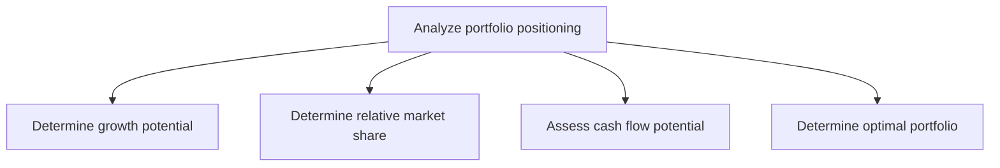
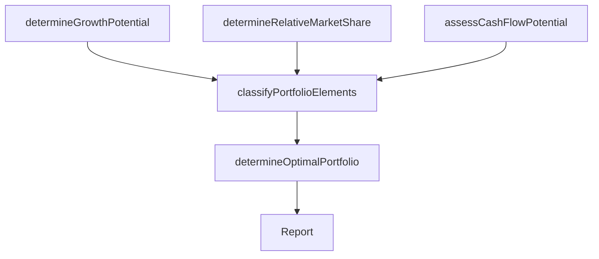

# Analyze portfolio positioning

> Business-as-Code definition for portfolio positioning analysis. Models the evaluation of the organization's business portfolio using growth-share matrices, market share analysis, cash flow assessment, and portfolio optimization techniques.

## Overview

Analyzing the strategic positioning of the organization's business portfolio to optimize resource allocation and maximize value creation. Evaluate each business unit or product line using frameworks such as BCG growth-share matrix, assessing growth potential, relative market share, cash flow generation, and overall strategic contribution to determine the optimal portfolio mix.

## Process Hierarchy



## GraphDL

```yaml
analyze:
  object: Portfolio Positioning
  actor: VP Strategy
  result: PortfolioPositioningReport
```

## Actions

| Action | Description |
|--------|-------------|
| determineGrowthPotential | Assess the market growth rate and expansion potential for each business unit |
| determineRelativeMarketShare | Calculate relative market share position compared to competitors |
| assessCashFlowPotential | Evaluate cash generation and capital requirements for each portfolio element |
| classifyPortfolioElements | Categorize business units using growth-share or attractiveness-strength matrices |
| determineOptimalPortfolio | Define the target portfolio mix based on strategic and financial analysis |

## Events

| Event | Description |
|-------|-------------|
| growthPotentialDetermined | Market growth analysis completed for all portfolio elements |
| relativeMarketShareDetermined | Market share positions calculated and benchmarked |
| cashFlowPotentialAssessed | Cash flow generation and capital needs assessed |
| portfolioElementsClassified | Business units categorized in strategic portfolio matrix |
| optimalPortfolioDetermined | Target portfolio mix defined and approved |

## Searches

| Search | Description |
|--------|-------------|
| getPortfolioPositioning | Retrieve the current portfolio positioning matrix |
| getGrowthAnalysis | Access growth potential data by business unit or product line |
| getMarketShareData | Retrieve relative market share positions over time |
| getCashFlowAnalysis | Access cash flow projections by portfolio element |

## Process Flow



## RACI Matrix

| Activity | Responsible | Accountable | Consulted | Informed |
|----------|-------------|-------------|-----------|----------|
| determineGrowthPotential | StrategyAnalyst | VP Strategy | Marketing | BusinessUnitLeads |
| determineRelativeMarketShare | MarketResearcher | VP Strategy | Sales | Finance |
| assessCashFlowPotential | FinancialAnalyst | CFO | Treasury | VP Strategy |
| determineOptimalPortfolio | VP Strategy | CEO | CFO | BoardOfDirectors |

## Sub-Processes

| ID | Name | Description |
|----|------|-------------|
| 1.2.10.1 | Determine growth potential | Evaluate total addressable market size, industry growth rates, and expansion potential for each portfolio element |
| 1.2.10.2 | Determine relative market share | Calculate and benchmark market share position relative to competitors for each business unit |
| 1.2.10.3 | Assess cash flow potential | Evaluate cash generation capacity, capital requirements, and investment returns for portfolio elements |
| 1.2.10.4 | Determine optimal portfolio | Define the target portfolio mix using growth-share matrices and strategic optimization |

## Related Processes

| Process | Relationship |
|---------|-------------|
| 1.2.6 Formulate business unit strategies | Upstream - BU strategies inform portfolio analysis |
| 1.2.9 Develop financial strategies | Related - portfolio positioning influences financial strategy |
| 1.1.5 Conduct organization restructuring opportunities | Downstream - portfolio analysis may trigger restructuring |

## Related Departments

| Department | Role |
|-----------|------|
| Strategy | Leads portfolio positioning analysis and optimization |
| Finance | Provides financial data for cash flow and market share analysis |
| Corporate Development | Executes portfolio changes (acquisitions, divestitures) |
| Marketing | Provides market growth and competitive share data |

## Related Occupations

| Occupation | Involvement |
|-----------|-------------|
| VP Strategy | Leads portfolio analysis and optimization recommendations |
| Strategy Analyst | Conducts growth, share, and cash flow analysis |
| Financial Analyst | Models financial performance of portfolio elements |

## KPIs

| KPI | Description | Unit |
|-----|-------------|------|
| Portfolio Balance | Distribution of units across growth-share quadrants | % |
| Revenue Concentration | Revenue share of top business units in portfolio | % |
| Portfolio Value Creation | Total shareholder return attributable to portfolio decisions | % |

## Usage

```typescript
import { analyzePortfolioPositioning } from '@headlessly/analyze-portfolio-positioning'

const portfolio = analyzePortfolioPositioning()

// Determine growth potential for each business unit
const growth = await portfolio.determineGrowthPotential({
  businessUnitIds: ['unit-a', 'unit-b', 'unit-c'],
  horizon: '5-years',
  dataSource: 'market-research'
})

// Determine optimal portfolio mix
const optimal = await portfolio.determineOptimalPortfolio({
  framework: 'BCG-growth-share',
  constraints: ['capital-budget', 'strategic-priorities', 'risk-tolerance']
})
```
