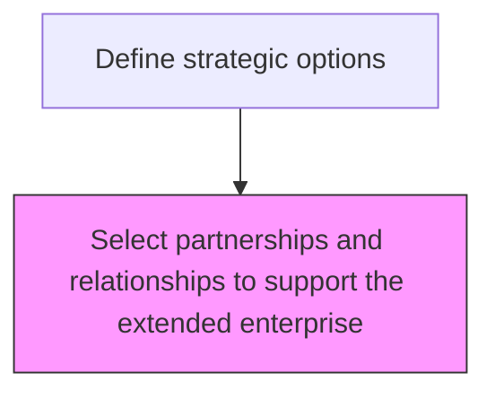
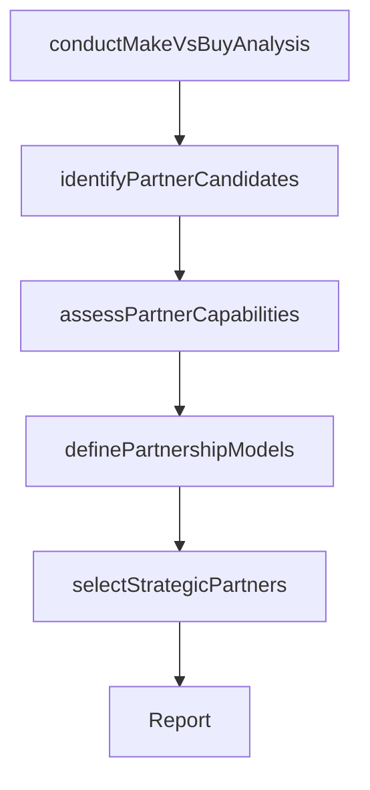

# Select partnerships and relationships to support the extended enterprise

> Business-as-Code definition for extended enterprise partnership selection. Models the strategic make-vs-buy analysis and partner selection decisions for the extended enterprise, including outsourcing, franchising, and supply chain partnership strategies.

## Overview

Supporting the design, manufacture and distribution of product and services through the extended enterprise model.  This is concerned with the strategic decisions on make vs buy, in house or out sourced.  Senior Executives map out how they want to run their business.  Make strategic choices as to whether to buy in components / sub-assemblies, run their own distribution fleet or contract out, own their dealerships or franchise out, etc.  Strategize with partnerships. Collaborate design consideration at strategy level for automotive and procurement act within the Target Operating Model set at strategy level.

## Process Hierarchy



## GraphDL

```yaml
select:
  object: Partnerships And Relationships To Support Extended Enterprise
  actor: VP Strategy
  result: ExtendedEnterprisePartnershipPlan
```

## Actions

| Action | Description |
|--------|-------------|
| conductMakeVsBuyAnalysis | Evaluate whether to perform activities in-house or outsource to partners |
| identifyPartnerCandidates | Screen and shortlist potential partners for each outsourced capability |
| assessPartnerCapabilities | Evaluate partner capabilities, reliability, and strategic alignment |
| definePartnershipModels | Determine the optimal partnership structure (franchise, JV, outsource, etc.) |
| selectStrategicPartners | Finalize partner selections and define relationship terms |

## Events

| Event | Description |
|-------|-------------|
| makeVsBuyAnalysisConducted | Make-vs-buy decisions documented for all key activities |
| partnerCandidatesIdentified | Potential partners shortlisted for each capability |
| partnerCapabilitiesAssessed | Partner capability and fit evaluations completed |
| partnershipModelsDefined | Partnership structures and terms defined |
| strategicPartnersSelected | Final partner selections made and formalized |

## Searches

| Search | Description |
|--------|-------------|
| getMakeVsBuyDecisions | Retrieve make-vs-buy analysis results by capability |
| getPartnerCandidates | Access shortlisted partner candidates with evaluation scores |
| getPartnershipModels | Retrieve defined partnership models and structures |

## Process Flow



## RACI Matrix

| Activity | Responsible | Accountable | Consulted | Informed |
|----------|-------------|-------------|-----------|----------|
| conductMakeVsBuyAnalysis | StrategyAnalyst | VP Strategy | COO | CFO |
| identifyPartnerCandidates | CorporateDevelopmentAnalyst | VP Strategy | Procurement | Operations |
| assessPartnerCapabilities | CorporateDevelopmentAnalyst | VP Strategy | QualityAssurance | Legal |
| selectStrategicPartners | VP Strategy | CEO | CFO | BoardOfDirectors |

## Related Processes

| Process | Relationship |
|---------|-------------|
| 1.2.2.5 Develop partner/alliance strategy | Downstream - partner selections feed alliance strategy |
| 1.2.2.1 Define strategic options | Parent - partnership selection is a sub-process of option definition |
| 1.1.1 Assess the external environment | Upstream - external assessment identifies partnership landscape |

## Related Departments

| Department | Role |
|-----------|------|
| Strategy | Leads make-vs-buy analysis and partner selection |
| Procurement | Provides supplier and vendor capability data |
| Operations | Assesses operational fit of partnership models |
| Legal | Reviews partnership structures and contractual terms |

## Related Occupations

| Occupation | Involvement |
|-----------|-------------|
| VP Strategy | Leads extended enterprise partnership decisions |
| Corporate Development Analyst | Evaluates partner candidates and capabilities |
| Procurement Manager | Provides supplier market intelligence |

## KPIs

| KPI | Description | Unit |
|-----|-------------|------|
| Partner Utilization | Percentage of value chain activities performed by partners | % |
| Partner Performance Score | Average performance rating of strategic partners | Score (1-10) |
| Make-vs-Buy Decision Coverage | Percentage of key activities with completed make-vs-buy analysis | % |

## Usage

```typescript
import { selectPartnershipsAndRelationshipsToSupportExtendedEnterprise } from '@headlessly/select-partnerships-and-relationships-to-support-extended-enterprise'

const partnerships = selectPartnershipsAndRelationshipsToSupportExtendedEnterprise()

// Conduct make-vs-buy analysis
const decisions = await partnerships.conductMakeVsBuyAnalysis({
  activities: ['manufacturing', 'distribution', 'customer-support', 'IT-infrastructure'],
  criteria: ['cost', 'quality', 'speed', 'strategic-importance']
})

// Select strategic partners
const partners = await partnerships.selectStrategicPartners({
  capabilities: decisions.filter(d => d.decision === 'buy').map(d => d.activity),
  evaluationCriteria: ['capability-fit', 'financial-stability', 'cultural-alignment']
})
```
