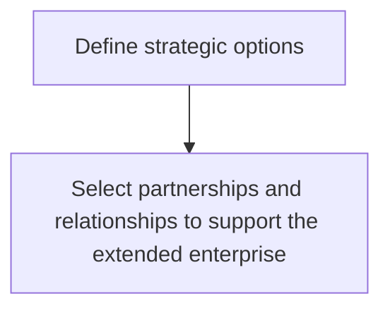
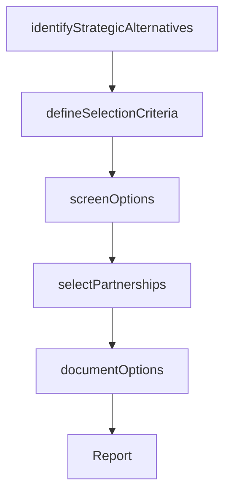

# Define strategic options

> Business-as-Code definition for strategic option definition. Models the identification and delineation of strategic decision alternatives, including partnership selection, that enable the organization to achieve its mission objectives.

## Overview

Defining the various options available to achieve the goals highlighted in the mission statement. Delineate (in accordance with a predefined criteria) the various permutations of strategic decisions that would help the organization achieve the objectives outlined in Develop overall mission statement [10037]. Involve senior management and key strategy personnel, with timely help from professional services providers.

## Process Hierarchy



## GraphDL

```yaml
define:
  object: Strategic Options
  actor: VP Strategy
  result: StrategicOptionsCatalog
```

## Actions

| Action | Description |
|--------|-------------|
| identifyStrategicAlternatives | Generate the full range of strategic decision alternatives |
| defineSelectionCriteria | Establish criteria for evaluating and comparing strategic options |
| screenOptions | Apply selection criteria to narrow the field of viable options |
| selectPartnerships | Identify partnership and alliance opportunities to support strategy |
| documentOptions | Formally document each strategic option with rationale and requirements |

## Events

| Event | Description |
|-------|-------------|
| strategicAlternativesIdentified | Full range of strategic alternatives generated |
| selectionCriteriaDefined | Evaluation criteria for strategic options established |
| optionsScreened | Strategic options filtered against selection criteria |
| partnershipsSelected | Partnership and alliance opportunities identified |
| optionsDocumented | Strategic options formally documented and cataloged |

## Searches

| Search | Description |
|--------|-------------|
| getStrategicOptions | Retrieve all defined strategic options with evaluation status |
| getSelectionCriteria | Access the criteria used for option evaluation |
| getPartnershipOptions | List identified partnership and alliance opportunities |

## Process Flow



## RACI Matrix

| Activity | Responsible | Accountable | Consulted | Informed |
|----------|-------------|-------------|-----------|----------|
| identifyStrategicAlternatives | StrategyAnalyst | VP Strategy | BusinessUnitLeads | CEO |
| defineSelectionCriteria | VP Strategy | CEO | CFO | BoardOfDirectors |
| screenOptions | StrategyAnalyst | VP Strategy | ExternalConsultant | Finance |
| selectPartnerships | VP Strategy | CEO | CorporateDevelopmentManager | LegalCounsel |

## Sub-Processes

| ID | Name | Description |
|----|------|-------------|
| 1.2.2.1.1 | Select partnerships and relationships to support the extended enterprise | Supporting the design, manufacture and distribution of product and services through the extended ent |

## Related Processes

| Process | Relationship |
|---------|-------------|
| 1.2.1 Develop overall mission statement | Upstream - mission objectives guide option identification |
| 1.2.2.2 Assess and analyze impact of each option | Downstream - defined options proceed to impact assessment |
| 1.1.1 Assess the external environment | Upstream - external analysis informs option feasibility |

## Related Departments

| Department | Role |
|-----------|------|
| Strategy | Leads option identification and criteria definition |
| Corporate Development | Identifies partnership and alliance opportunities |
| Finance | Provides financial feasibility data for screening |
| Legal | Reviews regulatory implications of strategic options |

## Related Occupations

| Occupation | Involvement |
|-----------|-------------|
| VP Strategy | Leads strategic option definition |
| Strategy Analyst | Generates and screens strategic alternatives |
| Corporate Development Manager | Identifies partnership opportunities |

## KPIs

| KPI | Description | Unit |
|-----|-------------|------|
| Options Generated | Number of strategic alternatives identified per planning cycle | Count |
| Screening Rate | Percentage of options passing initial selection criteria | % |
| Partnership Pipeline | Number of viable partnership opportunities identified | Count |

## Usage

```typescript
import { defineStrategicOptions } from '@headlessly/define-strategic-options'

const options = defineStrategicOptions()

// Identify strategic alternatives
const alternatives = await options.identifyStrategicAlternatives({
  missionObjectives: ['market-expansion', 'product-diversification', 'operational-excellence'],
  constraints: ['capital-budget', 'timeline', 'risk-tolerance']
})

// Screen options against criteria
const screened = await options.screenOptions({
  optionIds: alternatives.map(a => a.id),
  criteria: ['strategic-fit', 'financial-return', 'implementation-feasibility']
})
```
