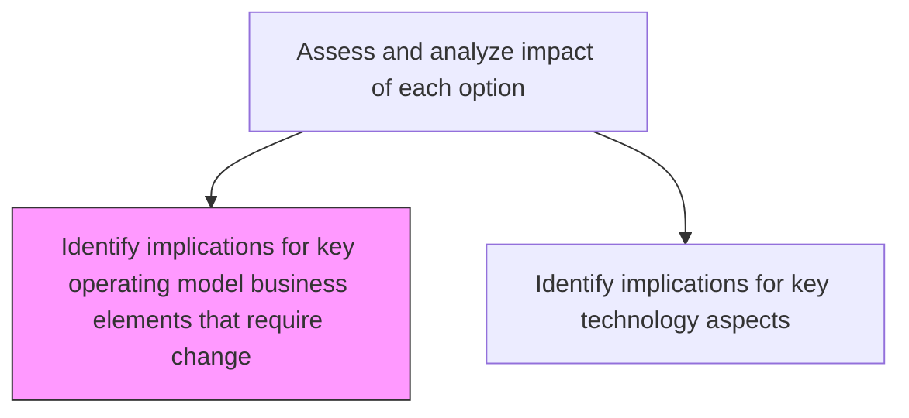
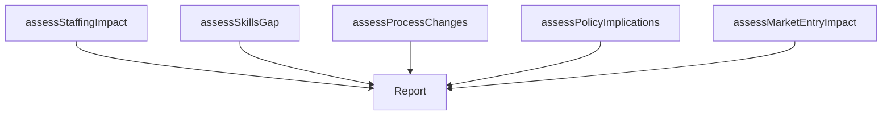

# Identify implications for key operating model business elements that require change

> Business-as-Code definition for operating model change implications identification. Models the assessment of how strategic options affect staffing, skills, processes, policies, and organizational structures within the operating model.

## Overview

Determine impacts of elements such as staffing, skills, training, new markets, technology, or policies within operating model which needs change.

## Process Hierarchy



## GraphDL

```yaml
identify:
  object: Implications For Key Operating Model Business Elements That Require Change
  actor: StrategyAnalyst
  result: OperatingModelImpactReport
```

## Actions

| Action | Description |
|--------|-------------|
| assessStaffingImpact | Evaluate how the strategic option affects workforce size, composition, and location |
| assessSkillsGap | Identify new skills and competencies required by the strategic option |
| assessProcessChanges | Determine which business processes require redesign or enhancement |
| assessPolicyImplications | Evaluate changes needed in organizational policies and governance |
| assessMarketEntryImpact | Analyze implications for entering new markets or geographies |

## Events

| Event | Description |
|-------|-------------|
| staffingImpactAssessed | Workforce implications evaluated |
| skillsGapAssessed | Required new skills and competencies identified |
| processChangesAssessed | Process redesign requirements documented |
| policyImplicationsAssessed | Policy and governance changes identified |
| marketEntryImpactAssessed | New market entry implications analyzed |

## Searches

| Search | Description |
|--------|-------------|
| getOperatingModelImpact | Retrieve operating model impact analysis by strategic option |
| getSkillsGapAnalysis | Access skills gap assessment for a strategic option |
| getProcessChangeRequirements | List processes requiring redesign for a specific option |

## Process Flow



## RACI Matrix

| Activity | Responsible | Accountable | Consulted | Informed |
|----------|-------------|-------------|-----------|----------|
| assessStaffingImpact | HRBusinessPartner | VP Strategy | HumanResources | COO |
| assessSkillsGap | StrategyAnalyst | VP Strategy | LearningDevelopment | HumanResources |
| assessProcessChanges | ProcessEngineer | COO | Operations | VP Strategy |
| assessPolicyImplications | StrategyAnalyst | VP Strategy | LegalCounsel | Compliance |

## Related Processes

| Process | Relationship |
|---------|-------------|
| 1.2.2.2.2 Identify implications for key technology aspects | Sibling - technology impact assessment |
| 1.2.4 Create organizational design | Downstream - operating model changes drive org design |
| 1.2.2.2 Assess and analyze impact of each option | Parent - overall impact assessment framework |

## Related Departments

| Department | Role |
|-----------|------|
| Strategy | Leads operating model impact assessment |
| Human Resources | Assesses staffing and skills implications |
| Operations | Evaluates process change requirements |
| Compliance | Reviews policy and governance implications |

## Related Occupations

| Occupation | Involvement |
|-----------|-------------|
| Strategy Analyst | Conducts operating model impact analysis |
| HR Business Partner | Assesses workforce and skills implications |
| Process Engineer | Evaluates process redesign requirements |

## KPIs

| KPI | Description | Unit |
|-----|-------------|------|
| Impact Coverage | Percentage of operating model elements assessed | % |
| Change Magnitude | Overall scale of required operating model changes | Score (1-10) |
| Readiness Gap | Gap between current and required operating model capabilities | Score (1-10) |

## Usage

```typescript
import { identifyImplicationsForKeyOperatingModelBusinessElementsThatRequireChange } from '@headlessly/identify-implications-for-key-operating-model-business-elements-that-require-change'

const opModel = identifyImplicationsForKeyOperatingModelBusinessElementsThatRequireChange()

// Assess staffing impact of a strategic option
const staffing = await opModel.assessStaffingImpact({
  strategicOptionId: 'option-001',
  dimensions: ['headcount', 'location', 'composition', 'cost']
})

// Assess skills gap requirements
const skills = await opModel.assessSkillsGap({
  strategicOptionId: 'option-001',
  categories: ['technical', 'leadership', 'domain-expertise']
})
```
