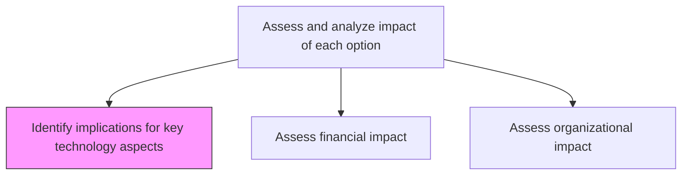
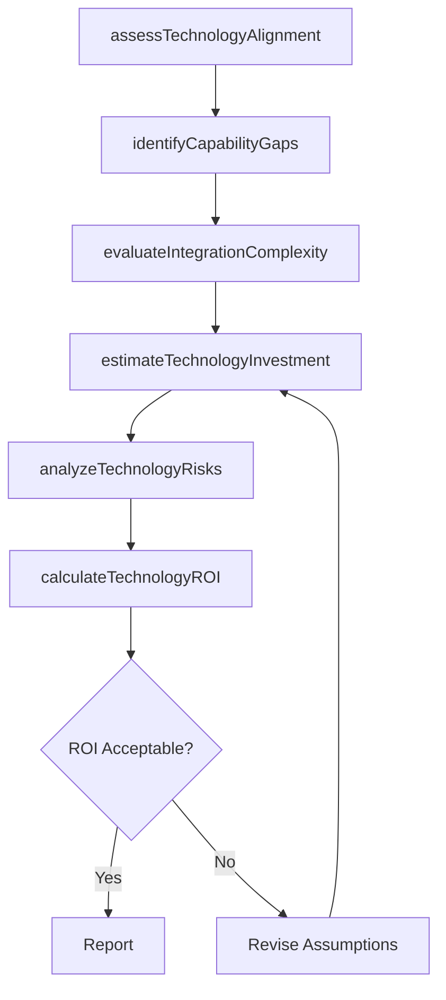

# Identify implications for key technology aspects

> Business-as-Code definition for identifying technology implications of strategic options. Models the assessment of technology ROI, architecture impact, capability gaps, and integration complexity for each strategic alternative under consideration.

## Overview

Determining key factors for technology ROI, benefits, architecture, etc. Evaluate how each strategic option affects the existing technology stack, identify required technology investments, assess architecture compatibility, and estimate the technology-related costs and risks of each alternative. This analysis ensures that strategic decisions account for technology enablement, constraints, and transformation requirements.

## Process Hierarchy



## GraphDL

```yaml
identify:
  object: Implications For Key Technology Aspects
  actor: EnterpriseArchitect
  result: TechnologyImplicationsAssessment
```

## Actions

| Action | Description |
|--------|-------------|
| assessTechnologyAlignment | Evaluate alignment of each strategic option with current technology architecture |
| estimateTechnologyInvestment | Project capital and operating costs for technology enablement |
| identifyCapabilityGaps | Determine technology capability gaps that each option would create |
| evaluateIntegrationComplexity | Assess the complexity of integrating new technology requirements |
| analyzeTechnologyRisks | Identify technology-related risks including obsolescence and vendor lock-in |
| calculateTechnologyROI | Compute expected return on technology investments for each option |

## Events

| Event | Description |
|-------|-------------|
| technologyAlignmentAssessed | Technology alignment analysis completed for a strategic option |
| technologyInvestmentEstimated | Technology cost projections finalized |
| capabilityGapsIdentified | Technology capability gaps documented |
| integrationComplexityEvaluated | Integration complexity assessment completed |
| technologyRisksAnalyzed | Technology risk register updated for strategic options |
| technologyROICalculated | Return on technology investment computed |

## Searches

| Search | Description |
|--------|-------------|
| getTechnologyImplications | Retrieve technology implications assessment for a strategic option |
| getCapabilityGaps | List technology capability gaps by strategic option |
| getTechnologyROI | Access ROI calculations for technology investments |
| getTechnologyRisks | Retrieve technology risk assessments by option |

## Process Flow



## RACI Matrix

| Activity | Responsible | Accountable | Consulted | Informed |
|----------|-------------|-------------|-----------|----------|
| assessTechnologyAlignment | EnterpriseArchitect | CTO | VP Strategy | Engineering |
| identifyCapabilityGaps | TechnologyStrategist | CTO | EnterpriseArchitect | ProductTeam |
| estimateTechnologyInvestment | ITFinanceAnalyst | CTO | CFO | VP Strategy |
| calculateTechnologyROI | TechnologyStrategist | CTO | CFO | CEO |

## Related Processes

| Process | Relationship |
|---------|-------------|
| 1.2.2.2 Assess and analyze impact of each option | Parent - technology implications are one dimension of impact analysis |
| 1.1.1.5 Assess new technology innovations | Upstream - technology landscape informs implications assessment |
| 1.2.2.1 Develop strategic options | Upstream - strategic options are evaluated for technology impact |

## Related Departments

| Department | Role |
|-----------|------|
| Information Technology | Leads technology implications analysis and architecture assessment |
| Strategy | Provides strategic context and option definitions |
| Finance | Validates technology investment estimates and ROI calculations |
| Enterprise Architecture | Assesses architecture compatibility and integration complexity |

## Related Occupations

| Occupation | Involvement |
|-----------|-------------|
| Enterprise Architect | Evaluates architecture alignment and integration complexity |
| Technology Strategist | Assesses capability gaps and calculates technology ROI |
| IT Finance Analyst | Estimates technology investment costs |

## KPIs

| KPI | Description | Unit |
|-----|-------------|------|
| Technology ROI | Expected return on technology investment per strategic option | % |
| Capability Gap Count | Number of technology capability gaps identified per option | Count |
| Integration Complexity Score | Assessed complexity of technology integration requirements | Score (1-10) |
| Technology Risk Severity | Weighted severity of identified technology risks | Score (1-100) |

## Usage

```typescript
import { identifyImplicationsForKeyTechnologyAspects } from '@headlessly/identify-implications-for-key-technology-aspects'

const techImplications = identifyImplicationsForKeyTechnologyAspects()

// Assess technology alignment for a strategic option
const alignment = await techImplications.assessTechnologyAlignment({
  strategicOptionId: 'digital-transformation-option-a',
  architectureLayers: ['infrastructure', 'platform', 'application', 'data']
})

// Calculate technology ROI
const roi = await techImplications.calculateTechnologyROI({
  strategicOptionId: 'digital-transformation-option-a',
  investmentHorizon: '3-years',
  discountRate: 0.08
})
```
