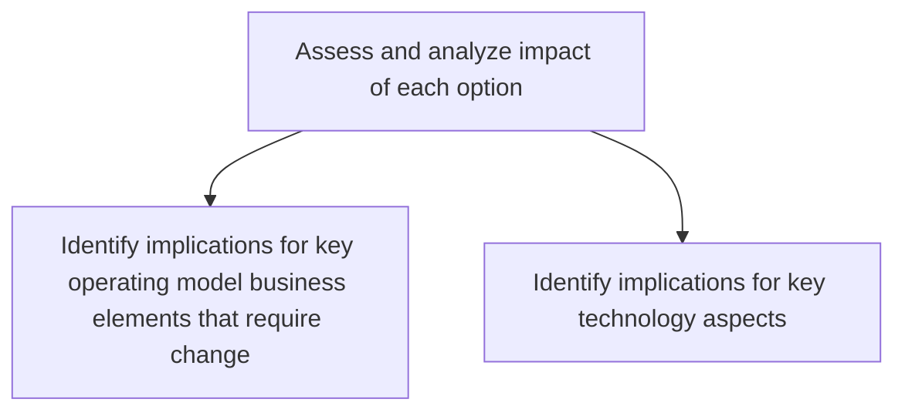
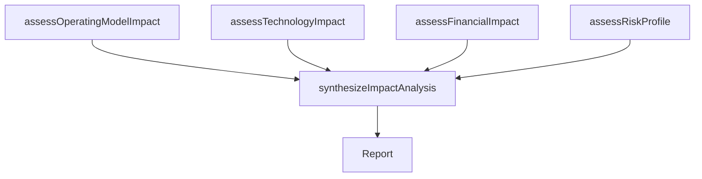

# Assess and analyze impact of each option

> Business-as-Code definition for strategic option impact assessment. Models the analysis of operational, technological, financial, and organizational consequences of each strategic option to inform decision-making.

## Overview

Scoping and probing to study the impact of strategic options for fulfilling the organization's objectives. Estimate a measure of the impact effectuated by each set of strategic decisions, which comprise Define strategic options [10047]. Closely examine the consequences of each option.

## Process Hierarchy



## GraphDL

```yaml
assess:
  object: And Analyze Impact Of Each Option
  actor: StrategyAnalyst
  result: StrategicImpactAssessment
```

## Actions

| Action | Description |
|--------|-------------|
| assessOperatingModelImpact | Evaluate implications for staffing, skills, processes, and organizational structure |
| assessTechnologyImpact | Determine technology investment, architecture changes, and IT capability requirements |
| assessFinancialImpact | Model the revenue, cost, and capital expenditure impact of each option |
| assessRiskProfile | Evaluate the risk exposure and mitigation requirements for each option |
| synthesizeImpactAnalysis | Consolidate all impact dimensions into a comprehensive comparison |

## Events

| Event | Description |
|-------|-------------|
| operatingModelImpactAssessed | Operating model change implications documented |
| technologyImpactAssessed | Technology requirements and investment needs evaluated |
| financialImpactAssessed | Financial impact projections completed |
| riskProfileAssessed | Risk exposure for each option evaluated |
| impactAnalysisSynthesized | Comprehensive impact comparison finalized |

## Searches

| Search | Description |
|--------|-------------|
| getImpactAssessment | Retrieve impact analysis for a specific strategic option |
| getImpactComparison | Compare impact across multiple strategic options |
| getRiskAssessment | Access risk profile analysis for each option |

## Process Flow



## RACI Matrix

| Activity | Responsible | Accountable | Consulted | Informed |
|----------|-------------|-------------|-----------|----------|
| assessOperatingModelImpact | StrategyAnalyst | VP Strategy | COO | HumanResources |
| assessTechnologyImpact | EnterpriseArchitect | CTO | IT | VP Strategy |
| assessFinancialImpact | FinancialAnalyst | CFO | BusinessUnitLeads | VP Strategy |
| synthesizeImpactAnalysis | StrategyAnalyst | VP Strategy | ExecutiveTeam | CEO |

## Sub-Processes

| ID | Name | Description |
|----|------|-------------|
| 1.2.2.2.1 | Identify implications for key operating model business elements that require change | Determine impacts of elements such as staffing, skills, training, new markets, technology, or polici |
| 1.2.2.2.2 | Identify implications for key technology aspects | Determining key factors for technology ROI, benefits, architecture, etc. |

## Related Processes

| Process | Relationship |
|---------|-------------|
| 1.2.2.1 Define strategic options | Upstream - options must be defined before impact assessment |
| 1.2.2.3 Develop B2B strategy | Downstream - impact analysis informs strategy development |
| 1.2.3 Coordinate and align functional and process strategies | Downstream - impact findings shape functional alignment |

## Related Departments

| Department | Role |
|-----------|------|
| Strategy | Leads impact analysis coordination and synthesis |
| Finance | Models financial consequences of each option |
| Information Technology | Assesses technology implications and requirements |
| Operations | Evaluates operational model changes |

## Related Occupations

| Occupation | Involvement |
|-----------|-------------|
| Strategy Analyst | Conducts cross-dimensional impact analysis |
| Enterprise Architect | Evaluates technology architecture implications |
| Financial Analyst | Models financial impact and investment requirements |

## KPIs

| KPI | Description | Unit |
|-----|-------------|------|
| Impact Assessment Coverage | Percentage of options with complete multi-dimensional impact analysis | % |
| Assessment Cycle Time | Time from option definition to completed impact analysis | Days |
| Decision Quality | Percentage of strategic decisions achieving projected impact | % |

## Usage

```typescript
import { assessAndAnalyzeImpactOfEachOption } from '@headlessly/assess-and-analyze-impact-of-each-option'

const impact = assessAndAnalyzeImpactOfEachOption()

// Assess operating model impact
const operatingImpact = await impact.assessOperatingModelImpact({
  optionId: 'strategic-option-001',
  dimensions: ['staffing', 'skills', 'processes', 'organizational-structure']
})

// Synthesize all impact dimensions
const synthesis = await impact.synthesizeImpactAnalysis({
  optionIds: ['strategic-option-001', 'strategic-option-002', 'strategic-option-003'],
  comparisonFramework: 'weighted-scoring'
})
```
