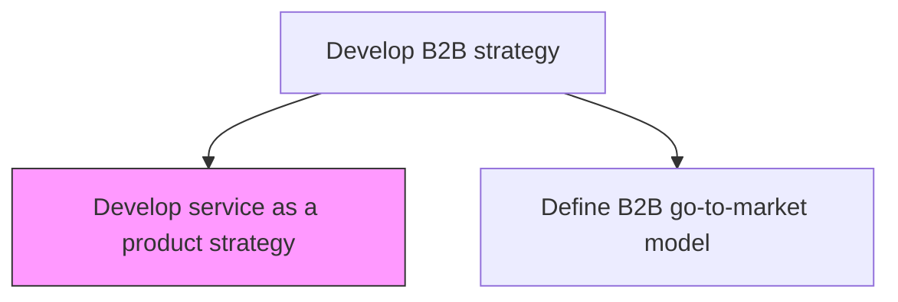
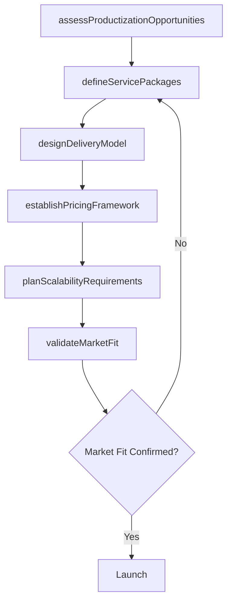

# Develop service as a product strategy

> Business-as-Code definition for service-as-a-product strategy development. Models the process of defining business objectives, delivery models, pricing structures, and scalability plans for productizing services in a B2B context.

## Overview

Defining objectives related to business and delivery models to productize service. Transform bespoke professional services into standardized, repeatable product offerings with defined scope, pricing, and delivery mechanisms. Establish service packaging, tiering, and self-service capabilities that enable scalable revenue growth while maintaining service quality and customer satisfaction.

## Process Hierarchy



## GraphDL

```yaml
develop:
  object: Service As Product Strategy
  actor: VP Product
  result: ServiceProductizationStrategy
```

## Actions

| Action | Description |
|--------|-------------|
| assessProductizationOpportunities | Identify services with high potential for standardization and packaging |
| defineServicePackages | Create tiered service offerings with defined scope, deliverables, and pricing |
| designDeliveryModel | Architect the delivery model including self-service, managed, and hybrid options |
| establishPricingFramework | Define pricing structures including subscription, usage-based, and outcome-based models |
| planScalabilityRequirements | Determine technology and operational requirements for scalable service delivery |
| validateMarketFit | Test productized service offerings with target customer segments |

## Events

| Event | Description |
|-------|-------------|
| productizationOpportunitiesAssessed | Service productization opportunity analysis completed |
| servicePackagesDefined | Tiered service packages designed and documented |
| deliveryModelDesigned | Service delivery model architecture finalized |
| pricingFrameworkEstablished | Pricing structure defined and approved |
| scalabilityRequirementsPlanned | Scalability plan for service delivery documented |
| marketFitValidated | Productized service validated with target customers |

## Searches

| Search | Description |
|--------|-------------|
| getServicePackages | Retrieve defined service packages and their configurations |
| getProductizationOpportunities | List services assessed for productization potential |
| getPricingModels | Access pricing framework and tier definitions |
| getMarketValidationResults | Retrieve customer validation feedback and adoption metrics |

## Process Flow



## RACI Matrix

| Activity | Responsible | Accountable | Consulted | Informed |
|----------|-------------|-------------|-----------|----------|
| assessProductizationOpportunities | ProductManager | VP Product | ServiceDelivery | Sales |
| defineServicePackages | ProductManager | VP Product | Engineering | Marketing |
| establishPricingFramework | PricingAnalyst | VP Product | CFO | Sales |
| validateMarketFit | ProductManager | VP Product | CustomerSuccess | CEO |

## Related Processes

| Process | Relationship |
|---------|-------------|
| 1.2.2.3 Develop B2B strategy | Parent - service productization is a component of B2B strategy |
| 1.2.2.4 Develop B2C strategy | Parallel - productization may enable B2C channel expansion |
| 1.2.7 Develop customer experience strategy | Related - productized services shape the customer experience |

## Related Departments

| Department | Role |
|-----------|------|
| Product | Leads service productization strategy and package design |
| Engineering | Builds technology platform for scalable service delivery |
| Sales | Validates market demand and selling approach for productized services |
| Service Delivery | Provides operational input for delivery model design |

## Related Occupations

| Occupation | Involvement |
|-----------|-------------|
| Product Manager | Designs service packages and validates market fit |
| Service Delivery Manager | Informs delivery model and operational requirements |
| Pricing Analyst | Develops pricing framework and tier economics |

## KPIs

| KPI | Description | Unit |
|-----|-------------|------|
| Productization Rate | Percentage of services converted to productized offerings | % |
| Recurring Revenue Mix | Share of revenue from productized vs. bespoke services | % |
| Service Delivery Scalability | Number of customers served per delivery resource | Ratio |
| Customer Adoption Rate | Rate of customer adoption for productized service offerings | % |

## Usage

```typescript
import { developServiceAsProductStrategy } from '@headlessly/develop-service-as-product-strategy'

const serviceProduct = developServiceAsProductStrategy()

// Assess productization opportunities
const opportunities = await serviceProduct.assessProductizationOpportunities({
  services: ['consulting', 'implementation', 'managed-services'],
  criteria: ['repeatability', 'margin', 'demand']
})

// Define service packages
const packages = await serviceProduct.defineServicePackages({
  serviceId: 'managed-analytics',
  tiers: ['starter', 'professional', 'enterprise'],
  pricingModel: 'subscription'
})
```
