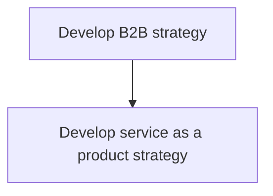
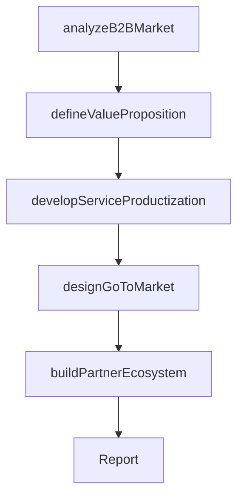

# Develop B2B strategy

> Business-as-Code definition for B2B strategy development. Models the creation of long-term plans for business-to-business market engagement, including enterprise sales strategy, service productization, and channel partner development.

## Overview

Defining a long term plan of action and roadmap to achieve business to business objectives and goals.

## Process Hierarchy



## GraphDL

```yaml
develop:
  object: B2B Strategy
  actor: VP Sales
  result: B2BStrategyPlan
```

## Actions

| Action | Description |
|--------|-------------|
| analyzeB2BMarket | Assess the B2B market landscape, customer segments, and competitive dynamics |
| defineValueProposition | Articulate the differentiated value proposition for enterprise customers |
| developServiceProductization | Define strategy for packaging services as scalable, repeatable products |
| designGoToMarket | Create the B2B go-to-market strategy including sales channels and pricing |
| buildPartnerEcosystem | Develop channel partner and reseller strategies for B2B distribution |

## Events

| Event | Description |
|-------|-------------|
| b2bMarketAnalyzed | B2B market landscape and segmentation analysis completed |
| valuePropositionDefined | Enterprise value proposition articulated |
| serviceProductizationDeveloped | Service-as-a-product strategy formulated |
| goToMarketDesigned | B2B go-to-market strategy created |
| partnerEcosystemBuilt | Channel partner strategy developed |

## Searches

| Search | Description |
|--------|-------------|
| getB2BStrategy | Retrieve the current B2B strategy and roadmap |
| getB2BSegments | Access B2B customer segments and profiles |
| getChannelPerformance | Retrieve performance data by B2B sales channel |

## Process Flow



## RACI Matrix

| Activity | Responsible | Accountable | Consulted | Informed |
|----------|-------------|-------------|-----------|----------|
| analyzeB2BMarket | MarketResearcher | VP Sales | Marketing | VP Strategy |
| defineValueProposition | ProductMarketing | VP Sales | ProductManagement | CEO |
| developServiceProductization | ProductManagement | VP Sales | Engineering | Finance |
| designGoToMarket | VP Sales | CEO | Marketing | ChannelPartners |

## Sub-Processes

| ID | Name | Description |
|----|------|-------------|
| 1.2.2.3.1 | Develop service as a product strategy | Defining objectives related to business and delivery models to productize service. |

## Related Processes

| Process | Relationship |
|---------|-------------|
| 1.2.2.4 Develop B2C strategy | Sibling - complementary channel strategy |
| 1.2.2.5 Develop partner/alliance strategy | Related - B2B often relies on partner channels |
| 1.2.2.1 Define strategic options | Upstream - B2B strategy is a selected strategic option |

## Related Departments

| Department | Role |
|-----------|------|
| Sales | Leads B2B go-to-market and enterprise sales strategy |
| Marketing | Develops B2B demand generation and positioning |
| Product Management | Ensures product-market fit for enterprise customers |
| Channel Partnerships | Manages B2B channel partner relationships |

## Related Occupations

| Occupation | Involvement |
|-----------|-------------|
| VP Sales | Leads B2B strategy development |
| Product Marketing Manager | Defines B2B value proposition and messaging |
| Channel Partnership Manager | Develops B2B partner distribution strategy |

## KPIs

| KPI | Description | Unit |
|-----|-------------|------|
| Enterprise Customer Acquisition | Number of new B2B customers acquired per quarter | Count |
| Average Deal Size | Average revenue per B2B transaction | Currency |
| B2B Revenue Growth | Year-over-year growth in B2B revenue | % |

## Usage

```typescript
import { developB2bStrategy } from '@headlessly/develop-b2b-strategy'

const b2b = developB2bStrategy()

// Analyze B2B market landscape
const market = await b2b.analyzeB2BMarket({
  segments: ['enterprise', 'mid-market', 'SMB'],
  industries: ['technology', 'financial-services', 'healthcare']
})

// Develop service productization strategy
const productization = await b2b.developServiceProductization({
  services: ['consulting', 'implementation', 'managed-services'],
  pricingModels: ['subscription', 'usage-based', 'tiered']
})
```
