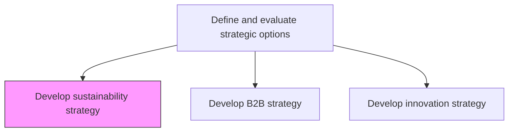
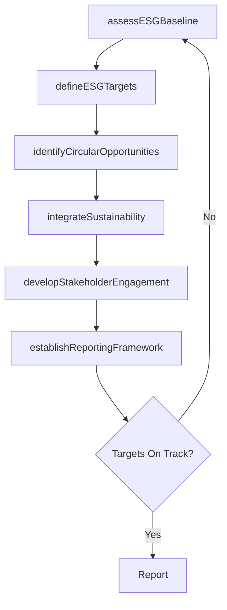

# Develop sustainability strategy

> Business-as-Code definition for sustainability strategy development. Models the formulation of ESG-aligned strategic initiatives that integrate environmental stewardship, social responsibility, and long-term business resilience into the organization's core strategy.

## Overview

Formulating strategic options that create opportunities for the sustenance and prosperity of the business in the long run. Go beyond business longevity to consider alternate strategies that allow the organizations preservation of vitality over time. Earmark resources and target processes, the former of which are dedicated to the absorption of sustainable practices in the latter. Define ESG goals, set emissions targets, evaluate circular economy opportunities, and embed sustainability into supply chain, operations, and product design.

## Process Hierarchy



## GraphDL

```yaml
develop:
  object: Sustainability Strategy
  actor: ChiefSustainabilityOfficer
  result: SustainabilityStrategyPlan
```

## Actions

| Action | Description |
|--------|-------------|
| assessESGBaseline | Evaluate current environmental, social, and governance performance |
| defineESGTargets | Set measurable targets for emissions, resource usage, and social impact |
| identifyCircularOpportunities | Evaluate circular economy models for waste reduction and resource efficiency |
| integrateSustainability | Embed sustainability practices into supply chain, operations, and product design |
| developStakeholderEngagement | Create engagement plans for investors, regulators, and community stakeholders |
| establishReportingFramework | Define sustainability reporting and disclosure frameworks aligned to GRI and TCFD |

## Events

| Event | Description |
|-------|-------------|
| esgBaselineAssessed | Current ESG performance baseline documented |
| esgTargetsDefined | Measurable ESG targets established and approved |
| circularOpportunitiesIdentified | Circular economy opportunities evaluated and prioritized |
| sustainabilityIntegrated | Sustainability practices embedded into operational processes |
| stakeholderEngagementDeveloped | Stakeholder engagement plan created and activated |
| reportingFrameworkEstablished | Sustainability reporting framework defined and implemented |

## Searches

| Search | Description |
|--------|-------------|
| getESGPerformance | Retrieve current ESG performance metrics and trends |
| getSustainabilityTargets | Access defined ESG targets and progress tracking |
| getCircularEconomyOpportunities | List identified circular economy initiatives |
| getSustainabilityReports | Retrieve published sustainability reports and disclosures |

## Process Flow



## RACI Matrix

| Activity | Responsible | Accountable | Consulted | Informed |
|----------|-------------|-------------|-----------|----------|
| assessESGBaseline | SustainabilityManager | ChiefSustainabilityOfficer | Operations | CEO |
| defineESGTargets | ChiefSustainabilityOfficer | CEO | BoardOfDirectors | InvestorRelations |
| integrateSustainability | SustainabilityManager | ChiefSustainabilityOfficer | SupplyChain | ProductTeam |
| establishReportingFramework | SustainabilityAnalyst | ChiefSustainabilityOfficer | Finance | LegalCounsel |

## Related Processes

| Process | Relationship |
|---------|-------------|
| 1.2.2 Define and evaluate strategic options | Parent - sustainability is a key strategic dimension |
| 1.1.1.8 Identify ecological concerns | Upstream - ecological analysis informs sustainability strategy |
| 1.2.5 Develop and set organizational goals | Downstream - ESG targets become organizational goals |

## Related Departments

| Department | Role |
|-----------|------|
| Sustainability | Leads ESG strategy formulation and implementation |
| Operations | Embeds sustainable practices into production and logistics |
| Supply Chain | Integrates sustainability criteria into sourcing and procurement |
| Investor Relations | Communicates sustainability commitments to investors and analysts |

## Related Occupations

| Occupation | Involvement |
|-----------|-------------|
| Chief Sustainability Officer | Leads sustainability strategy and ESG target setting |
| Sustainability Manager | Implements sustainability initiatives across operations |
| Environmental Analyst | Conducts baseline assessments and monitors ESG metrics |

## KPIs

| KPI | Description | Unit |
|-----|-------------|------|
| Carbon Emissions Reduction | Year-over-year reduction in Scope 1 and 2 emissions | % |
| ESG Score | Composite ESG rating from external assessment providers | Score (1-100) |
| Sustainable Revenue Share | Percentage of revenue from sustainable products or services | % |
| Waste Diversion Rate | Percentage of operational waste diverted from landfill | % |

## Usage

```typescript
import { developSustainabilityStrategy } from '@headlessly/develop-sustainability-strategy'

const sustainability = developSustainabilityStrategy()

// Assess current ESG baseline
const baseline = await sustainability.assessESGBaseline({
  dimensions: ['environmental', 'social', 'governance'],
  reportingYear: 2025
})

// Define ESG targets
const targets = await sustainability.defineESGTargets({
  baselineId: baseline.id,
  targetYear: 2030,
  frameworks: ['GRI', 'TCFD', 'SBTi']
})
```
