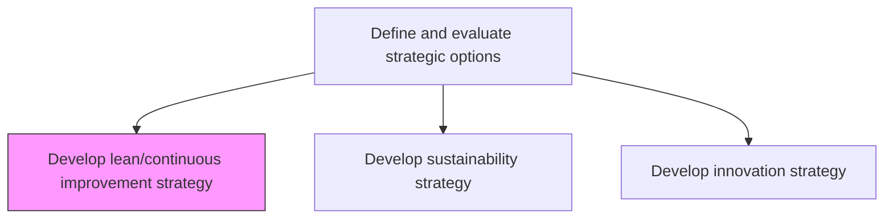
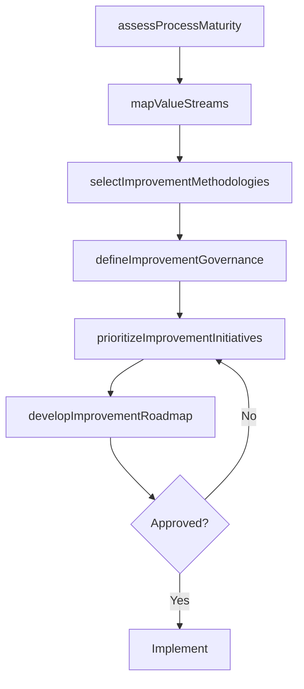

# Develop lean/continuous improvement strategy

> Business-as-Code definition for lean and continuous improvement strategy development. Models the creation of a systematic approach to process optimization, waste elimination, and performance advancement using lean, Six Sigma, and kaizen methodologies.

## Overview

Developing strategies for the optimization of processes and the improvement of functional areas in order to improve the bottom line. Create a road map of decision choices that would allow the organization to continuously enhance process efficiencies and advance performance standards. Define lean principles adoption, establish continuous improvement governance, select methodologies such as Six Sigma, Kaizen, and value stream mapping, and embed a culture of operational excellence.

## Process Hierarchy



## GraphDL

```yaml
develop:
  object: Lean/continuous Improvement Strategy
  actor: VP Operations
  result: ContinuousImprovementStrategyPlan
```

## Actions

| Action | Description |
|--------|-------------|
| assessProcessMaturity | Evaluate current process maturity and identify improvement opportunities |
| selectImprovementMethodologies | Choose lean, Six Sigma, kaizen, or hybrid methodologies for the organization |
| defineImprovementGovernance | Establish governance structure for continuous improvement initiatives |
| mapValueStreams | Document value streams to identify waste and inefficiency |
| prioritizeImprovementInitiatives | Rank improvement projects by impact, feasibility, and strategic alignment |
| developImprovementRoadmap | Create a phased roadmap for implementing improvement initiatives |

## Events

| Event | Description |
|-------|-------------|
| processMaturityAssessed | Process maturity evaluation completed across functional areas |
| methodologiesSelected | Improvement methodologies chosen and documented |
| improvementGovernanceDefined | Governance structure for continuous improvement established |
| valueStreamsMapped | Value stream maps created for key processes |
| improvementInitiativesPrioritized | Improvement projects ranked and approved |
| improvementRoadmapDeveloped | Phased improvement implementation roadmap finalized |

## Searches

| Search | Description |
|--------|-------------|
| getProcessMaturity | Retrieve process maturity scores by functional area |
| getImprovementInitiatives | List continuous improvement initiatives by status and priority |
| getValueStreamMaps | Access value stream maps for key processes |
| getImprovementRoadmap | Retrieve the current improvement implementation roadmap |

## Process Flow



## RACI Matrix

| Activity | Responsible | Accountable | Consulted | Informed |
|----------|-------------|-------------|-----------|----------|
| assessProcessMaturity | ProcessExcellenceManager | VP Operations | BusinessUnitLeads | CEO |
| mapValueStreams | LeanPractitioner | VP Operations | ProcessOwners | Finance |
| selectImprovementMethodologies | ProcessExcellenceManager | VP Operations | CTO | HumanResources |
| prioritizeImprovementInitiatives | VP Operations | CEO | CFO | AllDepartments |

## Related Processes

| Process | Relationship |
|---------|-------------|
| 1.2.2 Define and evaluate strategic options | Parent - lean strategy is a strategic option |
| 1.2.3 Coordinate and align functional and process strategies | Downstream - improvement strategy aligns functional processes |
| 1.2.5 Develop and set organizational goals | Related - improvement targets feed organizational goals |

## Related Departments

| Department | Role |
|-----------|------|
| Operations | Leads continuous improvement strategy and value stream mapping |
| Quality | Provides Six Sigma and quality management expertise |
| Human Resources | Enables cultural adoption and improvement skill development |
| Finance | Quantifies cost savings and ROI from improvement initiatives |

## Related Occupations

| Occupation | Involvement |
|-----------|-------------|
| Process Excellence Manager | Leads improvement strategy and methodology selection |
| Lean Practitioner | Conducts value stream mapping and waste analysis |
| Six Sigma Black Belt | Leads data-driven improvement projects |

## KPIs

| KPI | Description | Unit |
|-----|-------------|------|
| Process Cycle Efficiency | Ratio of value-added time to total process time | % |
| Improvement Project Completion | Percentage of planned improvement initiatives completed on time | % |
| Cost Savings from Improvement | Total cost savings realized from improvement initiatives | USD |
| Waste Reduction | Percentage reduction in identified process waste | % |
| Employee Improvement Participation | Percentage of employees engaged in improvement activities | % |

## Usage

```typescript
import { developLeanContinuousImprovementStrategy } from '@headlessly/develop-lean-continuous-improvement-strategy'

const improvement = developLeanContinuousImprovementStrategy()

// Assess process maturity across functional areas
const maturity = await improvement.assessProcessMaturity({
  functionalAreas: ['manufacturing', 'supply-chain', 'customer-service'],
  framework: 'CMMI'
})

// Prioritize improvement initiatives
const initiatives = await improvement.prioritizeImprovementInitiatives({
  criteria: ['cost-impact', 'strategic-alignment', 'feasibility'],
  methodology: 'weighted-scoring'
})
```
