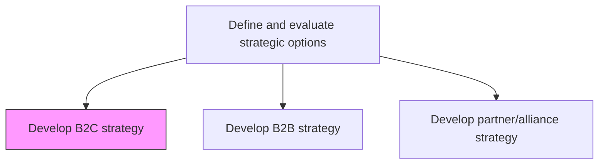
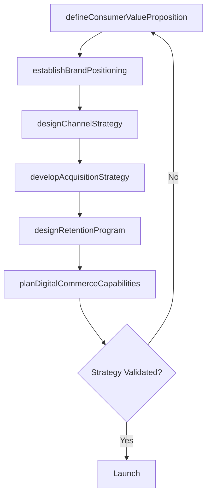

# Develop B2C strategy

> Business-as-Code definition for B2C strategy development. Models the creation of a consumer-focused strategic plan encompassing direct-to-consumer channels, digital commerce, brand positioning, and consumer engagement approaches.

## Overview

Defining a long term plan of action and roadmap to achieve business to consumer objectives and goals. Establish the direct-to-consumer value proposition, define digital and physical channel strategies, design consumer acquisition and retention programs, and create a brand experience roadmap that drives consumer loyalty and lifetime value.

## Process Hierarchy



## GraphDL

```yaml
develop:
  object: B2C Strategy
  actor: CMO
  result: B2CStrategyPlan
```

## Actions

| Action | Description |
|--------|-------------|
| defineConsumerValueProposition | Articulate the unique value proposition for direct-to-consumer offerings |
| designChannelStrategy | Define digital and physical channel mix for consumer engagement and sales |
| developAcquisitionStrategy | Create consumer acquisition strategy including digital marketing and partnerships |
| designRetentionProgram | Develop loyalty and retention programs to maximize customer lifetime value |
| establishBrandPositioning | Define brand positioning, messaging, and experience standards for consumers |
| planDigitalCommerceCapabilities | Architect digital commerce platform requirements and technology roadmap |

## Events

| Event | Description |
|-------|-------------|
| consumerValuePropositionDefined | Consumer value proposition articulated and validated |
| channelStrategyDesigned | Consumer channel mix strategy finalized |
| acquisitionStrategyDeveloped | Consumer acquisition strategy and budget approved |
| retentionProgramDesigned | Loyalty and retention program designed and scheduled |
| brandPositioningEstablished | Brand positioning and messaging framework approved |
| digitalCommerceCapabilitiesPlanned | Digital commerce technology roadmap finalized |

## Searches

| Search | Description |
|--------|-------------|
| getConsumerSegments | Retrieve defined consumer segments and their profiles |
| getChannelPerformance | Access performance metrics by consumer channel |
| getAcquisitionMetrics | Retrieve consumer acquisition cost and volume data |
| getRetentionMetrics | Access customer retention rates and lifetime value data |

## Process Flow



## RACI Matrix

| Activity | Responsible | Accountable | Consulted | Informed |
|----------|-------------|-------------|-----------|----------|
| defineConsumerValueProposition | VP Marketing | CMO | ProductTeam | Sales |
| designChannelStrategy | DigitalMarketingDirector | CMO | IT | Finance |
| developAcquisitionStrategy | GrowthMarketingManager | CMO | Analytics | CFO |
| designRetentionProgram | CustomerMarketingManager | CMO | CustomerSuccess | ProductTeam |

## Related Processes

| Process | Relationship |
|---------|-------------|
| 1.2.2.3 Develop B2B strategy | Parallel - B2C strategy may complement or diverge from B2B |
| 1.2.7 Develop customer experience strategy | Downstream - B2C strategy shapes consumer experience design |
| 1.2.2.5 Develop partner/alliance strategy | Related - channel partnerships support B2C distribution |

## Related Departments

| Department | Role |
|-----------|------|
| Marketing | Leads B2C strategy, brand positioning, and consumer acquisition |
| Digital Commerce | Builds and operates direct-to-consumer commerce platform |
| Product | Designs consumer-focused product features and packaging |
| Customer Success | Drives consumer retention and loyalty programs |

## Related Occupations

| Occupation | Involvement |
|-----------|-------------|
| CMO | Champions B2C strategy and brand positioning |
| Growth Marketing Manager | Designs consumer acquisition programs |
| Digital Commerce Director | Architects direct-to-consumer platform strategy |

## KPIs

| KPI | Description | Unit |
|-----|-------------|------|
| Customer Acquisition Cost | Average cost to acquire a new consumer | USD |
| Customer Lifetime Value | Projected revenue per consumer over their lifecycle | USD |
| Digital Channel Revenue | Revenue generated through direct digital channels | USD |
| Net Promoter Score | Consumer willingness to recommend the brand | Score (-100 to 100) |

## Usage

```typescript
import { developB2cStrategy } from '@headlessly/develop-b2c-strategy'

const b2c = developB2cStrategy()

// Define consumer value proposition
const valueProposition = await b2c.defineConsumerValueProposition({
  targetSegments: ['digital-natives', 'value-seekers', 'premium-consumers'],
  differentiators: ['convenience', 'personalization', 'sustainability']
})

// Design channel strategy
const channels = await b2c.designChannelStrategy({
  digitalChannels: ['web', 'mobile-app', 'social-commerce'],
  physicalChannels: ['retail-stores', 'pop-up-experiences'],
  integrationType: 'omnichannel'
})
```
