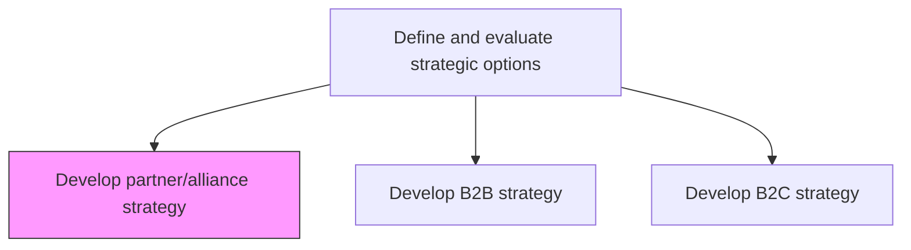
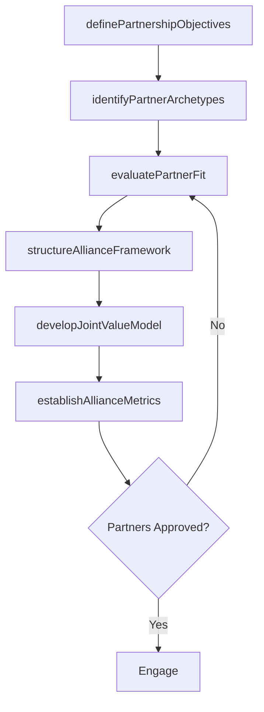

# Develop partner/alliance strategy

> Business-as-Code definition for partner and alliance strategy development. Models the process of defining partnership objectives, evaluating potential allies, structuring alliance frameworks, and establishing governance for strategic partnerships.

## Overview

Defining direction and plan objectives for partnering with other companies to deliver product/services. Focus on creating a vision and strategic objectives and culminate in creating measures for the strategic alliance or partnership. Identify partnership archetypes, evaluate potential partners for strategic fit, define joint value creation models, establish governance frameworks, and create performance metrics for alliance management.

## Process Hierarchy



## GraphDL

```yaml
develop:
  object: Partner/alliance Strategy
  actor: VP BusinessDevelopment
  result: PartnerAllianceStrategyPlan
```

## Actions

| Action | Description |
|--------|-------------|
| definePartnershipObjectives | Articulate strategic goals for partnerships including market access, capability, and scale |
| identifyPartnerArchetypes | Classify partnership types such as technology, distribution, co-development, and ecosystem |
| evaluatePartnerFit | Assess potential partners for strategic alignment, cultural fit, and complementary capabilities |
| structureAllianceFramework | Design partnership governance, economics, and intellectual property arrangements |
| developJointValueModel | Create shared value creation models including revenue sharing and co-investment plans |
| establishAllianceMetrics | Define KPIs and performance management frameworks for alliance success |

## Events

| Event | Description |
|-------|-------------|
| partnershipObjectivesDefined | Strategic partnership goals documented and approved |
| partnerArchetypesIdentified | Partnership types classified and prioritized |
| partnerFitEvaluated | Potential partner assessment completed |
| allianceFrameworkStructured | Partnership governance and economics framework finalized |
| jointValueModelDeveloped | Shared value creation model designed and agreed |
| allianceMetricsEstablished | Alliance performance metrics defined |

## Searches

| Search | Description |
|--------|-------------|
| getPartnerPipeline | Retrieve list of potential and active partners by type and status |
| getAllianceFrameworks | Access defined alliance governance and economic frameworks |
| getPartnerPerformance | Retrieve performance metrics for active partnerships |
| getJointValueModels | Access shared value creation models by partnership |

## Process Flow



## RACI Matrix

| Activity | Responsible | Accountable | Consulted | Informed |
|----------|-------------|-------------|-----------|----------|
| definePartnershipObjectives | VP BusinessDevelopment | CEO | VP Strategy | CFO |
| evaluatePartnerFit | AllianceManager | VP BusinessDevelopment | Legal | ProductTeam |
| structureAllianceFramework | AllianceManager | VP BusinessDevelopment | GeneralCounsel | Finance |
| establishAllianceMetrics | AllianceManager | VP BusinessDevelopment | Finance | ExecutiveTeam |

## Related Processes

| Process | Relationship |
|---------|-------------|
| 1.2.2 Define and evaluate strategic options | Parent - alliance strategy is a strategic option |
| 1.2.2.6 Develop merger/demerger/acquisition/exit strategy | Related - alliances are an alternative to M&A |
| 1.2.6 Formulate business unit strategies | Downstream - partnerships enable BU strategic objectives |

## Related Departments

| Department | Role |
|-----------|------|
| Business Development | Leads partner identification, evaluation, and alliance structuring |
| Legal | Reviews partnership agreements, IP, and governance terms |
| Strategy | Ensures alliance objectives align with corporate strategy |
| Product | Identifies co-development and integration opportunities |

## Related Occupations

| Occupation | Involvement |
|-----------|-------------|
| VP Business Development | Leads alliance strategy and partner engagement |
| Alliance Manager | Manages day-to-day partnership operations and performance |
| Corporate Attorney | Structures legal frameworks for partnerships |

## KPIs

| KPI | Description | Unit |
|-----|-------------|------|
| Partner Revenue Contribution | Revenue generated through partnership channels | USD |
| Alliance Success Rate | Percentage of partnerships meeting performance targets | % |
| Partner Pipeline Coverage | Number of qualified potential partners under evaluation | Count |
| Time to Alliance Activation | Average time from partner identification to active partnership | Days |

## Usage

```typescript
import { developPartnerAllianceStrategy } from '@headlessly/develop-partner-alliance-strategy'

const alliance = developPartnerAllianceStrategy()

// Define partnership objectives
const objectives = await alliance.definePartnershipObjectives({
  strategicGoals: ['market-expansion', 'technology-access', 'distribution-scale'],
  targetRegions: ['APAC', 'EMEA']
})

// Evaluate partner fit
const partners = await alliance.evaluatePartnerFit({
  candidates: ['partner-alpha', 'partner-beta'],
  criteria: ['strategic-alignment', 'cultural-fit', 'financial-stability']
})
```
