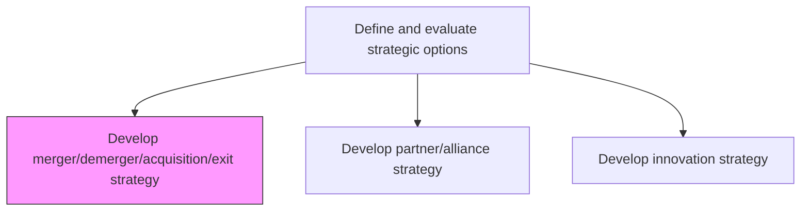
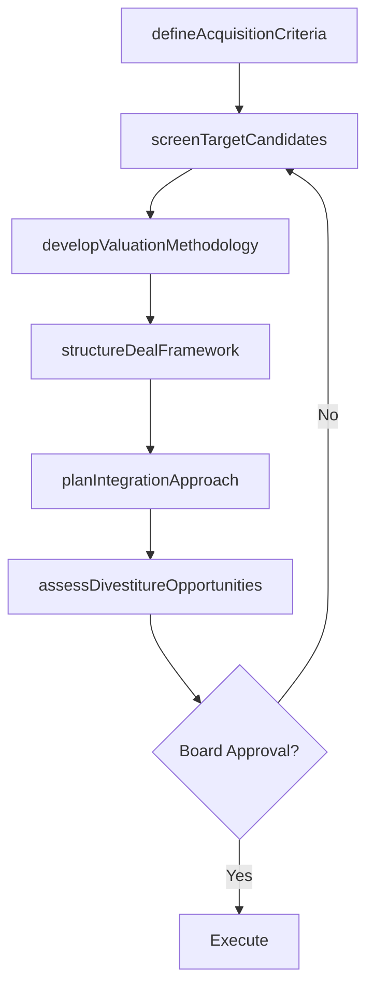

# Develop merger/demerger/acquisition/exit strategy

> Business-as-Code definition for M&A and exit strategy development. Models the framework for evaluating merger, demerger, acquisition, and divestiture opportunities to drive corporate portfolio value creation.

## Overview

Defining a strategy for corporate development. Include providing a framework for evaluating merger and acquisition candidates; and planning for a value creation through merging/demerging with a company, acquiring a company, or exiting from an already merged/acquired company. Establish target screening criteria, valuation methodologies, integration planning principles, and divestiture playbooks to ensure disciplined execution of inorganic growth and portfolio optimization.

## Process Hierarchy



## GraphDL

```yaml
develop:
  object: Merger/demerger/acquisition/exit Strategy
  actor: VP CorporateDevelopment
  result: MandAStrategyPlan
```

## Actions

| Action | Description |
|--------|-------------|
| defineAcquisitionCriteria | Establish strategic and financial criteria for evaluating M&A targets |
| screenTargetCandidates | Identify and assess potential acquisition or merger candidates |
| developValuationMethodology | Define valuation frameworks including DCF, comparables, and synergy analysis |
| planIntegrationApproach | Create integration planning principles and playbook for post-deal execution |
| assessDivestitureOpportunities | Evaluate portfolio elements for potential divestiture or spinoff |
| structureDealFramework | Design deal structures, financing approaches, and governance mechanisms |

## Events

| Event | Description |
|-------|-------------|
| acquisitionCriteriaDefined | M&A target screening criteria established and approved |
| targetCandidatesScreened | Potential acquisition or merger candidates identified and assessed |
| valuationMethodologyDeveloped | Valuation frameworks and models defined |
| integrationApproachPlanned | Post-merger integration planning principles documented |
| divestitureOpportunitiesAssessed | Portfolio elements evaluated for divestiture potential |
| dealFrameworkStructured | Deal structure and financing approach finalized |

## Searches

| Search | Description |
|--------|-------------|
| getTargetPipeline | Retrieve M&A target candidates by screening criteria and status |
| getValuationModels | Access valuation models and deal economics for candidates |
| getDivestitureCandidates | List portfolio elements flagged for potential divestiture |
| getDealHistory | Retrieve historical M&A transactions and performance outcomes |

## Process Flow



## RACI Matrix

| Activity | Responsible | Accountable | Consulted | Informed |
|----------|-------------|-------------|-----------|----------|
| defineAcquisitionCriteria | VP CorporateDevelopment | CEO | VP Strategy | BoardOfDirectors |
| screenTargetCandidates | CorporateDevelopmentAnalyst | VP CorporateDevelopment | InvestmentBanker | CFO |
| developValuationMethodology | FinancialAnalyst | CFO | VP CorporateDevelopment | Legal |
| planIntegrationApproach | IntegrationManager | VP CorporateDevelopment | HR | IT |

## Related Processes

| Process | Relationship |
|---------|-------------|
| 1.2.2 Define and evaluate strategic options | Parent - M&A is a key strategic option |
| 1.2.10 Analyze portfolio positioning | Upstream - portfolio analysis identifies M&A and divestiture needs |
| 1.1.1.9 Conduct mergers and acquisitions analysis | Related - external M&A analysis informs strategy |

## Related Departments

| Department | Role |
|-----------|------|
| Corporate Development | Leads M&A strategy, target screening, and deal execution |
| Finance | Conducts valuations and structures deal financing |
| Legal | Manages due diligence, regulatory filings, and deal documentation |
| Human Resources | Plans workforce integration and cultural alignment |

## Related Occupations

| Occupation | Involvement |
|-----------|-------------|
| VP Corporate Development | Leads M&A strategy and target pipeline management |
| Investment Banker | Advises on deal structuring and valuation |
| Integration Manager | Plans and executes post-merger integration |

## KPIs

| KPI | Description | Unit |
|-----|-------------|------|
| Deal Pipeline Value | Total estimated value of M&A targets under evaluation | USD |
| Acquisition Success Rate | Percentage of acquisitions meeting value creation targets at 3 years | % |
| Integration Completion Rate | Percentage of integration milestones completed on schedule | % |
| Time to Deal Close | Average time from target identification to deal closing | Months |

## Usage

```typescript
import { developMergerDemergerAcquisitionExitStrategy } from '@headlessly/develop-merger-demerger-acquisition-exit-strategy'

const manda = developMergerDemergerAcquisitionExitStrategy()

// Screen target candidates
const targets = await manda.screenTargetCandidates({
  criteria: { minRevenue: 50000000, industry: 'enterprise-software', geography: 'North America' },
  dealType: 'acquisition'
})

// Assess divestiture opportunities
const divestitures = await manda.assessDivestitureOpportunities({
  portfolioElements: ['legacy-hardware', 'non-core-services'],
  evaluationCriteria: ['strategic-fit', 'financial-performance', 'market-attractiveness']
})
```
