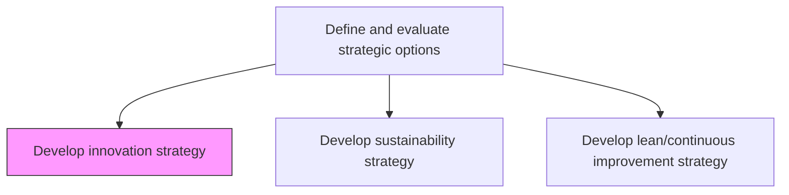
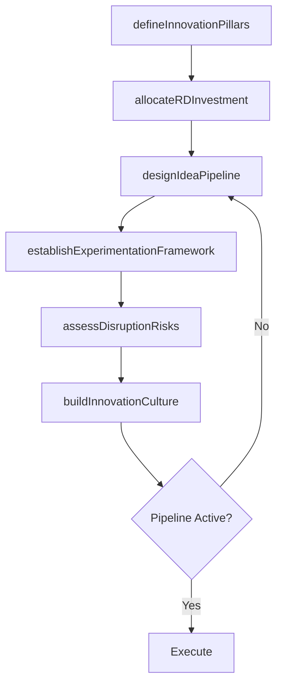

# Develop innovation strategy

> Business-as-Code definition for innovation strategy development. Models the creation of a structured approach to fostering technological advancement, business model innovation, and new value proposition development.

## Overview

Developing a plan and vision to encourage advancements in technology or services. Create a roadmap for changing or innovating the business model to make business operations more competitive. Set up new R&D services for changing or bringing new value propositions, services, production processes, and invention of technology not previously used by competitors etc. Define innovation pillars, allocate R&D investment, establish idea pipeline processes, and build a culture of experimentation and rapid prototyping.

## Process Hierarchy



## GraphDL

```yaml
develop:
  object: Innovation Strategy
  actor: ChiefInnovationOfficer
  result: InnovationStrategyPlan
```

## Actions

| Action | Description |
|--------|-------------|
| defineInnovationPillars | Identify core innovation themes aligned to strategic priorities |
| allocateRDInvestment | Determine R&D budget allocation across innovation horizons |
| designIdeaPipeline | Create processes for idea generation, evaluation, and progression |
| establishExperimentationFramework | Define rapid prototyping and testing methodologies |
| assessDisruptionRisks | Evaluate disruptive threats and opportunities across technology domains |
| buildInnovationCulture | Develop programs to foster employee creativity and intrapreneurship |

## Events

| Event | Description |
|-------|-------------|
| innovationPillarsDefined | Core innovation themes identified and approved |
| rdInvestmentAllocated | R&D budget distributed across innovation horizons |
| ideaPipelineDesigned | Idea generation and progression process established |
| experimentationFrameworkEstablished | Rapid prototyping methodology defined and deployed |
| disruptionRisksAssessed | Disruption threat and opportunity analysis completed |
| innovationCultureBuilt | Innovation culture programs launched and activated |

## Searches

| Search | Description |
|--------|-------------|
| getInnovationPipeline | Retrieve ideas and projects in the innovation pipeline by stage |
| getRDInvestments | Access R&D budget allocation and spending by innovation pillar |
| getInnovationMetrics | Retrieve innovation performance metrics and outcomes |
| getDisruptionRadar | Access disruption threat and opportunity assessments |

## Process Flow



## RACI Matrix

| Activity | Responsible | Accountable | Consulted | Informed |
|----------|-------------|-------------|-----------|----------|
| defineInnovationPillars | ChiefInnovationOfficer | CEO | VP Strategy | BoardOfDirectors |
| allocateRDInvestment | ChiefInnovationOfficer | CFO | CTO | BusinessUnitLeads |
| designIdeaPipeline | InnovationManager | ChiefInnovationOfficer | ProductTeam | Engineering |
| buildInnovationCulture | InnovationManager | ChiefInnovationOfficer | HR | AllEmployees |

## Related Processes

| Process | Relationship |
|---------|-------------|
| 1.2.2.12 Develop innovation strategy and framework | Related - operational framework complements strategic direction |
| 1.1.1.5 Assess new technology innovations | Upstream - technology assessments inform innovation priorities |
| 1.2.2 Define and evaluate strategic options | Parent - innovation is a core strategic option |

## Related Departments

| Department | Role |
|-----------|------|
| Innovation | Leads innovation strategy and pipeline management |
| Research and Development | Executes technology research and prototyping |
| Product | Translates innovation into commercial products and features |
| Engineering | Provides technical feasibility and implementation expertise |

## Related Occupations

| Occupation | Involvement |
|-----------|-------------|
| Chief Innovation Officer | Leads innovation strategy and culture development |
| Innovation Manager | Manages idea pipeline and experimentation programs |
| R&D Director | Directs research initiatives and prototype development |

## KPIs

| KPI | Description | Unit |
|-----|-------------|------|
| Innovation Revenue Share | Percentage of revenue from products launched in last 3 years | % |
| R&D Intensity | R&D spending as percentage of revenue | % |
| Idea-to-Launch Cycle Time | Average time from idea submission to market launch | Months |
| Patent Applications Filed | Number of patent applications filed per year | Count |

## Usage

```typescript
import { developInnovationStrategy } from '@headlessly/develop-innovation-strategy'

const innovation = developInnovationStrategy()

// Define innovation pillars
const pillars = await innovation.defineInnovationPillars({
  strategicPriorities: ['ai-automation', 'platform-extensibility', 'sustainability'],
  horizons: ['horizon-1-core', 'horizon-2-adjacent', 'horizon-3-transformational']
})

// Assess disruption risks
const disruptions = await innovation.assessDisruptionRisks({
  domains: ['generative-ai', 'quantum-computing', 'edge-computing'],
  timeframe: '5-years'
})
```
