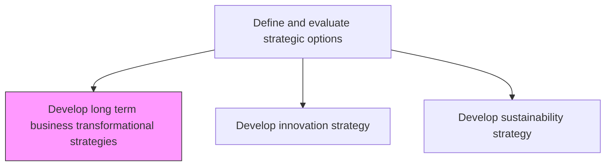
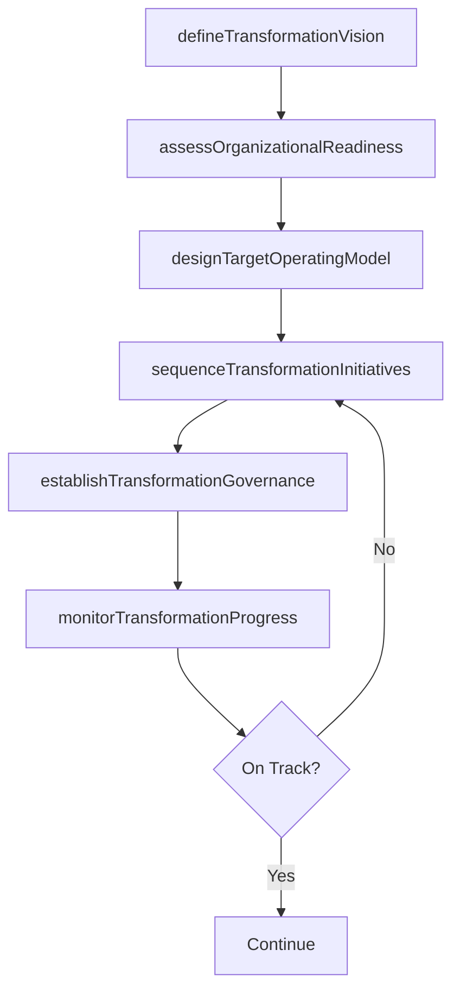

# Develop long term business transformational strategies

> Business-as-Code definition for long-term business transformation strategy development. Models the creation of multi-year strategic plans that fundamentally reshape business models, operating models, and organizational capabilities.

## Overview

Developing long-term strategic plans that drive fundamental business transformation across multiple years. Define transformation vision and themes, assess organizational readiness for change, design target operating models, sequence transformation initiatives, and establish governance to sustain momentum. Address digital transformation, operating model redesign, cultural change, and capability building to position the organization for sustained competitive advantage.

## Process Hierarchy



## GraphDL

```yaml
develop:
  object: Long Term Business Transformational Strategies
  actor: ChiefTransformationOfficer
  result: TransformationStrategyPlan
```

## Actions

| Action | Description |
|--------|-------------|
| defineTransformationVision | Articulate the long-term transformation vision and strategic themes |
| assessOrganizationalReadiness | Evaluate the organization's readiness for large-scale change |
| designTargetOperatingModel | Define the future-state operating model including processes, technology, and talent |
| sequenceTransformationInitiatives | Prioritize and sequence transformation workstreams across a multi-year roadmap |
| establishTransformationGovernance | Create governance structures for transformation oversight and decision-making |
| monitorTransformationProgress | Track transformation milestones and adjust course as needed |

## Events

| Event | Description |
|-------|-------------|
| transformationVisionDefined | Long-term transformation vision articulated and endorsed |
| organizationalReadinessAssessed | Change readiness assessment completed |
| targetOperatingModelDesigned | Future-state operating model documented and approved |
| transformationInitiativesSequenced | Multi-year transformation roadmap finalized |
| transformationGovernanceEstablished | Transformation governance structures activated |
| transformationProgressMonitored | Transformation milestone review completed |

## Searches

| Search | Description |
|--------|-------------|
| getTransformationRoadmap | Retrieve the multi-year transformation initiative roadmap |
| getReadinessAssessment | Access organizational change readiness scores and gaps |
| getTransformationMetrics | Retrieve transformation progress metrics and milestone status |
| getOperatingModelDesign | Access the target operating model documentation |

## Process Flow



## RACI Matrix

| Activity | Responsible | Accountable | Consulted | Informed |
|----------|-------------|-------------|-----------|----------|
| defineTransformationVision | ChiefTransformationOfficer | CEO | BoardOfDirectors | AllEmployees |
| assessOrganizationalReadiness | ChangeManagementLead | ChiefTransformationOfficer | HR | BusinessUnitLeads |
| designTargetOperatingModel | TransformationArchitect | ChiefTransformationOfficer | CTO | CFO |
| establishTransformationGovernance | ChiefTransformationOfficer | CEO | VP Strategy | PMO |

## Related Processes

| Process | Relationship |
|---------|-------------|
| 1.2.2 Define and evaluate strategic options | Parent - transformation strategy is a strategic option |
| 1.2.4 Create organizational design | Downstream - transformation drives organizational redesign |
| 1.2.2.7 Develop innovation strategy | Related - innovation is a key transformation enabler |

## Related Departments

| Department | Role |
|-----------|------|
| Transformation Office | Leads transformation strategy and governance |
| Strategy | Provides strategic context and alignment oversight |
| Human Resources | Manages change management and talent transformation |
| Information Technology | Enables digital transformation and technology modernization |

## Related Occupations

| Occupation | Involvement |
|-----------|-------------|
| Chief Transformation Officer | Leads transformation strategy and governance |
| Transformation Architect | Designs target operating models and initiative sequencing |
| Change Management Lead | Manages organizational readiness and adoption |

## KPIs

| KPI | Description | Unit |
|-----|-------------|------|
| Transformation Milestone Completion | Percentage of planned milestones completed on schedule | % |
| Operating Model Maturity | Progress toward target operating model implementation | Score (1-5) |
| Transformation ROI | Return on investment from transformation initiatives | % |
| Change Adoption Rate | Percentage of workforce adopting new processes and behaviors | % |

## Usage

```typescript
import { developLongTermBusinessTransformationalStrategies } from '@headlessly/develop-long-term-business-transformational-strategies'

const transformation = developLongTermBusinessTransformationalStrategies()

// Assess organizational readiness
const readiness = await transformation.assessOrganizationalReadiness({
  dimensions: ['culture', 'technology', 'talent', 'processes'],
  assessmentMethod: 'survey-and-interviews'
})

// Sequence transformation initiatives
const roadmap = await transformation.sequenceTransformationInitiatives({
  initiatives: ['digital-platform', 'agile-operating-model', 'data-driven-culture'],
  horizon: '5-years',
  dependencies: true
})
```
