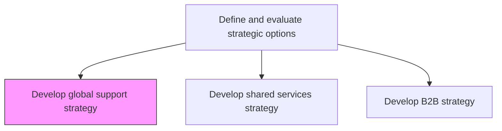
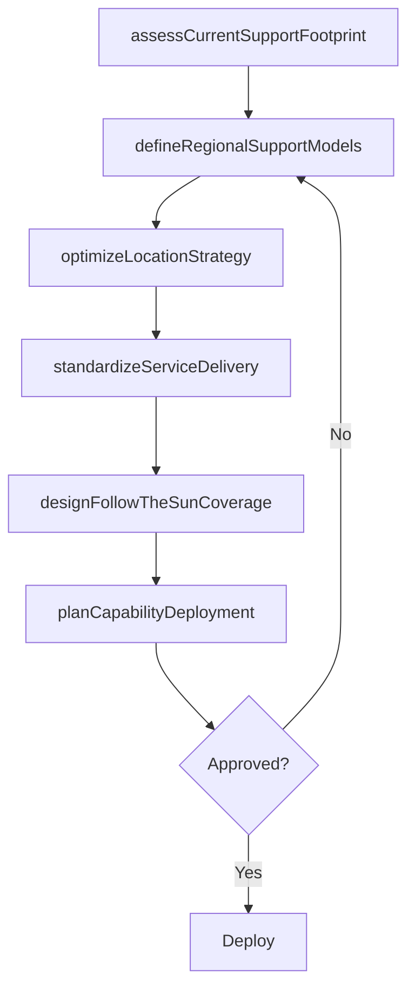

# Develop global support strategy

> Business-as-Code definition for global support strategy development. Models the planning of worldwide support service deployment, regional optimization, and cross-border operational efficiency for enterprise support functions.

## Overview

Developing a plan to deploy support services and support functions throughout the organization globally. Arrange the organizations functional support areas to create efficiencies of scale in the delivery of support services, globally. Define regional support models, establish follow-the-sun coverage, optimize location strategies for support centers, and standardize service delivery processes across geographies.

## Process Hierarchy



## GraphDL

```yaml
develop:
  object: Global Support Strategy
  actor: VP GlobalOperations
  result: GlobalSupportStrategyPlan
```

## Actions

| Action | Description |
|--------|-------------|
| assessCurrentSupportFootprint | Evaluate existing support service locations, capabilities, and performance |
| defineRegionalSupportModels | Design support delivery models tailored to each geographic region |
| optimizeLocationStrategy | Determine optimal locations for support centers based on cost, talent, and coverage |
| standardizeServiceDelivery | Create standardized processes and SLAs for global support consistency |
| designFollowTheSunCoverage | Architect round-the-clock support coverage across time zones |
| planCapabilityDeployment | Schedule rollout of support capabilities across global locations |

## Events

| Event | Description |
|-------|-------------|
| supportFootprintAssessed | Current global support footprint evaluated |
| regionalSupportModelsDefined | Regional support delivery models designed |
| locationStrategyOptimized | Support center location strategy finalized |
| serviceDeliveryStandardized | Global service delivery standards and SLAs established |
| followTheSunCoverageDesigned | Follow-the-sun coverage model architected |
| capabilityDeploymentPlanned | Global capability deployment roadmap created |

## Searches

| Search | Description |
|--------|-------------|
| getSupportLocations | Retrieve support center locations and their capabilities |
| getRegionalSLAs | Access service level agreements by region |
| getCoverageModel | Retrieve follow-the-sun coverage schedule and assignments |
| getGlobalSupportMetrics | Access global support performance metrics by region |

## Process Flow



## RACI Matrix

| Activity | Responsible | Accountable | Consulted | Informed |
|----------|-------------|-------------|-----------|----------|
| assessCurrentSupportFootprint | GlobalSupportDirector | VP GlobalOperations | RegionalManagers | Finance |
| optimizeLocationStrategy | OperationsAnalyst | VP GlobalOperations | HR | CFO |
| standardizeServiceDelivery | ProcessExcellenceManager | VP GlobalOperations | QualityAssurance | IT |
| designFollowTheSunCoverage | GlobalSupportDirector | VP GlobalOperations | RegionalManagers | CustomerSuccess |

## Related Processes

| Process | Relationship |
|---------|-------------|
| 1.2.2.10 Develop shared services strategy | Related - global support leverages shared services models |
| 1.2.2 Define and evaluate strategic options | Parent - global support is a strategic option |
| 1.2.4 Create organizational design | Downstream - global support shapes organizational structure |

## Related Departments

| Department | Role |
|-----------|------|
| Global Operations | Leads global support strategy and location optimization |
| Human Resources | Manages global talent acquisition and workforce planning |
| Information Technology | Provides global technology infrastructure and tools |
| Finance | Evaluates cost-benefit of global support configurations |

## Related Occupations

| Occupation | Involvement |
|-----------|-------------|
| VP Global Operations | Leads global support strategy development |
| Global Support Director | Manages support center operations and coverage models |
| Operations Analyst | Analyzes location economics and operational efficiency |

## KPIs

| KPI | Description | Unit |
|-----|-------------|------|
| Global Coverage Hours | Percentage of business hours covered by support services | % |
| Support Cost per Region | Average cost of support delivery per region | USD |
| Service Consistency Score | Consistency of service delivery across global locations | Score (1-10) |
| Time Zone Coverage | Number of time zones with active support presence | Count |

## Usage

```typescript
import { developGlobalSupportStrategy } from '@headlessly/develop-global-support-strategy'

const globalSupport = developGlobalSupportStrategy()

// Assess current support footprint
const footprint = await globalSupport.assessCurrentSupportFootprint({
  regions: ['North America', 'EMEA', 'APAC', 'LATAM'],
  dimensions: ['locations', 'headcount', 'capabilities', 'costs']
})

// Design follow-the-sun coverage
const coverage = await globalSupport.designFollowTheSunCoverage({
  supportTiers: ['tier-1', 'tier-2', 'tier-3'],
  targetSLA: { responseTime: '1-hour', resolutionTime: '4-hours' }
})
```
