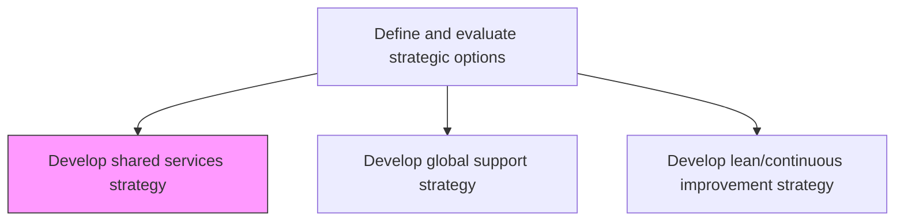
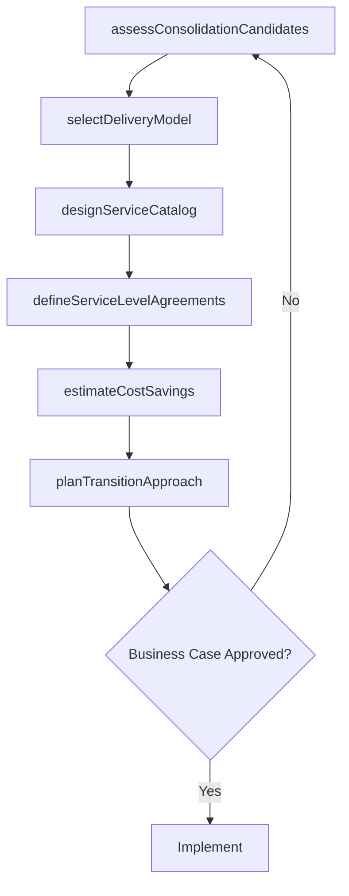

# Develop shared services strategy

> Business-as-Code definition for shared services strategy development. Models the consolidation of internal support functions into shared service centers to achieve economies of scale, process standardization, and cost efficiency.

## Overview

Charting a plan to leverage internal services and support functions throughout the organization. Delineate a framework of parameters and criteria to selectively filter service areas for inclusion among the organizations common resources. Arrange the organizations functional areas to create efficiencies of scale in the delivery of internal services. Evaluate candidate functions for consolidation, design service catalogs, define service level agreements, and plan the transition from distributed to shared delivery models.

## Process Hierarchy



## GraphDL

```yaml
develop:
  object: Shared Services Strategy
  actor: VP SharedServices
  result: SharedServicesStrategyPlan
```

## Actions

| Action | Description |
|--------|-------------|
| assessConsolidationCandidates | Evaluate internal functions for shared services consolidation potential |
| designServiceCatalog | Create a catalog of standardized services to be delivered by the shared center |
| defineServiceLevelAgreements | Establish SLAs and performance metrics for each shared service offering |
| planTransitionApproach | Design the migration plan from distributed functions to shared delivery |
| selectDeliveryModel | Choose between captive, outsourced, or hybrid shared services models |
| estimateCostSavings | Project cost reduction and efficiency gains from shared services consolidation |

## Events

| Event | Description |
|-------|-------------|
| consolidationCandidatesAssessed | Internal functions evaluated for shared services potential |
| serviceCatalogDesigned | Shared services catalog created with defined offerings |
| serviceLevelAgreementsDefined | SLAs established for each shared service |
| transitionApproachPlanned | Migration plan from distributed to shared model finalized |
| deliveryModelSelected | Shared services delivery model chosen and approved |
| costSavingsEstimated | Projected cost savings from consolidation documented |

## Searches

| Search | Description |
|--------|-------------|
| getServiceCatalog | Retrieve the shared services catalog and offerings |
| getSLAPerformance | Access SLA compliance and performance data by service |
| getConsolidationCandidates | List functions assessed for shared services migration |
| getCostSavingsProjections | Retrieve projected and realized cost savings from consolidation |

## Process Flow



## RACI Matrix

| Activity | Responsible | Accountable | Consulted | Informed |
|----------|-------------|-------------|-----------|----------|
| assessConsolidationCandidates | SharedServicesAnalyst | VP SharedServices | BusinessUnitLeads | CFO |
| designServiceCatalog | SharedServicesManager | VP SharedServices | ProcessOwners | IT |
| defineServiceLevelAgreements | SharedServicesManager | VP SharedServices | BusinessUnitLeads | Finance |
| estimateCostSavings | FinancialAnalyst | CFO | VP SharedServices | CEO |

## Related Processes

| Process | Relationship |
|---------|-------------|
| 1.2.2.9 Develop global support strategy | Related - shared services may be deployed globally |
| 1.2.2 Define and evaluate strategic options | Parent - shared services is a strategic option |
| 1.2.3 Coordinate and align functional and process strategies | Downstream - shared services reshape functional strategies |

## Related Departments

| Department | Role |
|-----------|------|
| Shared Services | Leads strategy development and service center operations |
| Finance | Provides cost-benefit analysis and financial modeling |
| Human Resources | Manages workforce transition and talent redeployment |
| Information Technology | Provides technology platform for shared service delivery |

## Related Occupations

| Occupation | Involvement |
|-----------|-------------|
| VP Shared Services | Leads shared services strategy and implementation |
| Shared Services Manager | Manages service catalog and SLA compliance |
| Process Excellence Specialist | Standardizes processes for shared service delivery |

## KPIs

| KPI | Description | Unit |
|-----|-------------|------|
| Cost per Transaction | Average cost to deliver a shared service transaction | USD |
| SLA Compliance Rate | Percentage of services meeting agreed service levels | % |
| Consolidation Savings | Realized cost savings from function consolidation | USD |
| Customer Satisfaction | Internal customer satisfaction with shared services | Score (1-10) |

## Usage

```typescript
import { developSharedServicesStrategy } from '@headlessly/develop-shared-services-strategy'

const sharedServices = developSharedServicesStrategy()

// Assess consolidation candidates
const candidates = await sharedServices.assessConsolidationCandidates({
  functions: ['finance-accounting', 'hr-operations', 'it-service-desk', 'procurement'],
  criteria: ['transaction-volume', 'standardization-potential', 'cost-savings']
})

// Define service level agreements
const slas = await sharedServices.defineServiceLevelAgreements({
  serviceId: 'accounts-payable',
  metrics: ['processing-time', 'accuracy-rate', 'customer-satisfaction'],
  targets: { processingTime: '48-hours', accuracyRate: 0.995 }
})
```
