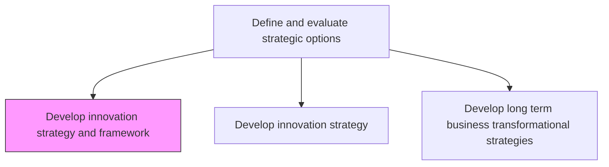
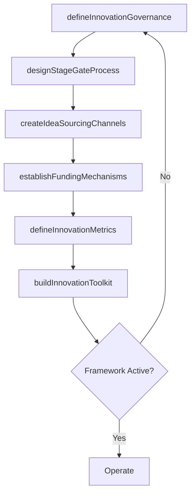

# Develop innovation strategy and framework

> Business-as-Code definition for innovation strategy and framework development. Models the creation of a comprehensive innovation management system including governance structures, stage-gate processes, funding mechanisms, and performance measurement for systematic innovation delivery.

## Overview

Developing a plan and vision to encourage advancements in technology or product/services. Create a roadmap for changing or innovating the business model to make business operations more competitive. Set up new R&D services for changing or bringing new value propositions, services, production processes, and invention of technology not previously used by competitors etc. Establish the operational framework that governs how innovation ideas are sourced, evaluated, funded, developed, and commercialized.

## Process Hierarchy



## GraphDL

```yaml
develop:
  object: Innovation Strategy And Framework
  actor: ChiefInnovationOfficer
  result: InnovationFrameworkDocument
```

## Actions

| Action | Description |
|--------|-------------|
| defineInnovationGovernance | Establish governance bodies, decision rights, and review cadence for innovation |
| designStageGateProcess | Create a structured stage-gate process for idea progression from concept to launch |
| establishFundingMechanisms | Define innovation funding models including venture-style, milestone-based, and budget allocation |
| createIdeaSourcingChannels | Build channels for sourcing ideas from employees, customers, and external partners |
| defineInnovationMetrics | Establish KPIs and measurement frameworks for innovation portfolio performance |
| buildInnovationToolkit | Curate methodologies, tools, and templates for innovation teams |

## Events

| Event | Description |
|-------|-------------|
| innovationGovernanceDefined | Innovation governance structure and decision rights established |
| stageGateProcessDesigned | Stage-gate process for innovation progression documented |
| fundingMechanismsEstablished | Innovation funding models defined and approved |
| ideaSourcingChannelsCreated | Idea sourcing channels activated and operational |
| innovationMetricsDefined | Innovation performance measurement framework established |
| innovationToolkitBuilt | Innovation methodology toolkit curated and deployed |

## Searches

| Search | Description |
|--------|-------------|
| getInnovationFramework | Retrieve the current innovation framework documentation |
| getStageGateStatus | Access stage-gate pipeline status for active innovation projects |
| getInnovationFunding | Retrieve innovation budget allocation and spending data |
| getIdeaPipeline | List sourced ideas by channel, status, and evaluation score |

## Process Flow



## RACI Matrix

| Activity | Responsible | Accountable | Consulted | Informed |
|----------|-------------|-------------|-----------|----------|
| defineInnovationGovernance | ChiefInnovationOfficer | CEO | VP Strategy | BoardOfDirectors |
| designStageGateProcess | InnovationManager | ChiefInnovationOfficer | ProductTeam | Engineering |
| establishFundingMechanisms | InnovationManager | CFO | ChiefInnovationOfficer | Finance |
| defineInnovationMetrics | InnovationAnalyst | ChiefInnovationOfficer | Strategy | BusinessUnitLeads |

## Related Processes

| Process | Relationship |
|---------|-------------|
| 1.2.2.7 Develop innovation strategy | Upstream - strategic direction guides framework design |
| 1.2.2 Define and evaluate strategic options | Parent - innovation framework is a strategic option |
| 1.3.1 Evaluate strategic initiatives | Downstream - innovation projects become strategic initiatives |

## Related Departments

| Department | Role |
|-----------|------|
| Innovation | Leads framework design and operational management |
| Research and Development | Primary user of the innovation framework for project execution |
| Finance | Manages innovation funding mechanisms and budget allocation |
| Product | Translates innovation outputs into product roadmap items |

## Related Occupations

| Occupation | Involvement |
|-----------|-------------|
| Chief Innovation Officer | Architects the innovation framework and governance model |
| Innovation Manager | Operates the stage-gate process and idea pipeline |
| R&D Program Manager | Executes innovation projects within the framework |

## KPIs

| KPI | Description | Unit |
|-----|-------------|------|
| Stage-Gate Conversion Rate | Percentage of ideas progressing through each stage gate | % |
| Innovation Portfolio Balance | Distribution of projects across innovation horizons | % |
| Time to Market | Average time from idea approval to market launch | Months |
| Innovation Spend Efficiency | Revenue generated per dollar of innovation investment | Ratio |

## Usage

```typescript
import { developInnovationStrategyAndFramework } from '@headlessly/develop-innovation-strategy-and-framework'

const framework = developInnovationStrategyAndFramework()

// Design stage-gate process
const stageGate = await framework.designStageGateProcess({
  stages: ['ideation', 'concept', 'feasibility', 'development', 'launch'],
  gates: ['strategic-fit', 'business-case', 'technical-review', 'market-readiness'],
  reviewCadence: 'monthly'
})

// Create idea sourcing channels
const channels = await framework.createIdeaSourcingChannels({
  sources: ['employee-portal', 'customer-feedback', 'hackathons', 'partner-ecosystem'],
  evaluationCriteria: ['novelty', 'feasibility', 'strategic-alignment', 'market-potential']
})
```
