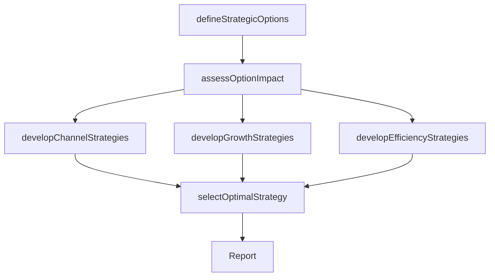

# Define and evaluate strategic options to achieve the objectives

> Business-as-Code definition for strategic option development and evaluation. Models the identification, assessment, and selection of strategic alternatives across B2B, B2C, partnership, M&A, innovation, sustainability, and transformation dimensions.

## Overview

Assessing sets of strategic decisions designed to drive the organization's long-term objectives. Identify various strategies concerning core functional areas. Appraise strategic options in light of auxiliary decision frameworks that ensure smooth functioning, the advancement of functional efficiencies, and vitality. Involve senior management executives, especially strategy and/or business unit personnel, with need-based consultative assistance from professional services providers.

## Process Hierarchy

```mermaid
graph TD
    A[Define and evaluate strategic options to achieve the objectives]
    A --> B[Define strategic options]
    A --> C[Assess and analyze impact of each option]
    A --> D[Develop B2B strategy]
    A --> E[Develop B2C strategy]
    A --> F[Develop partner/alliance strategy]
    A --> G[Develop merger/demerger/acquisition/exit strategy]
    A --> H[Develop innovation strategy]
    A --> I[Develop sustainability strategy]
    A --> J[Develop global support strategy]
    A --> K[Develop shared services strategy]
    A --> L[Develop lean/continuous improvement strategy]
    A --> M[Develop innovation strategy and framework]
    A --> N[Develop long term business transformational strategies]
```



## GraphDL

```yaml
define:
  object: And Evaluate Strategic Options To Achieve Objectives
  actor: VP Strategy
  result: StrategicOptionsPortfolio
```

## Actions

| Action | Description |
|--------|-------------|
| defineStrategicOptions | Identify and catalog the full range of strategic alternatives |
| assessOptionImpact | Evaluate the financial, operational, and market impact of each option |
| developChannelStrategies | Formulate B2B, B2C, and partner/alliance strategies |
| developGrowthStrategies | Define M&A, innovation, and business transformation approaches |
| developEfficiencyStrategies | Chart shared services, lean, and continuous improvement paths |
| selectOptimalStrategy | Rank and select the strategic options that best achieve objectives |

## Events

| Event | Description |
|-------|-------------|
| strategicOptionsDefined | Full range of strategic alternatives cataloged |
| optionImpactAssessed | Impact analysis completed for all strategic options |
| channelStrategiesDeveloped | B2B, B2C, and partnership strategies formulated |
| growthStrategiesDeveloped | M&A, innovation, and transformation strategies created |
| efficiencyStrategiesDeveloped | Shared services and continuous improvement strategies charted |
| optimalStrategySelected | Best-fit strategic options ranked and selected |

## Searches

| Search | Description |
|--------|-------------|
| getStrategicOptions | Retrieve all defined strategic options with evaluation scores |
| getOptionImpactAnalysis | Access impact analysis results for a specific strategic option |
| getSelectedStrategy | Retrieve the selected optimal strategy and rationale |
| getStrategyByType | Filter strategies by type (B2B, B2C, M&A, innovation, etc.) |

## Process Flow



## RACI Matrix

| Activity | Responsible | Accountable | Consulted | Informed |
|----------|-------------|-------------|-----------|----------|
| defineStrategicOptions | StrategyAnalyst | VP Strategy | BusinessUnitLeads | CEO |
| assessOptionImpact | StrategyAnalyst | VP Strategy | CFO | COO |
| developChannelStrategies | VP Strategy | CEO | Marketing | Sales |
| developGrowthStrategies | CorporateDevelopmentManager | CEO | CFO | BoardOfDirectors |
| selectOptimalStrategy | VP Strategy | CEO | ExecutiveTeam | BoardOfDirectors |

## Sub-Processes

| ID | Name | Description |
|----|------|-------------|
| 1.2.2.1 | Define strategic options | Defining the various options available to achieve the goals highlighted in the mission statement. De |
| 1.2.2.2 | Assess and analyze impact of each option | Scoping and probing to study the impact of strategic options for fulfilling the organization's objec |
| 1.2.2.3 | Develop B2B strategy | Defining a long term plan of action and roadmap to achieve business to business objectives and goals |
| 1.2.2.4 | Develop B2C strategy | Defining a long term plan of action and roadmap to achieve business to consumer objectives and goals |
| 1.2.2.5 | Develop partner/alliance strategy | Defining direction and plan objectives for partnering with other companies to deliver product/servic |
| 1.2.2.6 | Develop merger/demerger/acquisition/exit strategy | Defining a strategy for corporate development. Include providing a framework for evaluating merger a |
| 1.2.2.7 | Develop innovation strategy | Developing a plan and vision to encourage advancements in technology or services. Create a roadmap f |
| 1.2.2.8 | Develop sustainability strategy | Formulating strategic options that create opportunities for the sustenance and prosperity of the bus |
| 1.2.2.9 | Develop global support strategy | Developing a plan to deploy support services and support functions throughout the organization globa |
| 1.2.2.10 | Develop shared services strategy | Charting a plan to leverage internal services and support functions throughout the organization. Del |
| 1.2.2.11 | Develop lean/continuous improvement strategy | Developing strategies for the optimization of processes and the improvement of functional areas in o |
| 1.2.2.12 | Develop innovation strategy and framework | Developing a plan and vision to encourage advancements in technology or product/services. Create a r |
| 1.2.2.13 | Develop long term business transformational strategies | Charting a multi-year course for fundamental organizational transformation. Define the scope, timeli |

## Related Processes

| Process | Relationship |
|---------|-------------|
| 1.2.1 Develop overall mission statement | Upstream - mission guides strategic option selection |
| 1.2.3 Coordinate and align functional and process strategies | Downstream - selected strategies require functional alignment |
| 1.1.1 Assess the external environment | Upstream - external analysis informs strategic options |
| 1.1.3 Assess the internal environment | Upstream - internal capabilities constrain option feasibility |

## Related Departments

| Department | Role |
|-----------|------|
| Strategy | Leads strategic option definition and evaluation |
| Finance | Provides financial impact analysis for each option |
| Corporate Development | Develops M&A and partnership strategies |
| Operations | Assesses operational feasibility of strategic options |
| Marketing | Contributes market and channel strategy insights |

## Related Occupations

| Occupation | Involvement |
|-----------|-------------|
| VP Strategy | Leads strategic option evaluation and selection |
| Strategy Analyst | Conducts impact analysis and option modeling |
| Corporate Development Manager | Develops M&A and partnership strategies |
| CFO | Validates financial feasibility of strategic options |

## KPIs

| KPI | Description | Unit |
|-----|-------------|------|
| Options Evaluated | Number of strategic options formally evaluated per planning cycle | Count |
| Strategy Selection Time | Time from option identification to final selection | Weeks |
| Strategy Execution Rate | Percentage of selected strategies that proceed to implementation | % |
| Strategic Fit Score | Average alignment score of selected strategies with mission | Score (1-10) |

## Usage

```typescript
import { defineAndEvaluateStrategicOptionsToAchieveObjectives } from '@headlessly/define-and-evaluate-strategic-options-to-achieve-objectives'

const options = defineAndEvaluateStrategicOptionsToAchieveObjectives()

// Define strategic options
const strategicOptions = await options.defineStrategicOptions({
  missionId: 'current-mission',
  categories: ['B2B', 'B2C', 'partnership', 'M&A', 'innovation', 'sustainability']
})

// Assess impact of each option
const impact = await options.assessOptionImpact({
  optionIds: strategicOptions.map(o => o.id),
  dimensions: ['financial', 'operational', 'market', 'risk']
})
```
