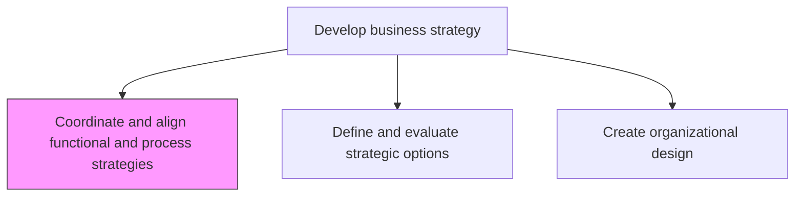
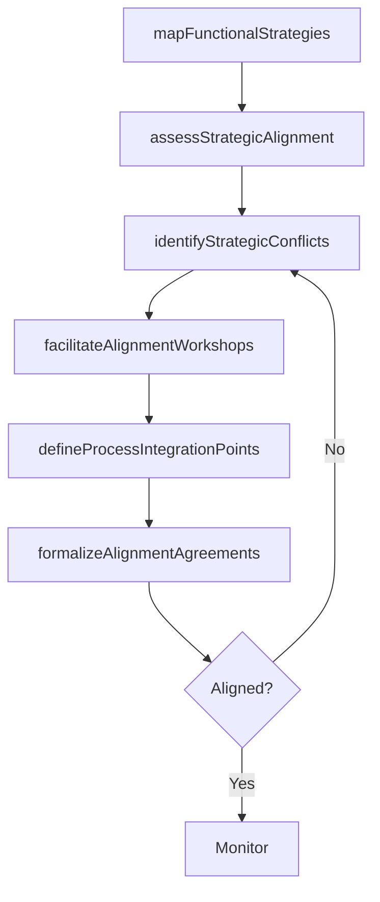

# Coordinate and align functional and process strategies

> Business-as-Code definition for functional and process strategy coordination. Models the alignment of departmental strategies, cross-functional processes, and operational plans with the overarching business strategy.

## Overview

Aligning the approach and method of individual units, departments, systems, and operations within the organization, in accordance with the larger strategic course adopted. Employ the organization's strategic path to guide the functions, divisions, and operations. Calibrate the plan and method of each functional area, as well as the processes therein, to Select the long-term business strategy [10039]. Facilitate cross-functional alignment workshops, resolve strategic conflicts between departments, and ensure that functional strategies collectively deliver corporate objectives.

## Process Hierarchy



## GraphDL

```yaml
coordinate:
  object: And Align Functional And Process Strategies
  actor: VP Strategy
  result: FunctionalAlignmentPlan
```

## Actions

| Action | Description |
|--------|-------------|
| mapFunctionalStrategies | Document the strategic plans of each functional area and department |
| assessStrategicAlignment | Evaluate the degree of alignment between functional strategies and corporate objectives |
| identifyStrategicConflicts | Detect misalignments, resource conflicts, or gaps between functional strategies |
| facilitateAlignmentWorkshops | Conduct cross-functional workshops to resolve conflicts and establish shared priorities |
| defineProcessIntegrationPoints | Identify critical handoffs and integration points across functional processes |
| formalizeAlignmentAgreements | Document agreed alignment commitments and coordination mechanisms |

## Events

| Event | Description |
|-------|-------------|
| functionalStrategiesMapped | All functional strategy documents collected and cataloged |
| strategicAlignmentAssessed | Cross-functional alignment evaluation completed |
| strategicConflictsIdentified | Misalignments and resource conflicts documented |
| alignmentWorkshopCompleted | Cross-functional alignment workshop conducted |
| processIntegrationPointsDefined | Critical cross-functional handoffs documented |
| alignmentAgreementsFormalized | Alignment commitments and coordination mechanisms established |

## Searches

| Search | Description |
|--------|-------------|
| getFunctionalStrategies | Retrieve functional strategy documents by department |
| getAlignmentScore | Access alignment score between functional and corporate strategies |
| getStrategicConflicts | List identified strategic conflicts and their resolution status |
| getIntegrationPoints | Retrieve cross-functional process integration points |

## Process Flow



## RACI Matrix

| Activity | Responsible | Accountable | Consulted | Informed |
|----------|-------------|-------------|-----------|----------|
| mapFunctionalStrategies | StrategyAnalyst | VP Strategy | FunctionalLeads | CEO |
| assessStrategicAlignment | VP Strategy | CEO | FunctionalLeads | BoardOfDirectors |
| facilitateAlignmentWorkshops | StrategyFacilitator | VP Strategy | AllDepartmentHeads | HR |
| formalizeAlignmentAgreements | VP Strategy | CEO | FunctionalLeads | Finance |

## Related Processes

| Process | Relationship |
|---------|-------------|
| 1.2.2 Define and evaluate strategic options | Upstream - selected strategy guides functional alignment |
| 1.2.5 Develop and set organizational goals | Downstream - aligned strategies inform goal setting |
| 1.2.6 Formulate business unit strategies | Parallel - BU strategies must align with functional strategies |

## Related Departments

| Department | Role |
|-----------|------|
| Strategy | Leads cross-functional alignment and conflict resolution |
| All Functional Areas | Contribute functional strategies and participate in alignment |
| Human Resources | Ensures organizational capability supports aligned strategies |
| Finance | Validates resource allocation across aligned functional plans |

## Related Occupations

| Occupation | Involvement |
|-----------|-------------|
| VP Strategy | Leads strategic alignment and coordination efforts |
| Strategy Analyst | Documents functional strategies and alignment assessments |
| Organization Development Consultant | Facilitates cross-functional workshops |

## KPIs

| KPI | Description | Unit |
|-----|-------------|------|
| Strategic Alignment Score | Degree of alignment between functional and corporate strategies | Score (1-10) |
| Conflict Resolution Rate | Percentage of identified strategic conflicts resolved | % |
| Cross-Functional Integration | Number of formalized cross-functional integration points | Count |
| Alignment Review Frequency | How often functional alignment is formally reviewed | Per Year |

## Usage

```typescript
import { coordinateAndAlignFunctionalAndProcessStrategies } from '@headlessly/coordinate-and-align-functional-and-process-strategies'

const alignment = coordinateAndAlignFunctionalAndProcessStrategies()

// Assess strategic alignment across functions
const scores = await alignment.assessStrategicAlignment({
  functions: ['marketing', 'sales', 'product', 'engineering', 'operations'],
  corporateStrategyId: 'strategy-2025'
})

// Identify strategic conflicts
const conflicts = await alignment.identifyStrategicConflicts({
  alignmentAssessmentId: scores.id,
  severity: 'high'
})
```
