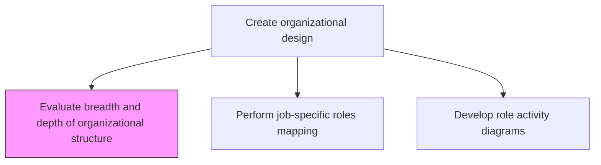
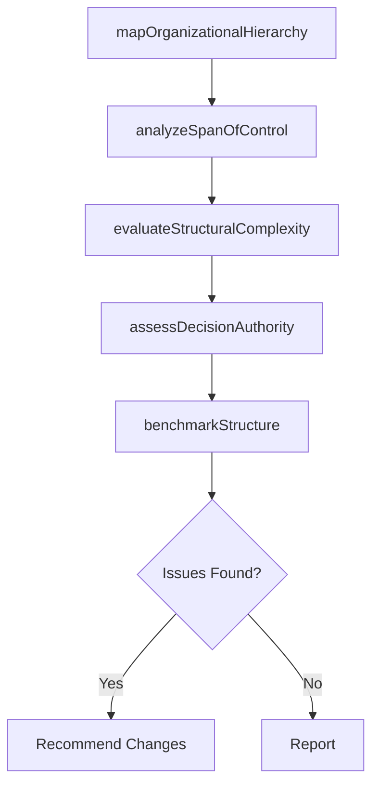

# Evaluate breadth and depth of organizational structure

> Business-as-Code definition for organizational structure evaluation. Models the assessment of organizational breadth, hierarchy depth, span of control, and structural synergies to determine optimal organizational architecture.

## Overview

Evaluating the structural makeup of the organization, including pertinent features of and associated synergies among constituent elements. Examine the organization's architectural framework, paying close attention to the individual elements, the relations among them, and the conjoint and co-acting forces therein. Analyze functions and processes, as well as work-related positions. Scrutinize various relevant characteristics associated with each of them, depending upon the scale, scope, and type of organization.

## Process Hierarchy



## GraphDL

```yaml
evaluate:
  object: Breadth And Depth Of Organizational Structure
  actor: OrganizationDesignConsultant
  result: OrganizationalStructureAssessment
```

## Actions

| Action | Description |
|--------|-------------|
| mapOrganizationalHierarchy | Document current organizational hierarchy, reporting lines, and layers |
| analyzeSpanOfControl | Assess manager-to-employee ratios across the organization |
| evaluateStructuralComplexity | Measure the number of organizational layers, divisions, and functional silos |
| assessDecisionAuthority | Map decision-making authority and escalation paths across the structure |
| benchmarkStructure | Compare organizational structure against industry peers and best practices |

## Events

| Event | Description |
|-------|-------------|
| organizationalHierarchyMapped | Current organizational hierarchy documented |
| spanOfControlAnalyzed | Manager-to-employee ratios assessed across units |
| structuralComplexityEvaluated | Organizational layers and silos measured and documented |
| decisionAuthorityAssessed | Decision-making authority map completed |
| structureBenchmarked | Structural benchmarking against peers completed |

## Searches

| Search | Description |
|--------|-------------|
| getOrganizationalChart | Retrieve current organizational hierarchy and reporting structure |
| getSpanOfControlMetrics | Access span of control ratios by department and level |
| getStructuralBenchmarks | Retrieve structural benchmarking results against industry peers |

## Process Flow



## RACI Matrix

| Activity | Responsible | Accountable | Consulted | Informed |
|----------|-------------|-------------|-----------|----------|
| mapOrganizationalHierarchy | OrganizationDesignConsultant | CHRO | DepartmentHeads | CEO |
| analyzeSpanOfControl | HRAnalyst | CHRO | Managers | VP Strategy |
| evaluateStructuralComplexity | OrganizationDesignConsultant | CHRO | VP Strategy | BoardOfDirectors |

## Related Processes

| Process | Relationship |
|---------|-------------|
| 1.2.4.2 Perform job-specific roles mapping and value-added analyses | Downstream - structure evaluation feeds role mapping |
| 1.2.4.4 Perform organization redesign workshops | Downstream - findings inform redesign workshops |
| 1.2.4 Create organizational design | Parent - structure evaluation is the first step in org design |

## Related Departments

| Department | Role |
|-----------|------|
| Human Resources | Leads organizational structure analysis and benchmarking |
| Strategy | Provides strategic context for structural assessment |
| Finance | Evaluates cost implications of structural configurations |

## Related Occupations

| Occupation | Involvement |
|-----------|-------------|
| Organization Design Consultant | Conducts structural assessments and benchmarking |
| HR Analyst | Gathers workforce data and span of control metrics |
| CHRO | Sponsors organizational structure evaluation |

## KPIs

| KPI | Description | Unit |
|-----|-------------|------|
| Span of Control Ratio | Average number of direct reports per manager | Ratio |
| Organizational Layers | Number of hierarchical levels from CEO to front line | Count |
| Decision Cycle Time | Average time for decisions to traverse the hierarchy | Days |
| Structural Overhead Ratio | Management and overhead costs as percentage of total payroll | % |

## Usage

```typescript
import { evaluateBreadthAndDepthOfOrganizationalStructure } from '@headlessly/evaluate-breadth-and-depth-of-organizational-structure'

const orgStructure = evaluateBreadthAndDepthOfOrganizationalStructure()

// Analyze span of control across the organization
const spanAnalysis = await orgStructure.analyzeSpanOfControl({
  scope: 'enterprise-wide',
  granularity: 'department',
  benchmarkSource: 'industry-median'
})

// Evaluate structural complexity
const complexity = await orgStructure.evaluateStructuralComplexity({
  dimensions: ['layers', 'divisions', 'shared-services', 'matrix-relationships'],
  comparisonPeriod: 'year-over-year'
})
```
