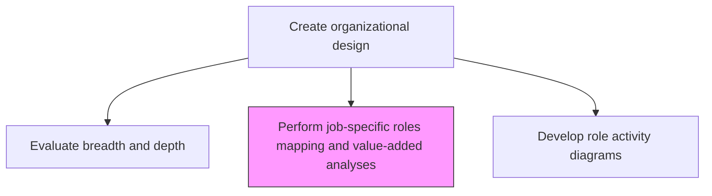
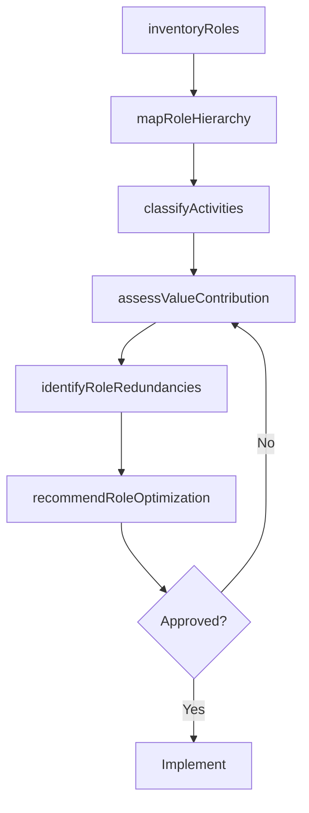

# Perform job-specific roles mapping and value-added analyses

> Business-as-Code definition for job-specific roles mapping and value-added analysis. Models the systematic mapping of organizational roles, their activities, and the value each contributes to the overall operation.

## Overview

Appraising job-specific roles within the organizational chart and their hierarchical architecture. Analyze a map of work-related roles within the organizational structure. Examine the value added by the positions associated with jobs to be performed and how they stack up within the organization's operations. Classify activities as value-adding, necessary non-value-adding, or waste to inform organizational redesign.

## Process Hierarchy



## GraphDL

```yaml
perform:
  object: Job-specific Roles Mapping And Value-added Analyses
  actor: OrganizationDesignConsultant
  result: RoleMappingReport
```

## Actions

| Action | Description |
|--------|-------------|
| inventoryRoles | Catalog all job-specific roles across the organization with descriptions and requirements |
| mapRoleHierarchy | Document reporting relationships and role dependencies within each function |
| classifyActivities | Categorize role activities as value-adding, support, or non-value-adding |
| assessValueContribution | Quantify the value contribution of each role to organizational outcomes |
| identifyRoleRedundancies | Detect overlapping responsibilities and duplicated roles across departments |
| recommendRoleOptimization | Propose role consolidation, elimination, or enhancement based on value analysis |

## Events

| Event | Description |
|-------|-------------|
| rolesInventoried | Complete role catalog documented across the organization |
| roleHierarchyMapped | Role reporting relationships and dependencies documented |
| activitiesClassified | Role activities categorized by value contribution |
| valueContributionAssessed | Quantitative value assessment completed for each role |
| roleRedundanciesIdentified | Overlapping and duplicate roles detected |
| roleOptimizationRecommended | Role optimization proposals documented and prioritized |

## Searches

| Search | Description |
|--------|-------------|
| getRoleCatalog | Retrieve the complete role inventory by department and function |
| getValueAnalysis | Access value-added analysis results by role or department |
| getRoleRedundancies | List identified role overlaps and redundancies |
| getRoleOptimizationPlans | Retrieve recommended role changes and consolidation plans |

## Process Flow



## RACI Matrix

| Activity | Responsible | Accountable | Consulted | Informed |
|----------|-------------|-------------|-----------|----------|
| inventoryRoles | HRAnalyst | CHRO | DepartmentHeads | Finance |
| classifyActivities | OrganizationDesignConsultant | CHRO | ProcessOwners | VP Strategy |
| assessValueContribution | OrganizationDesignConsultant | CHRO | Finance | CEO |

## Related Processes

| Process | Relationship |
|---------|-------------|
| 1.2.4.1 Evaluate breadth and depth of organizational structure | Upstream - structural evaluation precedes role mapping |
| 1.2.4.3 Develop role activity diagrams to assess hand-off activity | Downstream - role mapping feeds activity diagram development |
| 1.2.4.7 Assess organizational implication of feasible alternatives | Downstream - value analysis informs impact assessment |

## Related Departments

| Department | Role |
|-----------|------|
| Human Resources | Leads role mapping and value analysis |
| Strategy | Provides strategic context for value assessment |
| Finance | Quantifies cost and value contribution of roles |

## Related Occupations

| Occupation | Involvement |
|-----------|-------------|
| Organization Design Consultant | Conducts role mapping and value-added analysis |
| HR Analyst | Gathers role data and maintains role catalog |
| Process Analyst | Classifies activities by value contribution |

## KPIs

| KPI | Description | Unit |
|-----|-------------|------|
| Role Coverage | Percentage of organizational roles mapped and analyzed | % |
| Value-Added Activity Ratio | Proportion of role activities classified as value-adding | % |
| Role Redundancy Rate | Percentage of roles with significant overlap | % |
| Optimization Implementation Rate | Percentage of recommended role changes implemented | % |

## Usage

```typescript
import { performJobSpecificRolesMappingAndValueAddedAnalyses } from '@headlessly/perform-job-specific-roles-mapping-and-value-added-analyses'

const roleMapping = performJobSpecificRolesMappingAndValueAddedAnalyses()

// Classify activities by value contribution
const classification = await roleMapping.classifyActivities({
  department: 'operations',
  categories: ['value-adding', 'necessary-support', 'non-value-adding'],
  methodology: 'lean-value-stream'
})

// Identify role redundancies
const redundancies = await roleMapping.identifyRoleRedundancies({
  scope: 'enterprise-wide',
  overlapThreshold: 0.6
})
```
