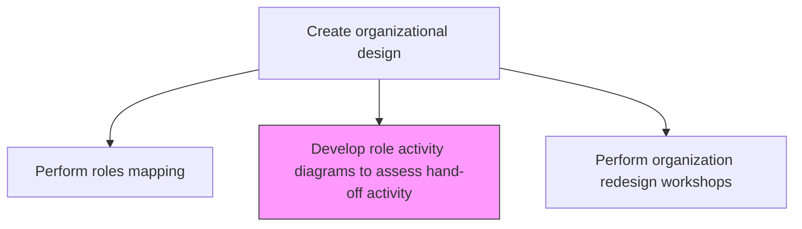
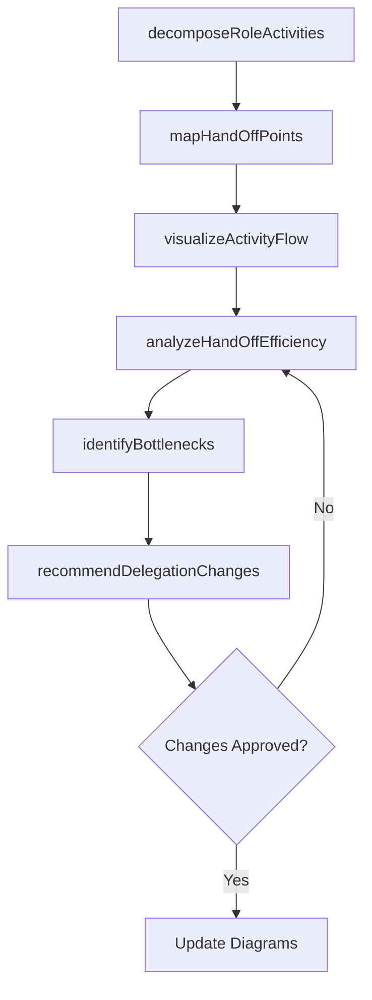

# Develop role activity diagrams to assess hand-off activity

> Business-as-Code definition for role activity diagram development. Models the decomposition of job roles into discrete activities and the visualization of hand-off points between roles to optimize delegation and workflow efficiency.

## Overview

Examining the constituent exercises and undertakings within a work-related position for the purpose of effective delegation. Deconstruct job-specific roles into activities and visualize the relations among them, with the objective of assigning responsibilities to the appropriate personnel. Identify hand-off points, bottlenecks, and unnecessary transfers of work between roles to streamline workflows and reduce cycle times.

## Process Hierarchy



## GraphDL

```yaml
develop:
  object: Role Activity Diagrams To Assess Hand-off Activity
  actor: ProcessAnalyst
  result: RoleActivityDiagramSet
```

## Actions

| Action | Description |
|--------|-------------|
| decomposeRoleActivities | Break down each role into its discrete constituent activities |
| mapHandOffPoints | Identify all points where work is transferred between roles |
| visualizeActivityFlow | Create role activity diagrams showing activity sequences and hand-offs |
| analyzeHandOffEfficiency | Assess the efficiency and necessity of each hand-off point |
| identifyBottlenecks | Detect workflow bottlenecks caused by excessive or inefficient hand-offs |
| recommendDelegationChanges | Propose changes to activity assignments to optimize hand-off efficiency |

## Events

| Event | Description |
|-------|-------------|
| roleActivitiesDecomposed | Role activities broken down and documented |
| handOffPointsMapped | Work transfer points between roles identified |
| activityFlowVisualized | Role activity diagrams created and validated |
| handOffEfficiencyAnalyzed | Hand-off efficiency assessment completed |
| bottlenecksIdentified | Workflow bottlenecks documented |
| delegationChangesRecommended | Activity reassignment proposals documented |

## Searches

| Search | Description |
|--------|-------------|
| getRoleActivityDiagrams | Retrieve role activity diagrams by process or department |
| getHandOffAnalysis | Access hand-off efficiency analysis results |
| getBottleneckReport | Retrieve identified workflow bottlenecks and their impact |

## Process Flow



## RACI Matrix

| Activity | Responsible | Accountable | Consulted | Informed |
|----------|-------------|-------------|-----------|----------|
| decomposeRoleActivities | ProcessAnalyst | CHRO | RoleIncumbents | DepartmentHeads |
| mapHandOffPoints | ProcessAnalyst | VP Operations | ProcessOwners | HR |
| analyzeHandOffEfficiency | ProcessAnalyst | VP Operations | LeanPractitioner | Finance |

## Related Processes

| Process | Relationship |
|---------|-------------|
| 1.2.4.2 Perform job-specific roles mapping | Upstream - role mapping provides input for activity decomposition |
| 1.2.4.6 Develop role analysis and activity diagrams for key processes | Related - complementary diagram development for key processes |
| 1.2.4.4 Perform organization redesign workshops | Downstream - diagrams inform redesign discussions |

## Related Departments

| Department | Role |
|-----------|------|
| Human Resources | Provides role definitions and workforce data |
| Operations | Identifies critical processes for hand-off analysis |
| Process Excellence | Applies lean methodology to hand-off optimization |

## Related Occupations

| Occupation | Involvement |
|-----------|-------------|
| Process Analyst | Creates role activity diagrams and analyzes hand-offs |
| Lean Practitioner | Identifies waste in hand-off activities |
| Organization Design Consultant | Recommends delegation and structural changes |

## KPIs

| KPI | Description | Unit |
|-----|-------------|------|
| Hand-Off Count | Number of work transfer points per process | Count |
| Hand-Off Cycle Time | Average time spent in hand-off transitions | Hours |
| Bottleneck Reduction | Percentage decrease in identified bottlenecks | % |
| Diagram Coverage | Percentage of key processes with current role activity diagrams | % |

## Usage

```typescript
import { developRoleActivityDiagramsToAssessHandOffActivity } from '@headlessly/develop-role-activity-diagrams-to-assess-hand-off-activity'

const diagrams = developRoleActivityDiagramsToAssessHandOffActivity()

// Map hand-off points for a process
const handOffs = await diagrams.mapHandOffPoints({
  processId: 'order-to-cash',
  roles: ['sales-rep', 'order-processor', 'warehouse', 'shipping', 'billing']
})

// Analyze hand-off efficiency
const efficiency = await diagrams.analyzeHandOffEfficiency({
  processId: 'order-to-cash',
  metrics: ['cycle-time', 'error-rate', 'rework-frequency']
})
```
