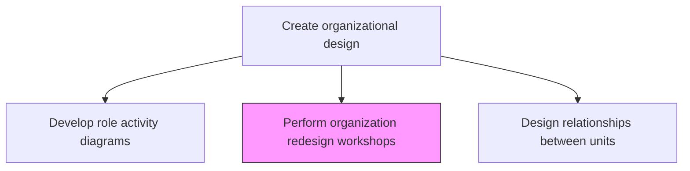
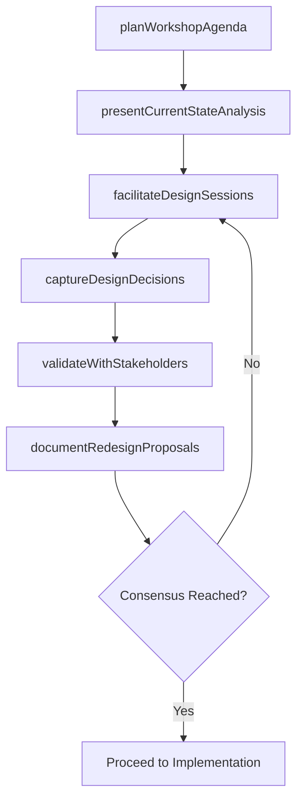

# Perform organization redesign workshops

> Business-as-Code definition for organization redesign workshop facilitation. Models the planning, execution, and follow-up of collaborative workshop sessions that engage stakeholders in developing and validating new organizational structures.

## Overview

Organizing workshop sessions to adopt organizational redesign. Communicate the organizational structure and mapping of responsibilities against job roles in order to facilitate an effective understanding among personnel. Use a collaborative process that may include participative workshop sessions. Engage cross-functional leaders in evaluating redesign alternatives, building consensus on structural changes, and co-creating implementation plans.

## Process Hierarchy



## GraphDL

```yaml
perform:
  object: Organization Redesign Workshops
  actor: OrganizationDesignFacilitator
  result: RedesignWorkshopOutputs
```

## Actions

| Action | Description |
|--------|-------------|
| planWorkshopAgenda | Define workshop objectives, agenda, participants, and materials |
| presentCurrentStateAnalysis | Share findings from structural evaluation and role mapping analyses |
| facilitateDesignSessions | Lead collaborative sessions to explore and evaluate redesign alternatives |
| captureDesignDecisions | Document design decisions, trade-offs, and consensus points from workshops |
| validateWithStakeholders | Confirm workshop outputs with key stakeholders not present in sessions |
| documentRedesignProposals | Formalize redesign proposals from workshop outputs into actionable plans |

## Events

| Event | Description |
|-------|-------------|
| workshopAgendaPlanned | Workshop objectives and agenda finalized |
| currentStatePresented | Current state analysis shared with workshop participants |
| designSessionsFacilitated | Collaborative redesign sessions completed |
| designDecisionsCaptured | Workshop design decisions and trade-offs documented |
| stakeholderValidationCompleted | Workshop outputs validated with additional stakeholders |
| redesignProposalsDocumented | Redesign proposals formalized from workshop outputs |

## Searches

| Search | Description |
|--------|-------------|
| getWorkshopSchedule | Retrieve planned and completed redesign workshops |
| getWorkshopOutputs | Access documented design decisions and proposals from workshops |
| getRedesignProposals | Retrieve formalized redesign proposals by department or function |

## Process Flow



## RACI Matrix

| Activity | Responsible | Accountable | Consulted | Informed |
|----------|-------------|-------------|-----------|----------|
| planWorkshopAgenda | OrganizationDesignFacilitator | CHRO | VP Strategy | DepartmentHeads |
| facilitateDesignSessions | OrganizationDesignFacilitator | CHRO | AllWorkshopParticipants | CEO |
| documentRedesignProposals | OrganizationDesignConsultant | CHRO | Finance | Legal |

## Related Processes

| Process | Relationship |
|---------|-------------|
| 1.2.4.1 Evaluate breadth and depth of organizational structure | Upstream - structural analysis feeds workshop discussions |
| 1.2.4.5 Design the relationships between organizational units | Downstream - workshops inform unit relationship design |
| 1.2.4.8 Migrate to new organization | Downstream - workshop proposals guide migration planning |

## Related Departments

| Department | Role |
|-----------|------|
| Human Resources | Leads workshop planning and facilitation |
| Strategy | Provides strategic context for redesign discussions |
| All Departments | Participate in collaborative design sessions |

## Related Occupations

| Occupation | Involvement |
|-----------|-------------|
| Organization Design Facilitator | Plans and leads redesign workshops |
| CHRO | Sponsors and approves workshop outputs |
| Change Management Specialist | Supports stakeholder engagement and consensus building |

## KPIs

| KPI | Description | Unit |
|-----|-------------|------|
| Workshop Participation Rate | Percentage of invited stakeholders who participated | % |
| Decision Consensus Rate | Percentage of design decisions reached by consensus | % |
| Proposal Acceptance Rate | Percentage of workshop proposals approved for implementation | % |
| Time to Consensus | Average time to reach consensus on redesign proposals | Days |

## Usage

```typescript
import { performOrganizationRedesignWorkshops } from '@headlessly/perform-organization-redesign-workshops'

const workshops = performOrganizationRedesignWorkshops()

// Plan workshop agenda
const agenda = await workshops.planWorkshopAgenda({
  objective: 'evaluate-matrix-to-functional-transition',
  participants: ['department-heads', 'vp-strategy', 'chro'],
  duration: '2-days'
})

// Capture design decisions from workshop
const decisions = await workshops.captureDesignDecisions({
  workshopId: agenda.id,
  categories: ['structure', 'reporting-lines', 'shared-services', 'governance']
})
```
