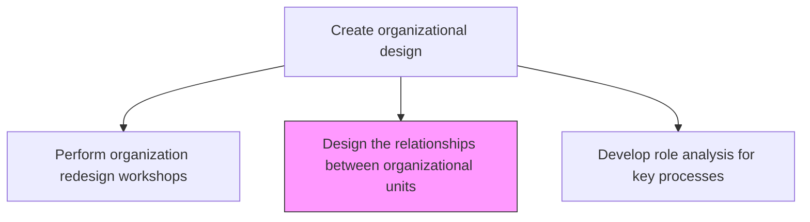
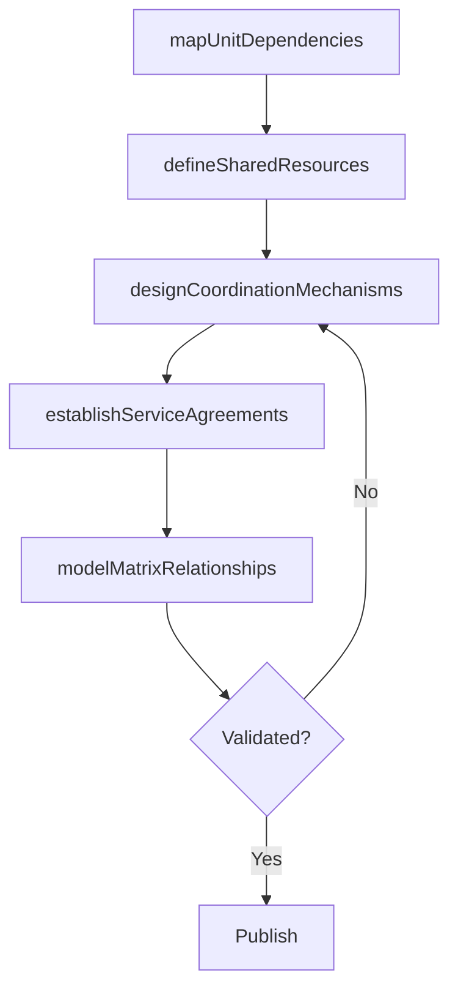

# Design the relationships between organizational units

> Business-as-Code definition for inter-unit relationship design. Models the definition of connections, dependencies, shared resources, and governance mechanisms between organizational units.

## Overview

Fleshing out the connections and dependencies among the various units of the organization. Delineate the relationship among business units or process frameworks within the organization, in terms of activities, synergies, and shared resources and responsibilities. Formalize relationships among business units so that any mutual coherence is clearly understood and can be attended to. Define matrix relationships, dotted-line reporting, shared service agreements, and cross-functional coordination mechanisms.

## Process Hierarchy



## GraphDL

```yaml
design:
  object: Relationships Between Organizational Units
  actor: OrganizationDesignConsultant
  result: InterUnitRelationshipMap
```

## Actions

| Action | Description |
|--------|-------------|
| mapUnitDependencies | Document operational dependencies between organizational units |
| defineSharedResources | Identify and formalize shared resources, budgets, and personnel across units |
| designCoordinationMechanisms | Create governance mechanisms for cross-unit coordination and decision-making |
| establishServiceAgreements | Define internal service level agreements between provider and consumer units |
| modelMatrixRelationships | Design matrix reporting and dotted-line relationships where needed |

## Events

| Event | Description |
|-------|-------------|
| unitDependenciesMapped | Inter-unit operational dependencies documented |
| sharedResourcesDefined | Shared resources and allocation rules formalized |
| coordinationMechanismsDesigned | Cross-unit coordination governance established |
| serviceAgreementsEstablished | Internal SLAs between units defined |
| matrixRelationshipsModeled | Matrix and dotted-line relationships documented |

## Searches

| Search | Description |
|--------|-------------|
| getUnitRelationships | Retrieve relationship maps between organizational units |
| getSharedResources | Access shared resource allocation across units |
| getServiceAgreements | Retrieve internal service level agreements between units |

## Process Flow



## RACI Matrix

| Activity | Responsible | Accountable | Consulted | Informed |
|----------|-------------|-------------|-----------|----------|
| mapUnitDependencies | OrganizationDesignConsultant | CHRO | BusinessUnitLeads | VP Strategy |
| designCoordinationMechanisms | OrganizationDesignConsultant | CEO | DepartmentHeads | HR |
| establishServiceAgreements | ProcessOwners | CHRO | Finance | IT |

## Related Processes

| Process | Relationship |
|---------|-------------|
| 1.2.4.4 Perform organization redesign workshops | Upstream - workshop outputs inform relationship design |
| 1.2.4.7 Assess organizational implication of feasible alternatives | Downstream - relationship design informs impact assessment |
| 1.2.3 Coordinate and align functional and process strategies | Related - unit relationships support functional alignment |

## Related Departments

| Department | Role |
|-----------|------|
| Human Resources | Leads inter-unit relationship design and governance |
| Strategy | Ensures relationship design supports strategic objectives |
| Finance | Manages shared resource allocation and cost sharing |

## Related Occupations

| Occupation | Involvement |
|-----------|-------------|
| Organization Design Consultant | Designs inter-unit relationships and coordination mechanisms |
| CHRO | Approves relationship design and governance framework |
| Business Unit Leader | Validates relationships and service agreements |

## KPIs

| KPI | Description | Unit |
|-----|-------------|------|
| Cross-Unit Collaboration Index | Measure of effective collaboration between units | Score (1-10) |
| SLA Compliance | Percentage of internal service agreements meeting targets | % |
| Shared Resource Utilization | Efficiency of shared resource allocation across units | % |

## Usage

```typescript
import { designRelationshipsBetweenOrganizationalUnits } from '@headlessly/design-relationships-between-organizational-units'

const unitDesign = designRelationshipsBetweenOrganizationalUnits()

// Map dependencies between units
const dependencies = await unitDesign.mapUnitDependencies({
  units: ['sales', 'marketing', 'product', 'engineering', 'customer-success'],
  dependencyTypes: ['data-flow', 'process-handoff', 'shared-resources']
})

// Establish internal service agreements
const sla = await unitDesign.establishServiceAgreements({
  providerUnit: 'it-shared-services',
  consumerUnit: 'sales',
  services: ['crm-support', 'data-analytics', 'reporting']
})
```
