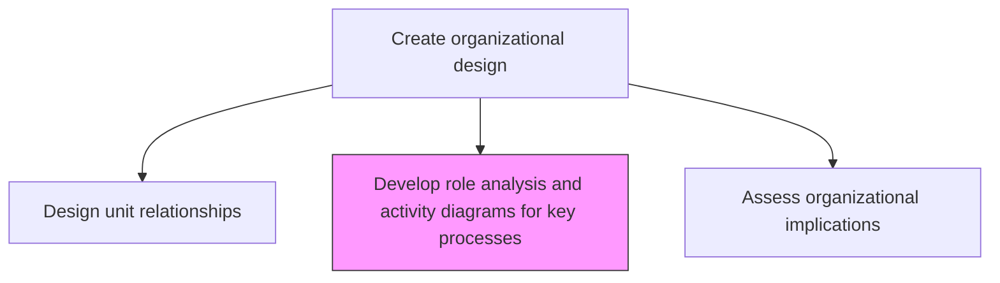
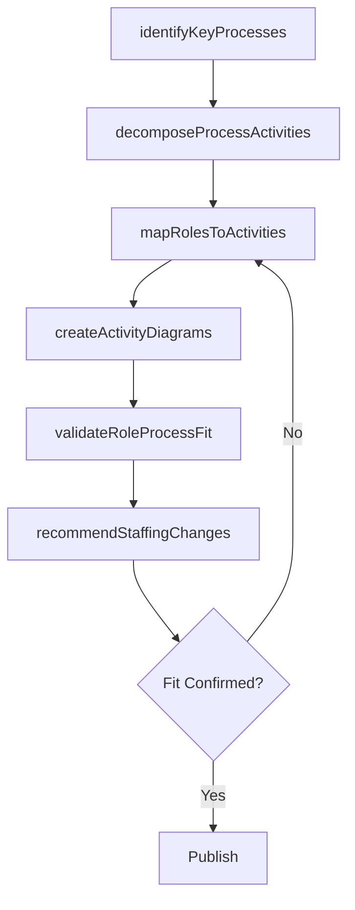

# Develop role analysis and activity diagrams for key processes

> Business-as-Code definition for key process role analysis and activity diagramming. Models the decomposition of critical business processes into activities and the mapping of appropriate roles against each activity for optimal staffing.

## Overview

Creating an understanding of the fit between job roles and organizational processes in order to properly place personnel. Deconstruct key processes into constituent activities, and examine job-related roles. Take cues from Develop role activity diagrams to assess hand-off activity [10051]. Map appropriate positions against these important processes, which in turn expedite the deployment of staff members.

## Process Hierarchy



## GraphDL

```yaml
develop:
  object: Role Analysis And Activity Diagrams For Key Processes
  actor: ProcessAnalyst
  result: KeyProcessRoleAnalysisReport
```

## Actions

| Action | Description |
|--------|-------------|
| identifyKeyProcesses | Select the most critical business processes for role analysis |
| decomposeProcessActivities | Break down key processes into discrete activities and tasks |
| mapRolesToActivities | Assign appropriate roles and competencies to each process activity |
| createActivityDiagrams | Build visual diagrams showing role-activity relationships and workflows |
| validateRoleProcessFit | Confirm that assigned roles have the required skills and capacity |
| recommendStaffingChanges | Propose personnel adjustments to optimize role-process alignment |

## Events

| Event | Description |
|-------|-------------|
| keyProcessesIdentified | Critical processes selected for role analysis |
| processActivitiesDecomposed | Key processes broken down into constituent activities |
| rolesMappedToActivities | Roles assigned to process activities |
| activityDiagramsCreated | Role-activity diagrams documented and published |
| roleProcessFitValidated | Role-process alignment confirmed |
| staffingChangesRecommended | Personnel optimization proposals documented |

## Searches

| Search | Description |
|--------|-------------|
| getKeyProcessDiagrams | Retrieve role-activity diagrams for key processes |
| getRoleProcessMapping | Access role-to-activity assignments by process |
| getStaffingRecommendations | Retrieve personnel optimization proposals |

## Process Flow



## RACI Matrix

| Activity | Responsible | Accountable | Consulted | Informed |
|----------|-------------|-------------|-----------|----------|
| identifyKeyProcesses | ProcessAnalyst | VP Operations | BusinessUnitLeads | CHRO |
| mapRolesToActivities | OrganizationDesignConsultant | CHRO | ProcessOwners | HR |
| validateRoleProcessFit | HRBusinessPartner | CHRO | Managers | Finance |

## Related Processes

| Process | Relationship |
|---------|-------------|
| 1.2.4.3 Develop role activity diagrams to assess hand-off activity | Upstream - hand-off analysis informs key process role mapping |
| 1.2.4.2 Perform job-specific roles mapping | Related - role mapping feeds key process analysis |
| 1.2.4.7 Assess organizational implication of feasible alternatives | Downstream - role analysis informs impact assessment |

## Related Departments

| Department | Role |
|-----------|------|
| Human Resources | Maps roles to activities and validates competency fit |
| Operations | Identifies key processes and validates activity decomposition |
| Strategy | Prioritizes processes based on strategic importance |

## Related Occupations

| Occupation | Involvement |
|-----------|-------------|
| Process Analyst | Decomposes processes and creates activity diagrams |
| Organization Design Consultant | Maps roles to activities and recommends changes |
| HR Business Partner | Validates role-process fit and staffing implications |

## KPIs

| KPI | Description | Unit |
|-----|-------------|------|
| Key Process Coverage | Percentage of critical processes with completed role analysis | % |
| Role-Process Fit Score | Alignment between assigned roles and process requirements | Score (1-10) |
| Staffing Optimization Savings | Cost savings from improved role-process alignment | USD |

## Usage

```typescript
import { developRoleAnalysisAndActivityDiagramsForKeyProcesses } from '@headlessly/develop-role-analysis-and-activity-diagrams-for-key-processes'

const roleAnalysis = developRoleAnalysisAndActivityDiagramsForKeyProcesses()

// Decompose a key process into activities
const activities = await roleAnalysis.decomposeProcessActivities({
  processId: 'order-to-cash',
  granularity: 'task-level'
})

// Map roles to process activities
const mapping = await roleAnalysis.mapRolesToActivities({
  processId: 'order-to-cash',
  matchCriteria: ['competency', 'capacity', 'location']
})
```
