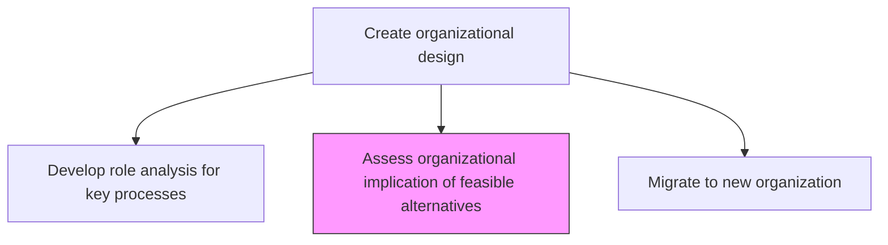
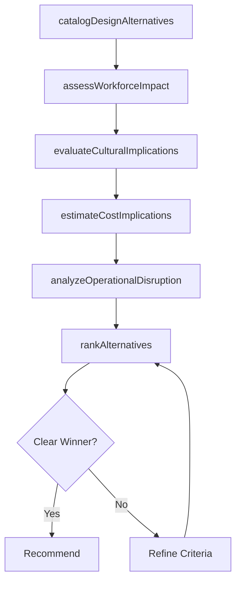

# Assess organizational implication of feasible alternatives

> Business-as-Code definition for organizational impact assessment of design alternatives. Models the evaluation of workforce, culture, cost, and operational implications for each feasible organizational structure option.

## Overview

Probing the repercussions of all practicable organizational design options. Analyze the significance and impact of workable organizational structure options. Closely examine the long-term impact of these frameworks over the functioning of the organization. Evaluate workforce displacement, cultural change requirements, cost implications, and operational disruption for each design alternative to select the optimal structure.

## Process Hierarchy



## GraphDL

```yaml
assess:
  object: Organizational Implication Of Feasible Alternatives
  actor: OrganizationDesignConsultant
  result: OrganizationalImpactAssessment
```

## Actions

| Action | Description |
|--------|-------------|
| catalogDesignAlternatives | Document all feasible organizational structure options under consideration |
| assessWorkforceImpact | Evaluate the impact on headcount, roles, and talent requirements for each option |
| evaluateCulturalImplications | Assess cultural change requirements and adoption risks per alternative |
| estimateCostImplications | Project implementation costs, ongoing costs, and efficiency gains per option |
| analyzeOperationalDisruption | Estimate operational disruption during transition for each design alternative |
| rankAlternatives | Score and rank alternatives based on multi-criteria assessment results |

## Events

| Event | Description |
|-------|-------------|
| designAlternativesCataloged | All feasible design options documented |
| workforceImpactAssessed | Workforce implications analyzed for each alternative |
| culturalImplicationsEvaluated | Cultural change requirements assessed |
| costImplicationsEstimated | Financial impact projected for each option |
| operationalDisruptionAnalyzed | Transition disruption estimates completed |
| alternativesRanked | Design alternatives scored and ranked |

## Searches

| Search | Description |
|--------|-------------|
| getDesignAlternatives | Retrieve cataloged design alternatives and their attributes |
| getImpactAssessments | Access impact assessment results by alternative |
| getAlternativeRankings | Retrieve ranked list of design alternatives with scores |

## Process Flow



## RACI Matrix

| Activity | Responsible | Accountable | Consulted | Informed |
|----------|-------------|-------------|-----------|----------|
| assessWorkforceImpact | OrganizationDesignConsultant | CHRO | HR | BusinessUnitLeads |
| estimateCostImplications | FinancialAnalyst | CFO | CHRO | CEO |
| rankAlternatives | OrganizationDesignConsultant | CEO | CHRO | BoardOfDirectors |

## Related Processes

| Process | Relationship |
|---------|-------------|
| 1.2.4.6 Develop role analysis for key processes | Upstream - role analysis informs workforce impact assessment |
| 1.2.4.8 Migrate to new organization | Downstream - selected alternative drives migration planning |
| 1.2.4 Create organizational design | Parent - impact assessment is a key step in org design |

## Related Departments

| Department | Role |
|-----------|------|
| Human Resources | Assesses workforce and cultural implications |
| Finance | Projects cost implications and efficiency gains |
| Operations | Evaluates operational disruption risks |

## Related Occupations

| Occupation | Involvement |
|-----------|-------------|
| Organization Design Consultant | Leads multi-criteria assessment and alternative ranking |
| HR Business Partner | Evaluates workforce impact and talent implications |
| Financial Analyst | Models cost implications of design alternatives |

## KPIs

| KPI | Description | Unit |
|-----|-------------|------|
| Alternatives Evaluated | Number of feasible design alternatives fully assessed | Count |
| Assessment Completeness | Percentage of impact dimensions evaluated per alternative | % |
| Decision Confidence Score | Strength of differentiation between ranked alternatives | Score (1-10) |

## Usage

```typescript
import { assessOrganizationalImplicationOfFeasibleAlternatives } from '@headlessly/assess-organizational-implication-of-feasible-alternatives'

const impact = assessOrganizationalImplicationOfFeasibleAlternatives()

// Assess workforce impact for a design alternative
const workforceImpact = await impact.assessWorkforceImpact({
  alternativeId: 'matrix-to-functional',
  dimensions: ['headcount', 'role-changes', 'skill-gaps', 'relocation']
})

// Rank all alternatives
const rankings = await impact.rankAlternatives({
  criteria: ['cost-efficiency', 'workforce-impact', 'cultural-fit', 'strategic-alignment'],
  weights: { costEfficiency: 0.3, workforceImpact: 0.25, culturalFit: 0.2, strategicAlignment: 0.25 }
})
```
