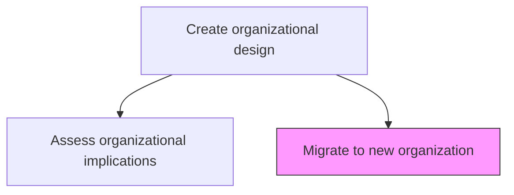
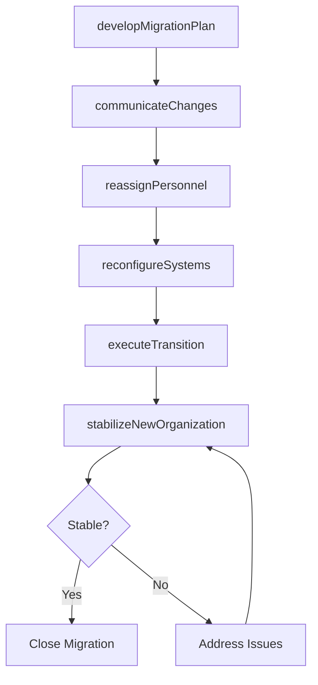

# Migrate to new organization

> Business-as-Code definition for organizational migration execution. Models the transition from the current organizational structure to the approved new design, including change management, personnel placement, and systems reconfiguration.

## Overview

Embracing and ratifying a new organizational structure. Assume the new framework to be the best fit through Assess the organizational implications of feasible alternatives [10055]. Plan and execute the phased migration to the approved organizational design, including communication campaigns, personnel reassignment, reporting line changes, systems reconfiguration, and post-migration stabilization.

## Process Hierarchy



## GraphDL

```yaml
migrate:
  object: To New Organization
  actor: ChangeManagementLead
  result: OrganizationalMigrationReport
```

## Actions

| Action | Description |
|--------|-------------|
| developMigrationPlan | Create a phased plan for transitioning to the new organizational structure |
| communicateChanges | Execute communication strategy to inform all stakeholders about structural changes |
| reassignPersonnel | Place employees in new roles, reporting lines, and organizational units |
| reconfigureSystems | Update HR, finance, and operational systems to reflect the new structure |
| executeTransition | Implement the organizational change according to the migration plan |
| stabilizeNewOrganization | Monitor and address issues during the post-migration stabilization period |

## Events

| Event | Description |
|-------|-------------|
| migrationPlanDeveloped | Phased migration plan created and approved |
| changesCommunicated | Organizational changes communicated to all stakeholders |
| personnelReassigned | Employee placements completed in the new structure |
| systemsReconfigured | IT and operational systems updated for the new organization |
| transitionExecuted | Organizational migration completed |
| organizationStabilized | Post-migration stabilization period concluded |

## Searches

| Search | Description |
|--------|-------------|
| getMigrationPlan | Retrieve the organizational migration plan and timeline |
| getMigrationStatus | Access current migration progress and milestone status |
| getPersonnelPlacements | Retrieve employee reassignment details and status |

## Process Flow



## RACI Matrix

| Activity | Responsible | Accountable | Consulted | Informed |
|----------|-------------|-------------|-----------|----------|
| developMigrationPlan | ChangeManagementLead | CHRO | VP Strategy | CEO |
| communicateChanges | CorporateCommunications | CEO | CHRO | AllEmployees |
| reassignPersonnel | HRBusinessPartner | CHRO | Managers | Legal |
| stabilizeNewOrganization | ChangeManagementLead | CHRO | DepartmentHeads | Finance |

## Related Processes

| Process | Relationship |
|---------|-------------|
| 1.2.4.7 Assess organizational implication of feasible alternatives | Upstream - selected alternative drives migration |
| 1.2.4 Create organizational design | Parent - migration is the final step in org design |
| 1.2.8 Communicate strategies internally and externally | Related - migration requires comprehensive communication |

## Related Departments

| Department | Role |
|-----------|------|
| Human Resources | Leads personnel reassignment and change management |
| Corporate Communications | Executes change communication strategy |
| Information Technology | Reconfigures systems for the new organizational structure |
| Legal | Ensures compliance with labor regulations during transition |

## Related Occupations

| Occupation | Involvement |
|-----------|-------------|
| Change Management Lead | Plans and manages the organizational migration |
| HR Business Partner | Executes personnel reassignment and supports employees |
| IT Systems Administrator | Reconfigures organizational systems and access controls |

## KPIs

| KPI | Description | Unit |
|-----|-------------|------|
| Migration Completion Rate | Percentage of migration milestones completed on schedule | % |
| Employee Retention During Migration | Percentage of employees retained through the transition | % |
| Time to Full Productivity | Time for the new organization to reach target productivity | Weeks |
| Change Satisfaction Score | Employee satisfaction with the migration process | Score (1-10) |

## Usage

```typescript
import { migrateToNewOrganization } from '@headlessly/migrate-to-new-organization'

const migration = migrateToNewOrganization()

// Develop migration plan
const plan = await migration.developMigrationPlan({
  targetStructure: 'functional-with-shared-services',
  phases: ['leadership-placement', 'middle-management', 'individual-contributors'],
  timeline: '6-months'
})

// Track migration progress
const status = await migration.stabilizeNewOrganization({
  migrationId: plan.id,
  monitoringPeriod: '90-days',
  escalationThreshold: 'critical'
})
```
