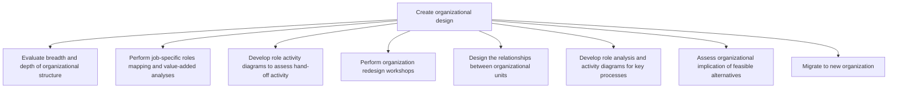
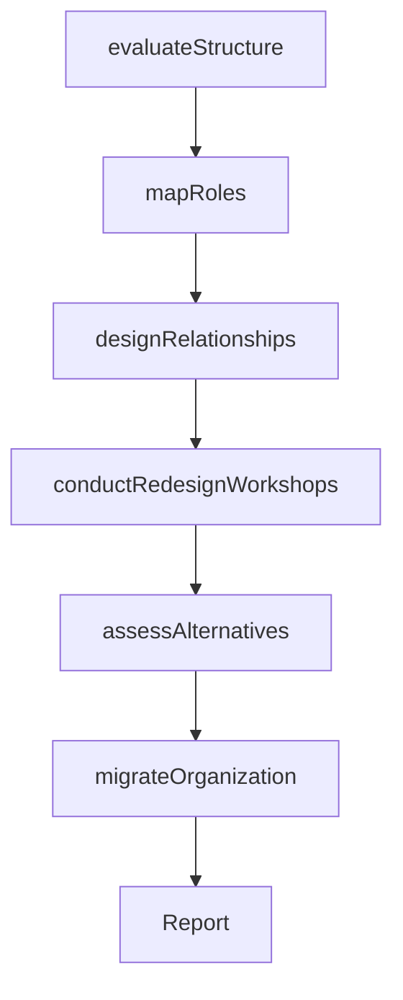

# Create organizational design

> Business-as-Code definition for organizational design creation. Models the systematic development of organizational structure, role definitions, reporting relationships, and process-to-role mappings that enable strategic execution.

## Overview

Formulating a design for the organization's resources that allow it to meet its objectives. Develop a new framework for molding the organization's various processes into a coherent and seamless whole.

## Process Hierarchy



## GraphDL

```yaml
create:
  object: Organizational Design
  actor: OrganizationalDevelopmentDirector
  result: OrganizationalDesignBlueprint
```

## Actions

| Action | Description |
|--------|-------------|
| evaluateStructure | Assess the breadth, depth, and span of control in the current organization |
| mapRoles | Map job-specific roles and conduct value-added analysis |
| designRelationships | Define reporting lines and dependencies between organizational units |
| conductRedesignWorkshops | Facilitate workshops to co-create the new organizational design |
| assessAlternatives | Evaluate organizational implications of feasible design alternatives |
| migrateOrganization | Execute the transition to the new organizational structure |

## Events

| Event | Description |
|-------|-------------|
| structureEvaluated | Current organizational structure assessment completed |
| rolesMapped | Job roles mapped and value-added analysis finalized |
| relationshipsDesigned | Inter-unit relationships and reporting lines defined |
| redesignWorkshopsConducted | Organizational redesign workshops completed |
| alternativesAssessed | Feasible design alternatives evaluated for impact |
| organizationMigrated | Transition to new organizational structure completed |

## Searches

| Search | Description |
|--------|-------------|
| getOrganizationalDesign | Retrieve the current organizational design blueprint |
| getRoleMap | Access role-to-process mappings and value-added analysis |
| getDesignAlternatives | List evaluated design alternatives with impact scores |
| getMigrationStatus | Check the status of organizational migration activities |

## Process Flow



## RACI Matrix

| Activity | Responsible | Accountable | Consulted | Informed |
|----------|-------------|-------------|-----------|----------|
| evaluateStructure | OrganizationalDevelopmentDirector | CHRO | BusinessUnitLeads | CEO |
| mapRoles | HRBusinessPartner | CHRO | DepartmentHeads | Finance |
| conductRedesignWorkshops | OrganizationalDevelopmentDirector | COO | ExternalConsultant | AllManagers |
| assessAlternatives | OrganizationalDevelopmentDirector | CEO | CFO | BoardOfDirectors |
| migrateOrganization | ChangeManagementLead | COO | HumanResources | AllEmployees |

## Sub-Processes

| ID | Name | Description |
|----|------|-------------|
| 1.2.4.1 | Evaluate breadth and depth of organizational structure | Evaluating the structural makeup of the organization, including pertinent features of and associated |
| 1.2.4.2 | Perform job-specific roles mapping and value-added analyses | Appraising job-specific roles within the organizational chart and their hierarchical architecture. A |
| 1.2.4.3 | Develop role activity diagrams to assess hand-off activity | Examining the constituent exercises and undertakings within a work-related position for the purpose  |
| 1.2.4.4 | Perform organization redesign workshops | Organizing workshop sessions to adopt organizational redesign. Communicate the organizational struct |
| 1.2.4.5 | Design the relationships between organizational units | Fleshing out the connections and dependencies among the various units of the organization. Delineate |
| 1.2.4.6 | Develop role analysis and activity diagrams for key processes | Creating an understanding of the fit between job roles and organizational processes in order to prop |
| 1.2.4.7 | Assess organizational implication of feasible alternatives | Probing the repercussions of all practicable organizational design options. Analyze the significance |
| 1.2.4.8 | Migrate to new organization | Embracing and ratifying a new organizational structure. (Assume the new framework to be the best fit |

## Related Processes

| Process | Relationship |
|---------|-------------|
| 1.2.2 Define and evaluate strategic options | Upstream - selected strategy drives organizational design |
| 1.2.6 Formulate business unit strategies | Downstream - org design shapes BU strategy formulation |
| 1.1.5 Conduct organization restructuring opportunities | Related - restructuring may trigger org redesign |

## Related Departments

| Department | Role |
|-----------|------|
| Human Resources | Leads organizational design and role mapping |
| Strategy | Provides strategic context for design decisions |
| Operations | Ensures design supports operational efficiency |
| Change Management | Manages transition to new organizational structure |

## Related Occupations

| Occupation | Involvement |
|-----------|-------------|
| Organizational Development Director | Leads organizational design and redesign efforts |
| HR Business Partner | Maps roles and conducts value-added analysis |
| Change Management Lead | Facilitates organizational migration |

## KPIs

| KPI | Description | Unit |
|-----|-------------|------|
| Span of Control | Average number of direct reports per manager | Ratio |
| Role Clarity Score | Employee understanding of roles and responsibilities | Score (1-10) |
| Migration Completion | Percentage of organizational units transitioned to new design | % |
| Design Effectiveness | Post-migration improvement in operational metrics | % |

## Usage

```typescript
import { createOrganizationalDesign } from '@headlessly/create-organizational-design'

const orgDesign = createOrganizationalDesign()

// Evaluate the current structure
const structure = await orgDesign.evaluateStructure({
  scope: 'enterprise',
  dimensions: ['span-of-control', 'layers', 'role-clarity', 'decision-rights']
})

// Conduct redesign workshops
const workshops = await orgDesign.conductRedesignWorkshops({
  participants: ['executive-team', 'department-heads', 'hr-partners'],
  designPrinciples: ['customer-centricity', 'agility', 'efficiency']
})
```
