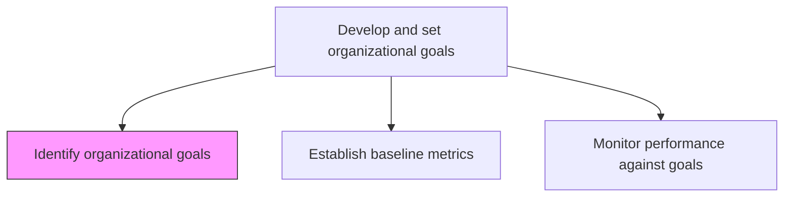
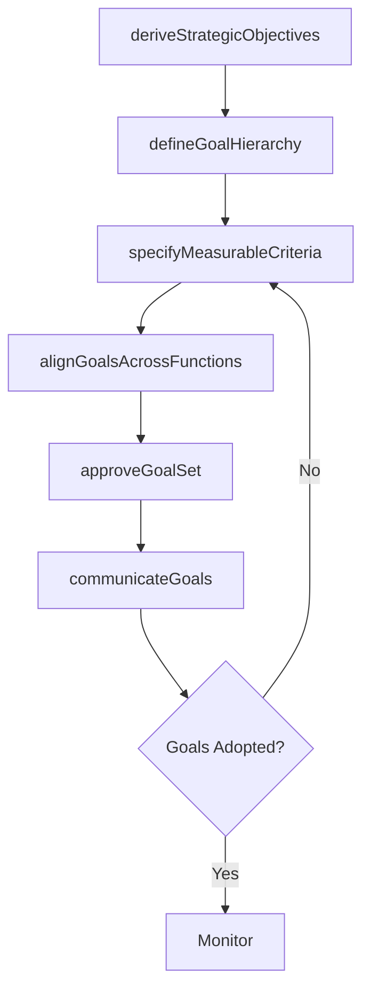

# Identify organizational goals

> Business-as-Code definition for organizational goal identification. Models the process of deriving strategic objectives from mission and vision, cascading them across the organization, and ensuring they are specific, measurable, and time-bound.

## Overview

Creating and developing strategic objectives that establishes a process to outline expected outcomes and guide employees' efforts. Translate the organizational mission and strategic priorities into concrete, measurable goals using frameworks such as OKR, balanced scorecard, or SMART goals. Ensure that goals cascade from enterprise level to functional and individual levels, creating alignment and accountability.

## Process Hierarchy



## GraphDL

```yaml
identify:
  object: Organizational Goals
  actor: VP Strategy
  result: OrganizationalGoalSet
```

## Actions

| Action | Description |
|--------|-------------|
| deriveStrategicObjectives | Translate mission and strategic priorities into enterprise-level objectives |
| defineGoalHierarchy | Create a cascading goal structure from enterprise to department to individual |
| specifyMeasurableCriteria | Ensure each goal is specific, measurable, achievable, relevant, and time-bound |
| alignGoalsAcrossFunctions | Validate that functional goals collectively support enterprise objectives |
| approveGoalSet | Obtain executive approval for the organizational goal framework |
| communicateGoals | Disseminate approved goals across the organization |

## Events

| Event | Description |
|-------|-------------|
| strategicObjectivesDerived | Enterprise-level objectives translated from strategy |
| goalHierarchyDefined | Cascading goal structure created |
| measurableCriteriaSpecified | SMART criteria applied to all goals |
| goalsAlignedAcrossFunctions | Cross-functional goal alignment confirmed |
| goalSetApproved | Organizational goals approved by executive leadership |
| goalsCommunicated | Goals disseminated to all employees |

## Searches

| Search | Description |
|--------|-------------|
| getOrganizationalGoals | Retrieve current organizational goals by level and function |
| getGoalHierarchy | Access the cascading goal structure |
| getGoalAlignment | Check alignment between functional goals and enterprise objectives |
| getGoalHistory | Retrieve historical goals and their outcomes |

## Process Flow



## RACI Matrix

| Activity | Responsible | Accountable | Consulted | Informed |
|----------|-------------|-------------|-----------|----------|
| deriveStrategicObjectives | VP Strategy | CEO | ExecutiveTeam | BoardOfDirectors |
| defineGoalHierarchy | VP Strategy | CEO | FunctionalLeads | HR |
| specifyMeasurableCriteria | StrategyAnalyst | VP Strategy | Finance | AllDepartments |
| communicateGoals | CorporateCommunications | CEO | HR | AllEmployees |

## Related Processes

| Process | Relationship |
|---------|-------------|
| 1.2.5.2 Establish baseline metrics | Downstream - goals require baseline measurements |
| 1.2.5.3 Monitor performance against goals | Downstream - goals are monitored for achievement |
| 1.2.1 Develop overall mission statement | Upstream - mission informs goal derivation |

## Related Departments

| Department | Role |
|-----------|------|
| Strategy | Leads goal derivation and hierarchy definition |
| Human Resources | Integrates goals into performance management systems |
| Finance | Provides financial targets and measurement criteria |
| Corporate Communications | Communicates goals organization-wide |

## Related Occupations

| Occupation | Involvement |
|-----------|-------------|
| VP Strategy | Leads strategic goal identification and alignment |
| CHRO | Integrates goals into performance management |
| Strategy Analyst | Develops measurable criteria and alignment analysis |

## KPIs

| KPI | Description | Unit |
|-----|-------------|------|
| Goal Cascade Completion | Percentage of departments with cascaded goals | % |
| Goal Clarity Score | Employee understanding of organizational goals | Score (1-10) |
| Goal Alignment Index | Degree of alignment between functional and enterprise goals | % |
| Goals Set On Time | Percentage of goals established within the planning cycle | % |

## Usage

```typescript
import { identifyOrganizationalGoals } from '@headlessly/identify-organizational-goals'

const goals = identifyOrganizationalGoals()

// Derive strategic objectives from mission
const objectives = await goals.deriveStrategicObjectives({
  missionId: 'current-mission',
  strategicPriorities: ['growth', 'profitability', 'customer-satisfaction', 'innovation'],
  framework: 'OKR'
})

// Define goal hierarchy across levels
const hierarchy = await goals.defineGoalHierarchy({
  enterpriseGoals: objectives.goals,
  levels: ['enterprise', 'division', 'department', 'team'],
  cascadeMethod: 'aligned-contribution'
})
```
