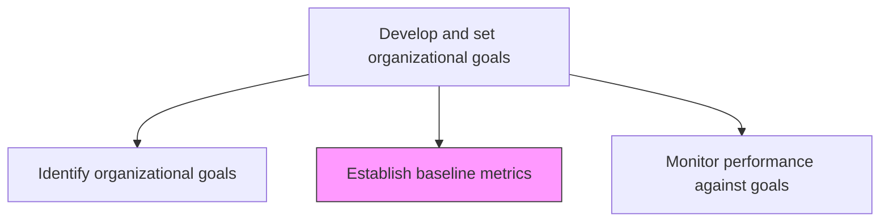
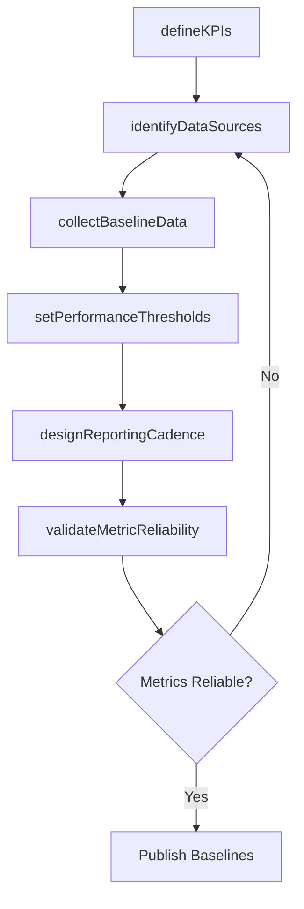

# Establish baseline metrics

> Business-as-Code definition for baseline metrics establishment. Models the creation of performance measurement baselines, KPI definitions, data collection methods, and benchmarking standards that enable goal tracking.

## Overview

Establishing baselines that provide standards for assessing performance. Create metrics and KPIs for various functions, processes, and activities based on organizational goals. Define data sources, measurement methodologies, reporting frequencies, and acceptable thresholds to enable objective performance monitoring and continuous improvement.

## Process Hierarchy



## GraphDL

```yaml
establish:
  object: Baseline Metrics
  actor: PerformanceAnalyst
  result: BaselineMetricsFramework
```

## Actions

| Action | Description |
|--------|-------------|
| defineKPIs | Create key performance indicators aligned to each organizational goal |
| identifyDataSources | Determine the data sources and systems required for metric calculation |
| collectBaselineData | Gather current-state performance data to establish measurement baselines |
| setPerformanceThresholds | Define target, acceptable, and warning thresholds for each metric |
| designReportingCadence | Establish the frequency and format of performance reporting |
| validateMetricReliability | Test metric calculations for accuracy, consistency, and repeatability |

## Events

| Event | Description |
|-------|-------------|
| kpisDefined | Key performance indicators created and linked to goals |
| dataSourcesIdentified | Required data sources and systems documented |
| baselineDataCollected | Current-state performance baselines captured |
| performanceThresholdsSet | Target and warning thresholds defined for each metric |
| reportingCadenceDesigned | Performance reporting schedule and format established |
| metricReliabilityValidated | Metric accuracy and consistency confirmed |

## Searches

| Search | Description |
|--------|-------------|
| getBaselineMetrics | Retrieve current baseline measurements by goal or function |
| getKPIDefinitions | Access KPI definitions, data sources, and calculation methods |
| getPerformanceThresholds | Retrieve target and warning thresholds for each metric |
| getMetricHistory | Access historical metric values for trend analysis |

## Process Flow



## RACI Matrix

| Activity | Responsible | Accountable | Consulted | Informed |
|----------|-------------|-------------|-----------|----------|
| defineKPIs | PerformanceAnalyst | VP Strategy | FunctionalLeads | Finance |
| collectBaselineData | PerformanceAnalyst | VP Strategy | IT | DataEngineering |
| setPerformanceThresholds | VP Strategy | CEO | CFO | BusinessUnitLeads |

## Related Processes

| Process | Relationship |
|---------|-------------|
| 1.2.5.1 Identify organizational goals | Upstream - goals drive KPI definition |
| 1.2.5.3 Monitor performance against goals | Downstream - baselines enable performance monitoring |
| 1.3.4 Establish high-level measures | Related - high-level measures complement operational baselines |

## Related Departments

| Department | Role |
|-----------|------|
| Strategy | Leads KPI definition and threshold setting |
| Finance | Provides financial metrics and validates targets |
| Information Technology | Enables data collection and reporting infrastructure |
| Business Intelligence | Builds dashboards and reporting capabilities |

## Related Occupations

| Occupation | Involvement |
|-----------|-------------|
| Performance Analyst | Defines KPIs and collects baseline data |
| Data Engineer | Builds data pipelines for metric calculation |
| Business Intelligence Analyst | Creates dashboards and reporting tools |

## KPIs

| KPI | Description | Unit |
|-----|-------------|------|
| Metric Coverage | Percentage of organizational goals with defined KPIs | % |
| Baseline Completeness | Percentage of KPIs with captured baseline measurements | % |
| Data Accuracy Score | Accuracy of metric data compared to source of truth | % |
| Reporting Automation Rate | Percentage of metrics with automated data collection | % |

## Usage

```typescript
import { establishBaselineMetrics } from '@headlessly/establish-baseline-metrics'

const baselines = establishBaselineMetrics()

// Define KPIs for organizational goals
const kpis = await baselines.defineKPIs({
  goalIds: ['revenue-growth', 'customer-retention', 'operational-efficiency'],
  metricTypes: ['financial', 'customer', 'process', 'learning']
})

// Collect baseline data
const baseline = await baselines.collectBaselineData({
  kpiIds: kpis.map(k => k.id),
  period: 'trailing-12-months',
  dataSources: ['erp', 'crm', 'hris']
})
```
