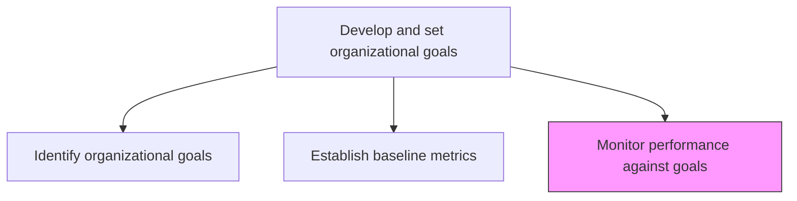
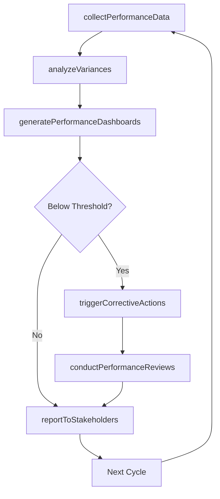

# Monitor performance against goals

> Business-as-Code definition for performance monitoring against goals. Models the ongoing tracking, analysis, and reporting of organizational performance relative to established goals and baselines.

## Overview

Defining methodology and frequency of assessment for measuring and monitoring performance of various functions, processes, and activities against standard set goals. Track KPI trends, generate performance dashboards, conduct variance analysis, trigger corrective actions when performance deviates from targets, and report progress to stakeholders at regular intervals.

## Process Hierarchy



## GraphDL

```yaml
monitor:
  object: Performance Against Goals
  actor: PerformanceAnalyst
  result: PerformanceMonitoringReport
```

## Actions

| Action | Description |
|--------|-------------|
| collectPerformanceData | Gather current performance data from operational and financial systems |
| analyzeVariances | Compare actual performance against targets and identify deviations |
| generatePerformanceDashboards | Create visual dashboards showing goal progress and trend data |
| triggerCorrectiveActions | Initiate corrective action workflows when performance falls below thresholds |
| conductPerformanceReviews | Hold periodic review meetings to discuss performance and adjust plans |
| reportToStakeholders | Produce and distribute performance reports to leadership and stakeholders |

## Events

| Event | Description |
|-------|-------------|
| performanceDataCollected | Current period performance data gathered and validated |
| variancesAnalyzed | Performance deviations identified and categorized |
| dashboardsGenerated | Performance dashboards updated and published |
| correctiveActionsTriggered | Corrective action workflows initiated for underperformance |
| performanceReviewConducted | Periodic performance review meeting completed |
| stakeholdersReported | Performance report distributed to stakeholders |

## Searches

| Search | Description |
|--------|-------------|
| getPerformanceDashboard | Retrieve current performance dashboard for a goal or function |
| getVarianceReport | Access variance analysis showing deviations from targets |
| getCorrectiveActions | List active corrective actions and their status |
| getPerformanceTrends | Retrieve performance trend data over multiple periods |

## Process Flow



## RACI Matrix

| Activity | Responsible | Accountable | Consulted | Informed |
|----------|-------------|-------------|-----------|----------|
| collectPerformanceData | PerformanceAnalyst | VP Strategy | DataEngineering | Finance |
| analyzeVariances | PerformanceAnalyst | VP Strategy | FunctionalLeads | CEO |
| conductPerformanceReviews | VP Strategy | CEO | ExecutiveTeam | BoardOfDirectors |
| reportToStakeholders | PerformanceAnalyst | CEO | CorporateCommunications | AllEmployees |

## Related Processes

| Process | Relationship |
|---------|-------------|
| 1.2.5.2 Establish baseline metrics | Upstream - baselines enable meaningful performance comparison |
| 1.2.5.1 Identify organizational goals | Upstream - goals define what is monitored |
| 1.3.4 Establish high-level measures | Related - high-level measures are monitored alongside operational KPIs |

## Related Departments

| Department | Role |
|-----------|------|
| Strategy | Leads performance monitoring and variance analysis |
| Business Intelligence | Builds and maintains performance dashboards |
| Finance | Provides financial performance data and analysis |
| All Departments | Report performance data and execute corrective actions |

## Related Occupations

| Occupation | Involvement |
|-----------|-------------|
| Performance Analyst | Collects data, analyzes variances, and generates reports |
| Business Intelligence Analyst | Builds dashboards and automates reporting |
| VP Strategy | Leads performance reviews and corrective action decisions |

## KPIs

| KPI | Description | Unit |
|-----|-------------|------|
| Goal Achievement Rate | Percentage of organizational goals meeting or exceeding targets | % |
| Variance Detection Speed | Time between performance deviation and corrective action initiation | Days |
| Dashboard Freshness | Age of most recent data in performance dashboards | Hours |
| Corrective Action Effectiveness | Percentage of corrective actions that restore performance to target | % |

## Usage

```typescript
import { monitorPerformanceAgainstGoals } from '@headlessly/monitor-performance-against-goals'

const monitoring = monitorPerformanceAgainstGoals()

// Analyze variances against targets
const variances = await monitoring.analyzeVariances({
  goalIds: ['revenue-growth', 'customer-retention', 'nps'],
  period: 'Q4-2025',
  threshold: 0.1
})

// Trigger corrective actions for underperforming areas
const actions = await monitoring.triggerCorrectiveActions({
  varianceIds: variances.filter(v => v.severity === 'critical').map(v => v.id),
  actionType: 'executive-review',
  dueDate: '2025-12-31'
})
```
