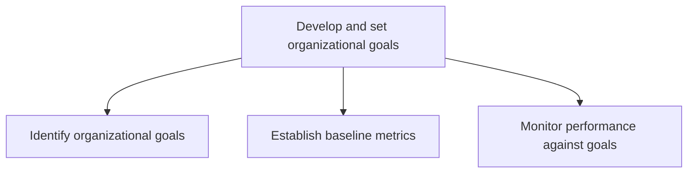
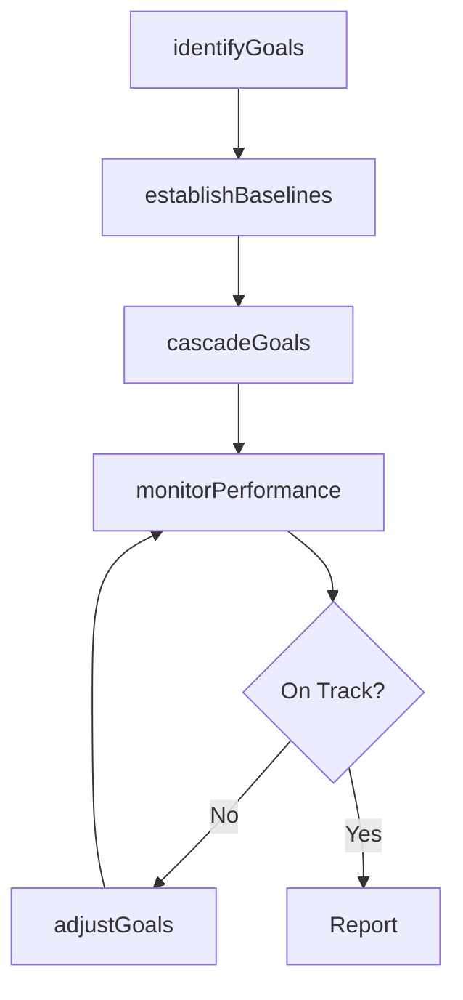

# Develop and set organizational goals

> Business-as-Code definition for organizational goal development and setting. Models the formulation, baselining, and performance monitoring of organization-wide targets that translate the mission into measurable near-to-mid-term objectives.

## Overview

Developing overall goals for the organization that help in accomplishing its mission. Formulate organization-wide targets in the near to middle term, which will accumulate and propel the organization to realize its long-term objectives, as outlined in Develop an overall mission statement [10037]. Enlist business unit heads or equivalent personnel, in close collaboration with senior management executives.

## Process Hierarchy



## GraphDL

```yaml
develop:
  object: And Set Organizational Goals
  actor: VP Strategy
  result: OrganizationalGoalFramework
```

## Actions

| Action | Description |
|--------|-------------|
| identifyGoals | Define strategic, operational, and financial goals aligned to the mission |
| establishBaselines | Set baseline metrics and KPIs for measuring goal attainment |
| cascadeGoals | Decompose organizational goals into business unit and departmental targets |
| monitorPerformance | Track progress against goals using defined metrics and reporting cadence |
| adjustGoals | Revise goals based on performance data and changing conditions |

## Events

| Event | Description |
|-------|-------------|
| goalsIdentified | Organizational goals defined and approved |
| baselinesEstablished | Baseline metrics and KPIs set for all goals |
| goalsCascaded | Goals decomposed and assigned to business units |
| performanceMonitored | Performance against goals tracked and reported |
| goalsAdjusted | Goals revised based on performance data |

## Searches

| Search | Description |
|--------|-------------|
| getOrganizationalGoals | Retrieve organizational goals with status and progress |
| getGoalBaselines | Access baseline metrics for specific goals |
| getPerformanceVsGoals | Compare current performance against goal targets |
| getGoalCascade | Retrieve the goal cascade from enterprise to business unit level |

## Process Flow



## RACI Matrix

| Activity | Responsible | Accountable | Consulted | Informed |
|----------|-------------|-------------|-----------|----------|
| identifyGoals | VP Strategy | CEO | BusinessUnitLeads | BoardOfDirectors |
| establishBaselines | StrategyAnalyst | VP Strategy | Finance | Operations |
| cascadeGoals | BusinessUnitLeads | VP Strategy | HumanResources | AllManagers |
| monitorPerformance | StrategyAnalyst | VP Strategy | Finance | CEO |

## Sub-Processes

| ID | Name | Description |
|----|------|-------------|
| 1.2.5.1 | Identify organizational goals | Creating and developing strategic objectives that establishes a process to outline expected outcomes |
| 1.2.5.2 | Establish baseline metrics | Establishing baselines that provide standards for assessing performance. Create metrics and KPI's fo |
| 1.2.5.3 | Monitor performance against goals | Defining methodology and frequency of assessment for measuring and monitoring performance of various |

## Related Processes

| Process | Relationship |
|---------|-------------|
| 1.2.1 Develop overall mission statement | Upstream - mission provides context for goal setting |
| 1.2.6 Formulate business unit strategies | Downstream - organizational goals cascade to BU strategies |
| 1.3.1 Develop and assign strategic initiatives | Downstream - goals drive initiative selection |

## Related Departments

| Department | Role |
|-----------|------|
| Strategy | Leads goal identification and alignment to mission |
| Finance | Establishes financial targets and baselines |
| Operations | Defines operational performance goals |
| Human Resources | Sets people and organizational development goals |

## Related Occupations

| Occupation | Involvement |
|-----------|-------------|
| VP Strategy | Leads organizational goal definition and monitoring |
| Strategy Analyst | Establishes baselines and tracks performance |
| Business Unit Lead | Translates organizational goals into unit-level targets |

## KPIs

| KPI | Description | Unit |
|-----|-------------|------|
| Goal Attainment Rate | Percentage of organizational goals met or exceeded | % |
| Goal Coverage | Percentage of business units with cascaded goals | % |
| Monitoring Cadence | Frequency of performance reviews against goals | Per Quarter |

## Usage

```typescript
import { developAndSetOrganizationalGoals } from '@headlessly/develop-and-set-organizational-goals'

const goals = developAndSetOrganizationalGoals()

// Identify organizational goals
const orgGoals = await goals.identifyGoals({
  missionId: 'current-mission',
  categories: ['revenue-growth', 'market-expansion', 'operational-excellence', 'talent-development'],
  timeHorizon: '3-years'
})

// Monitor performance against goals
const performance = await goals.monitorPerformance({
  goalIds: orgGoals.map(g => g.id),
  period: 'current-quarter'
})
```
