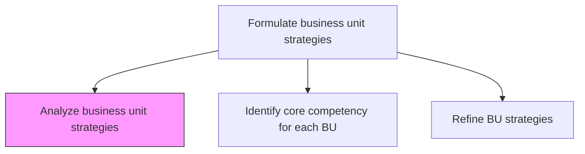
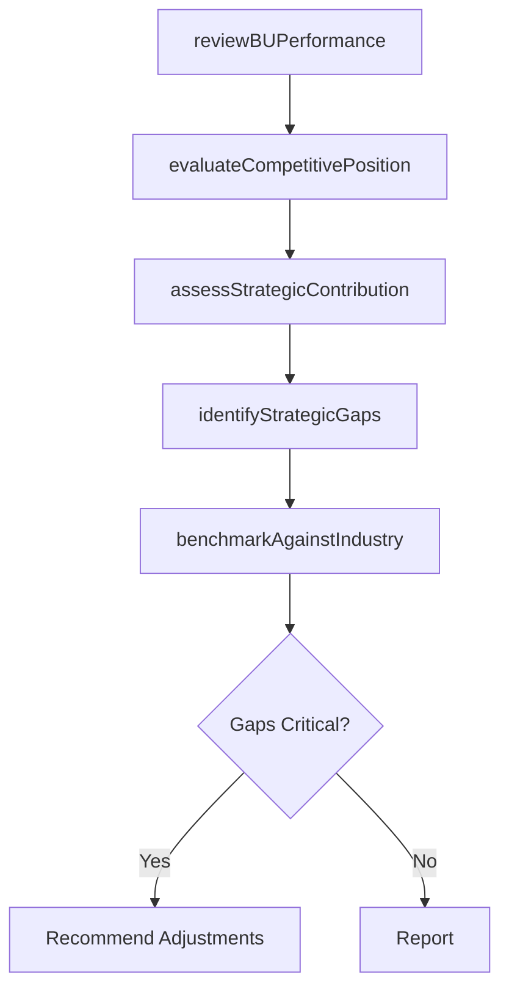

# Analyze business unit strategies

> Business-as-Code definition for business unit strategy analysis. Models the evaluation of each business unit's strategic performance, competitive positioning, and alignment with corporate objectives.

## Overview

Assessing the performance of a business unit against set organizational goals which are based on pre-defined metrics collected through various business unit operations. Evaluate BU strategy effectiveness, market position, competitive advantage, financial performance, and strategic contribution to the overall corporate portfolio.

## Process Hierarchy



## GraphDL

```yaml
analyze:
  object: Business Unit Strategies
  actor: StrategyAnalyst
  result: BusinessUnitStrategyAnalysis
```

## Actions

| Action | Description |
|--------|-------------|
| reviewBUPerformance | Assess each business unit's financial and operational performance against targets |
| evaluateCompetitivePosition | Analyze each BU's competitive positioning within its market |
| assessStrategicContribution | Evaluate each BU's contribution to corporate strategic objectives |
| identifyStrategicGaps | Detect gaps between BU strategy execution and intended outcomes |
| benchmarkAgainstIndustry | Compare BU performance against industry benchmarks and competitors |

## Events

| Event | Description |
|-------|-------------|
| buPerformanceReviewed | Business unit performance assessment completed |
| competitivePositionEvaluated | BU competitive positioning analysis finalized |
| strategicContributionAssessed | BU contribution to corporate strategy evaluated |
| strategicGapsIdentified | Gaps between BU strategy and outcomes documented |
| industryBenchmarkCompleted | BU performance benchmarked against industry |

## Searches

| Search | Description |
|--------|-------------|
| getBUStrategyAnalysis | Retrieve strategy analysis results by business unit |
| getBUPerformanceData | Access business unit performance metrics and trends |
| getStrategicGaps | List identified strategic gaps by business unit |

## Process Flow



## RACI Matrix

| Activity | Responsible | Accountable | Consulted | Informed |
|----------|-------------|-------------|-----------|----------|
| reviewBUPerformance | StrategyAnalyst | VP Strategy | BusinessUnitLeads | CFO |
| evaluateCompetitivePosition | StrategyAnalyst | VP Strategy | Marketing | CEO |
| identifyStrategicGaps | StrategyAnalyst | VP Strategy | BusinessUnitLeads | BoardOfDirectors |

## Related Processes

| Process | Relationship |
|---------|-------------|
| 1.2.6.2 Identify core competency for each business unit | Downstream - analysis informs competency identification |
| 1.2.6.3 Refine BU strategies in support of company strategy | Downstream - analysis drives BU strategy refinement |
| 1.2.10 Analyze portfolio positioning | Related - BU analysis feeds portfolio-level positioning |

## Related Departments

| Department | Role |
|-----------|------|
| Strategy | Leads BU strategy analysis and benchmarking |
| Finance | Provides financial performance data for BU assessment |
| Marketing | Contributes competitive positioning and market data |

## Related Occupations

| Occupation | Involvement |
|-----------|-------------|
| Strategy Analyst | Conducts BU strategy analysis and gap identification |
| VP Strategy | Reviews analysis results and recommends adjustments |
| Business Unit Leader | Provides operational context and validates findings |

## KPIs

| KPI | Description | Unit |
|-----|-------------|------|
| BU Revenue Growth | Year-over-year revenue growth by business unit | % |
| Strategic Alignment Score | Degree of BU strategy alignment with corporate objectives | Score (1-10) |
| Competitive Position Ranking | BU market position relative to competitors | Rank |

## Usage

```typescript
import { analyzeBusinessUnitStrategies } from '@headlessly/analyze-business-unit-strategies'

const buAnalysis = analyzeBusinessUnitStrategies()

// Review BU performance against targets
const performance = await buAnalysis.reviewBUPerformance({
  businessUnitIds: ['enterprise', 'mid-market', 'smb'],
  metrics: ['revenue', 'margin', 'market-share', 'customer-retention'],
  period: 'FY2025'
})

// Identify strategic gaps
const gaps = await buAnalysis.identifyStrategicGaps({
  businessUnitId: 'enterprise',
  comparedTo: 'corporate-strategy-targets'
})
```
