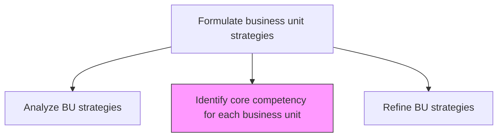
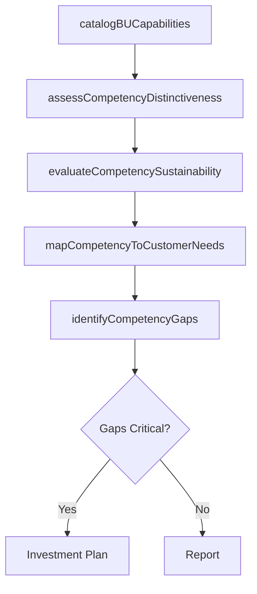

# Identify core competency for each business unit

> Business-as-Code definition for core competency identification per business unit. Models the assessment of distinctive capabilities, knowledge assets, and technical strengths that differentiate each business unit in the marketplace.

## Overview

Determining the resources and skills of each business unit based on knowledge and technical capacity. Enable business units to meet customer needs and grow in a competitive marketplace. Catalog distinctive capabilities, evaluate their sustainability and defensibility, assess alignment with customer needs, and identify competency gaps that require investment or development.

## Process Hierarchy



## GraphDL

```yaml
identify:
  object: Core Competency For Each Business Unit
  actor: BusinessUnitLead
  result: CoreCompetencyProfile
```

## Actions

| Action | Description |
|--------|-------------|
| catalogBUCapabilities | Document the key capabilities, skills, and knowledge assets of each business unit |
| assessCompetencyDistinctiveness | Evaluate which capabilities are truly distinctive and hard to replicate |
| evaluateCompetencySustainability | Determine the long-term defensibility of each core competency |
| mapCompetencyToCustomerNeeds | Align core competencies with customer requirements and market demands |
| identifyCompetencyGaps | Detect capability gaps that limit competitive positioning |

## Events

| Event | Description |
|-------|-------------|
| buCapabilitiesCataloged | Business unit capabilities documented |
| competencyDistinctivenessAssessed | Distinctive competencies identified and validated |
| competencySustainabilityEvaluated | Long-term defensibility of competencies assessed |
| competencyMappedToNeeds | Competencies aligned with customer requirements |
| competencyGapsIdentified | Capability gaps documented and prioritized |

## Searches

| Search | Description |
|--------|-------------|
| getCoreCompetencies | Retrieve core competency profiles by business unit |
| getCompetencyGaps | List identified competency gaps by business unit |
| getCompetencyMap | Access competency-to-customer-need alignment maps |

## Process Flow



## RACI Matrix

| Activity | Responsible | Accountable | Consulted | Informed |
|----------|-------------|-------------|-----------|----------|
| catalogBUCapabilities | BusinessUnitLead | VP Strategy | HR | CEO |
| assessCompetencyDistinctiveness | StrategyAnalyst | VP Strategy | BusinessUnitLead | Marketing |
| identifyCompetencyGaps | StrategyAnalyst | VP Strategy | HR | CTO |

## Related Processes

| Process | Relationship |
|---------|-------------|
| 1.2.6.1 Analyze business unit strategies | Upstream - BU analysis informs competency identification |
| 1.2.6.3 Refine BU strategies in support of company strategy | Downstream - competency profiles guide strategy refinement |
| 1.1.3 Assess the internal environment | Related - internal assessment includes competency evaluation |

## Related Departments

| Department | Role |
|-----------|------|
| Strategy | Leads core competency analysis framework |
| Human Resources | Assesses talent capabilities and skill inventories |
| Business Units | Provide subject matter expertise on distinctive capabilities |

## Related Occupations

| Occupation | Involvement |
|-----------|-------------|
| Business Unit Leader | Identifies and validates unit-specific competencies |
| Strategy Analyst | Evaluates competency distinctiveness and sustainability |
| Talent Management Director | Assesses workforce competencies and development needs |

## KPIs

| KPI | Description | Unit |
|-----|-------------|------|
| Competency Coverage | Percentage of BUs with documented core competency profiles | % |
| Competency Gap Count | Number of critical competency gaps identified per BU | Count |
| Competency Investment Rate | Investment in competency development as percentage of BU budget | % |

## Usage

```typescript
import { identifyCoreCompetencyForEachBusinessUnit } from '@headlessly/identify-core-competency-for-each-business-unit'

const competency = identifyCoreCompetencyForEachBusinessUnit()

// Catalog capabilities for a business unit
const capabilities = await competency.catalogBUCapabilities({
  businessUnitId: 'enterprise-solutions',
  categories: ['technology', 'domain-expertise', 'customer-relationships', 'operational-excellence']
})

// Identify competency gaps
const gaps = await competency.identifyCompetencyGaps({
  businessUnitId: 'enterprise-solutions',
  comparedTo: ['market-requirements', 'competitor-capabilities']
})
```
