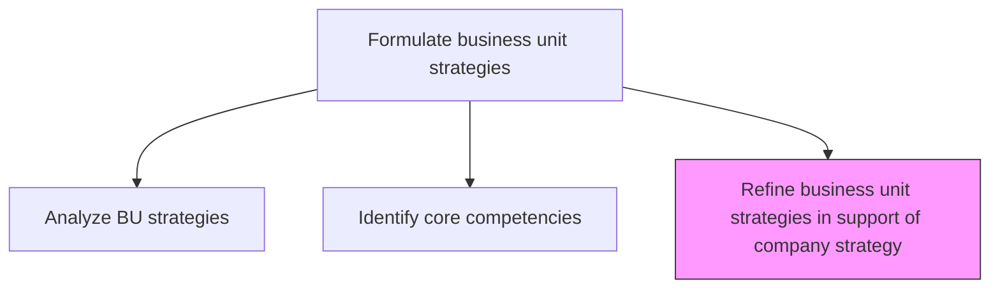
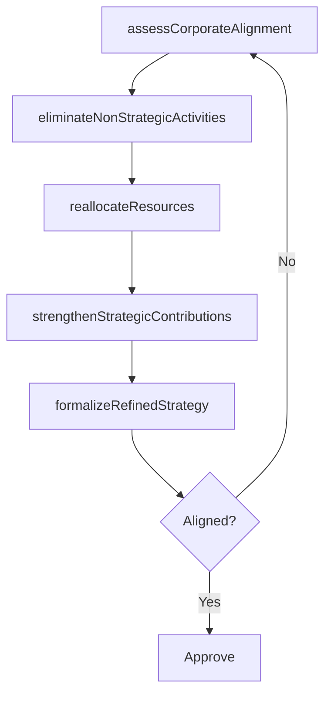

# Refine business unit strategies in support of company strategy

> Business-as-Code definition for business unit strategy refinement. Models the iterative adjustment of BU strategies to ensure alignment with and contribution to the overall company strategy.

## Overview

Evaluating existing business unit strategy based on the company's strategy and eliminate unwanted/unnecessary resources/elements and re-consider necessary resources to meet the overall company's strategy. Adjust BU priorities, reallocate resources, eliminate non-strategic activities, and strengthen areas that directly support corporate objectives. Ensure each BU strategy articulates its specific contribution to enterprise-level goals.

## Process Hierarchy



## GraphDL

```yaml
refine:
  object: Business Unit Strategies In Support Of Company Strategy
  actor: BusinessUnitLead
  result: RefinedBusinessUnitStrategy
```

## Actions

| Action | Description |
|--------|-------------|
| assessCorporateAlignment | Evaluate each BU strategy against current corporate strategic priorities |
| eliminateNonStrategicActivities | Identify and remove BU activities that do not support corporate objectives |
| reallocateResources | Redirect resources from non-strategic to strategically aligned activities |
| strengthenStrategicContributions | Enhance BU capabilities that directly support corporate priorities |
| formalizeRefinedStrategy | Document the updated BU strategy with clear corporate contribution statements |

## Events

| Event | Description |
|-------|-------------|
| corporateAlignmentAssessed | BU-corporate strategy alignment evaluation completed |
| nonStrategicActivitiesEliminated | Non-contributing activities identified and removed |
| resourcesReallocated | BU resources redirected to strategically aligned areas |
| strategicContributionsStrengthened | Key strategic contribution areas reinforced |
| refinedStrategyFormalized | Updated BU strategy documented and approved |

## Searches

| Search | Description |
|--------|-------------|
| getRefinedBUStrategies | Retrieve refined business unit strategies and their corporate contribution statements |
| getAlignmentAssessment | Access BU-corporate alignment evaluation results |
| getResourceReallocation | Retrieve resource reallocation plans by business unit |

## Process Flow



## RACI Matrix

| Activity | Responsible | Accountable | Consulted | Informed |
|----------|-------------|-------------|-----------|----------|
| assessCorporateAlignment | BusinessUnitLead | VP Strategy | StrategyAnalyst | CEO |
| reallocateResources | BusinessUnitLead | VP Strategy | CFO | HR |
| formalizeRefinedStrategy | BusinessUnitLead | CEO | VP Strategy | BoardOfDirectors |

## Related Processes

| Process | Relationship |
|---------|-------------|
| 1.2.6.1 Analyze business unit strategies | Upstream - BU analysis informs strategy refinement |
| 1.2.6.2 Identify core competency for each BU | Upstream - competency profiles guide refinement focus |
| 1.2.3 Coordinate and align functional and process strategies | Related - BU refinement supports cross-functional alignment |

## Related Departments

| Department | Role |
|-----------|------|
| Strategy | Facilitates alignment assessment and refinement process |
| Business Units | Refine their strategies to support corporate objectives |
| Finance | Supports resource reallocation analysis and budget adjustments |

## Related Occupations

| Occupation | Involvement |
|-----------|-------------|
| Business Unit Leader | Leads BU strategy refinement and resource reallocation |
| VP Strategy | Validates alignment with corporate strategy |
| Strategy Analyst | Analyzes alignment gaps and refinement options |

## KPIs

| KPI | Description | Unit |
|-----|-------------|------|
| Strategic Alignment Score | Post-refinement alignment between BU and corporate strategy | Score (1-10) |
| Resource Reallocation Volume | Percentage of BU resources redirected to strategic priorities | % |
| Non-Strategic Activity Reduction | Reduction in resources spent on non-contributing activities | % |

## Usage

```typescript
import { refineBusinessUnitStrategiesInSupportOfCompanyStrategy } from '@headlessly/refine-business-unit-strategies-in-support-of-company-strategy'

const refinement = refineBusinessUnitStrategiesInSupportOfCompanyStrategy()

// Assess corporate alignment
const alignment = await refinement.assessCorporateAlignment({
  businessUnitId: 'enterprise-solutions',
  corporateStrategyId: 'strategy-2025',
  dimensions: ['growth-contribution', 'margin-contribution', 'innovation-contribution']
})

// Reallocate resources to strategic priorities
const reallocation = await refinement.reallocateResources({
  businessUnitId: 'enterprise-solutions',
  fromActivities: ['legacy-maintenance'],
  toActivities: ['cloud-transformation', 'ai-enablement']
})
```
