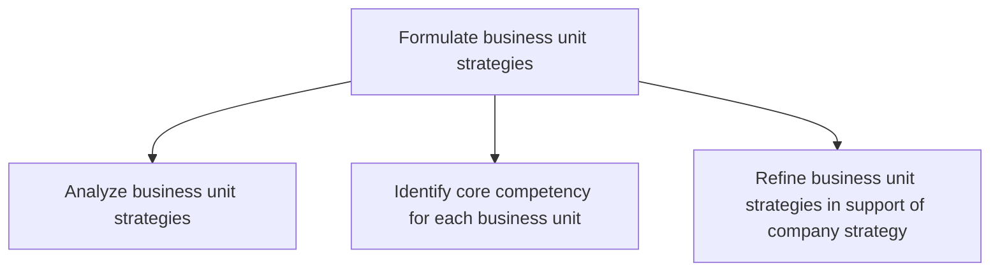
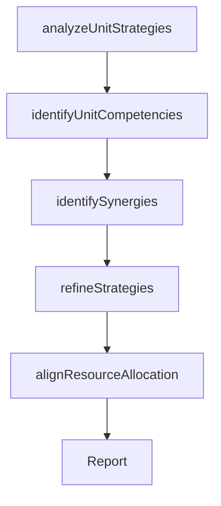

# Formulate business unit strategies

> Business-as-Code definition for business unit strategy formulation. Models the analysis, competency identification, and refinement of individual business unit strategies to ensure alignment with and support of the overall corporate strategy.

## Overview

Charting a strategic course for business units in order to leverage opportunities, sidestep hurdles, and create synergies among each other. Create strategic road maps for the organization's units--in light of their individual resources and requirements, as well as their relationships with other business units--to achieve organizational goals.

## Process Hierarchy



## GraphDL

```yaml
formulate:
  object: Business Unit Strategies
  actor: BusinessUnitLead
  result: BusinessUnitStrategyPlan
```

## Actions

| Action | Description |
|--------|-------------|
| analyzeUnitStrategies | Assess current business unit strategies against organizational goals |
| identifyUnitCompetencies | Determine the core competencies and distinctive capabilities of each unit |
| identifySynergies | Locate opportunities for cross-unit collaboration and resource sharing |
| refineStrategies | Adjust business unit strategies to better support corporate strategy |
| alignResourceAllocation | Ensure resource allocation aligns with refined business unit strategies |

## Events

| Event | Description |
|-------|-------------|
| unitStrategiesAnalyzed | Current business unit strategies assessed against goals |
| unitCompetenciesIdentified | Core competencies for each business unit documented |
| synergiesIdentified | Cross-unit synergy opportunities cataloged |
| strategiesRefined | Business unit strategies adjusted to support corporate direction |
| resourceAllocationAligned | Resources allocated in alignment with refined strategies |

## Searches

| Search | Description |
|--------|-------------|
| getBusinessUnitStrategies | Retrieve strategies for all or specific business units |
| getUnitCompetencies | Access core competency profiles by business unit |
| getSynergyOpportunities | List cross-unit synergy opportunities with estimated value |
| getStrategyAlignment | Check alignment between unit strategies and corporate strategy |

## Process Flow



## RACI Matrix

| Activity | Responsible | Accountable | Consulted | Informed |
|----------|-------------|-------------|-----------|----------|
| analyzeUnitStrategies | BusinessUnitLead | VP Strategy | Finance | CEO |
| identifyUnitCompetencies | BusinessUnitLead | VP Strategy | HumanResources | Operations |
| refineStrategies | BusinessUnitLead | CEO | VP Strategy | CFO |
| alignResourceAllocation | CFO | CEO | BusinessUnitLeads | BoardOfDirectors |

## Sub-Processes

| ID | Name | Description |
|----|------|-------------|
| 1.2.6.1 | Analyze business unit strategies | Assessing the performance of a business unit against set organizational goals which are based on pre |
| 1.2.6.2 | Identify core competency for each business unit | Determining the resources and skills of each business unit based on knowledge and technical capacity |
| 1.2.6.3 | Refine business unit strategies in support of company strategy | Evaluating existing business unit strategy based on the company's strategy and eliminate unwanted/un |

## Related Processes

| Process | Relationship |
|---------|-------------|
| 1.2.5 Develop and set organizational goals | Upstream - organizational goals guide BU strategy formulation |
| 1.1.3.6 Identify core competencies | Related - enterprise competencies inform BU-level analysis |
| 1.2.2 Define and evaluate strategic options | Upstream - corporate strategic options shape BU strategies |

## Related Departments

| Department | Role |
|-----------|------|
| Business Units | Primary owners of their respective strategies |
| Strategy | Ensures alignment between BU and corporate strategies |
| Finance | Validates resource allocation and financial feasibility |
| Human Resources | Assesses talent implications of unit strategies |

## Related Occupations

| Occupation | Involvement |
|-----------|-------------|
| Business Unit Lead | Primary author of unit-level strategic plans |
| VP Strategy | Ensures BU strategies support corporate direction |
| Financial Analyst | Models financial implications of unit strategies |

## KPIs

| KPI | Description | Unit |
|-----|-------------|------|
| Strategy Alignment Score | Degree of alignment between BU and corporate strategy | Score (1-10) |
| BU Goal Attainment | Percentage of business unit strategic goals achieved | % |
| Synergy Realization | Value captured from cross-unit synergy initiatives | Currency |

## Usage

```typescript
import { formulateBusinessUnitStrategies } from '@headlessly/formulate-business-unit-strategies'

const buStrategy = formulateBusinessUnitStrategies()

// Analyze current business unit strategies
const analysis = await buStrategy.analyzeUnitStrategies({
  businessUnitIds: ['sales', 'engineering', 'marketing', 'operations'],
  benchmarkAgainst: 'organizational-goals'
})

// Identify core competencies for each unit
const competencies = await buStrategy.identifyUnitCompetencies({
  businessUnitIds: analysis.map(a => a.businessUnitId),
  framework: 'VRIO'
})
```
