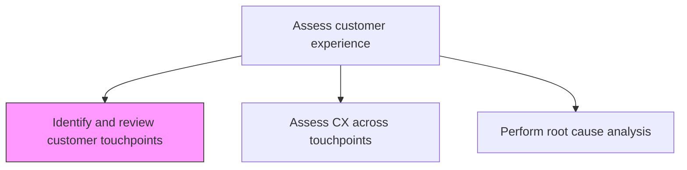
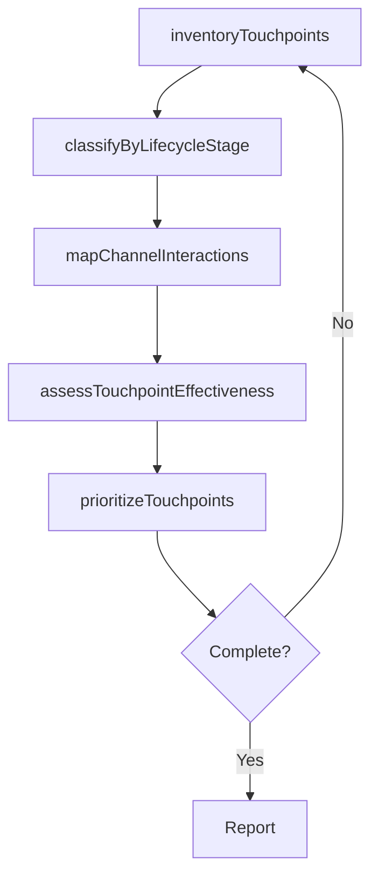

# Identify and review customer touchpoints

> Business-as-Code definition for customer touchpoint identification and review. Models the systematic inventory, classification, and evaluation of all customer interaction points across the lifecycle.

## Overview

Creating methods to gauge customer experiences, expectations, and suggestions. Review both liked and disliked areas of product/services to be delivered. Evaluate touchpoints based on the nature of product/service in the market e.g., billboards, web sites, direct mail, service calls, etc. Catalog every customer interaction point from awareness through post-purchase, classify by channel and lifecycle stage, and assess each touchpoint's contribution to overall customer satisfaction.

## Process Hierarchy



## GraphDL

```yaml
identify:
  object: And Review Customer Touchpoints
  actor: CXAnalyst
  result: TouchpointInventory
```

## Actions

| Action | Description |
|--------|-------------|
| inventoryTouchpoints | Catalog all customer interaction points across channels and lifecycle stages |
| classifyByLifecycleStage | Organize touchpoints by customer lifecycle stage from awareness to advocacy |
| assessTouchpointEffectiveness | Evaluate each touchpoint's impact on customer satisfaction and conversion |
| mapChannelInteractions | Document how customers move between channels at each touchpoint |
| prioritizeTouchpoints | Rank touchpoints by strategic importance and improvement potential |

## Events

| Event | Description |
|-------|-------------|
| touchpointsInventoried | Complete touchpoint catalog documented |
| touchpointsClassified | Touchpoints organized by lifecycle stage |
| touchpointEffectivenessAssessed | Touchpoint impact evaluation completed |
| channelInteractionsMapped | Cross-channel customer movement documented |
| touchpointsPrioritized | Touchpoints ranked by importance and improvement potential |

## Searches

| Search | Description |
|--------|-------------|
| getTouchpointInventory | Retrieve the complete touchpoint catalog by channel or lifecycle stage |
| getTouchpointEffectiveness | Access effectiveness scores for each touchpoint |
| getTouchpointPriorities | Retrieve prioritized touchpoints for improvement |

## Process Flow



## RACI Matrix

| Activity | Responsible | Accountable | Consulted | Informed |
|----------|-------------|-------------|-----------|----------|
| inventoryTouchpoints | CXAnalyst | VP CustomerExperience | Marketing | Sales |
| assessTouchpointEffectiveness | CXAnalyst | VP CustomerExperience | CustomerSuccess | Product |
| prioritizeTouchpoints | VP CustomerExperience | CMO | VP Strategy | CEO |

## Related Processes

| Process | Relationship |
|---------|-------------|
| 1.2.7.1.2 Assess customer experience across touchpoints | Downstream - touchpoint inventory enables CX assessment |
| 1.2.7.2.1 Define and manage personas | Related - personas inform touchpoint relevance |
| 1.2.7.2.2 Create customer journey maps | Downstream - touchpoint inventory feeds journey mapping |

## Related Departments

| Department | Role |
|-----------|------|
| Customer Experience | Leads touchpoint identification and review |
| Marketing | Provides awareness and acquisition touchpoint data |
| Sales | Identifies sales-stage interaction points |
| Customer Support | Documents service and support touchpoints |

## Related Occupations

| Occupation | Involvement |
|-----------|-------------|
| CX Analyst | Inventories and evaluates customer touchpoints |
| Marketing Manager | Provides marketing channel touchpoint data |
| UX Researcher | Assesses digital touchpoint effectiveness |

## KPIs

| KPI | Description | Unit |
|-----|-------------|------|
| Touchpoint Coverage | Percentage of customer lifecycle stages with documented touchpoints | % |
| Touchpoint Satisfaction Score | Average customer satisfaction rating per touchpoint | Score (1-10) |
| Channel Integration Score | Degree of seamless cross-channel touchpoint integration | Score (1-10) |

## Usage

```typescript
import { identifyAndReviewCustomerTouchpoints } from '@headlessly/identify-and-review-customer-touchpoints'

const touchpoints = identifyAndReviewCustomerTouchpoints()

// Inventory all touchpoints
const inventory = await touchpoints.inventoryTouchpoints({
  channels: ['web', 'mobile', 'email', 'phone', 'in-store', 'social'],
  lifecycleStages: ['awareness', 'consideration', 'purchase', 'onboarding', 'usage', 'renewal']
})

// Assess touchpoint effectiveness
const effectiveness = await touchpoints.assessTouchpointEffectiveness({
  touchpointIds: inventory.map(t => t.id),
  metrics: ['satisfaction', 'conversion-impact', 'effort-score']
})
```
