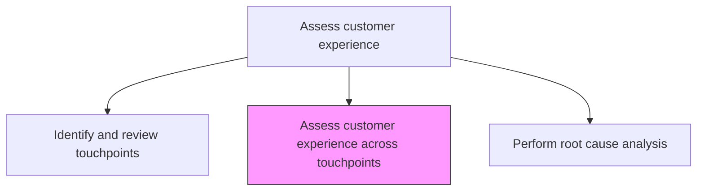
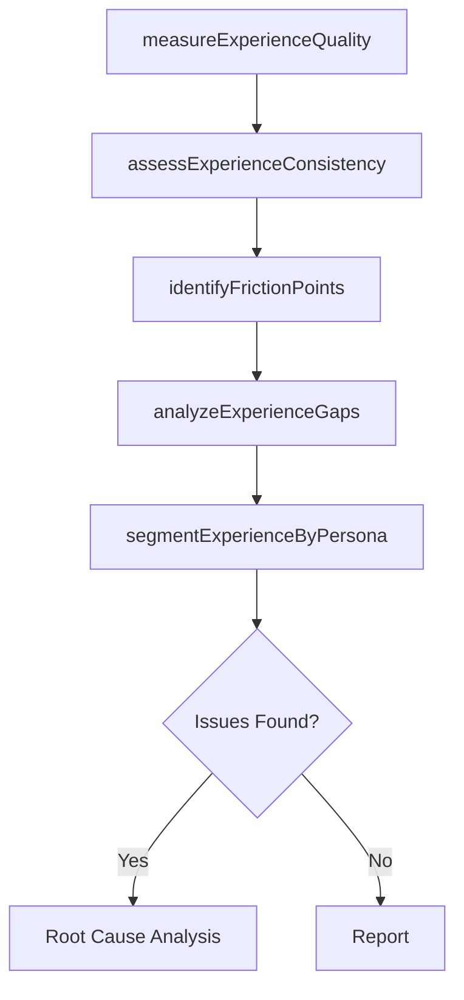

# Assess customer experience across touchpoints

> Business-as-Code definition for cross-touchpoint customer experience assessment. Models the measurement and analysis of customer experience quality, consistency, and effort across all interaction points throughout the customer lifecycle.

## Overview

Evaluating customer experiences, expectations, and suggestions in both liked and disliked areas of the product or services. Analyze all modes of communication, human and physical interactions, or customers experience during the relationship lifecycle with your organization. Evaluate the gaps/further development/alterations to the existing product/service to attain better customer response. Measure experience quality, consistency, and friction across every touchpoint to identify improvement opportunities.

## Process Hierarchy



## GraphDL

```yaml
assess:
  object: Customer Experience Across Touchpoints
  actor: CXAnalyst
  result: CrossTouchpointCXAssessment
```

## Actions

| Action | Description |
|--------|-------------|
| measureExperienceQuality | Collect customer satisfaction, NPS, and effort scores at each touchpoint |
| assessExperienceConsistency | Evaluate consistency of experience quality across channels and touchpoints |
| identifyFrictionPoints | Detect high-effort or negative experience moments in the customer journey |
| analyzeExperienceGaps | Compare actual experience against customer expectations at each touchpoint |
| segmentExperienceByPersona | Break down experience assessments by customer persona or segment |

## Events

| Event | Description |
|-------|-------------|
| experienceQualityMeasured | Customer satisfaction and effort scores collected across touchpoints |
| experienceConsistencyAssessed | Cross-touchpoint experience consistency evaluated |
| frictionPointsIdentified | High-effort or negative experience moments documented |
| experienceGapsAnalyzed | Expectation-reality gaps identified at each touchpoint |
| experienceSegmented | Experience assessment broken down by customer persona |

## Searches

| Search | Description |
|--------|-------------|
| getCXScores | Retrieve customer experience scores by touchpoint and channel |
| getFrictionPoints | List identified friction points ranked by severity |
| getExperienceGaps | Access expectation-reality gap analysis by touchpoint |
| getPersonaExperience | Retrieve experience data segmented by customer persona |

## Process Flow



## RACI Matrix

| Activity | Responsible | Accountable | Consulted | Informed |
|----------|-------------|-------------|-----------|----------|
| measureExperienceQuality | CXAnalyst | VP CustomerExperience | CustomerSuccess | Marketing |
| identifyFrictionPoints | CXAnalyst | VP CustomerExperience | UXResearcher | Product |
| analyzeExperienceGaps | CXAnalyst | VP CustomerExperience | Sales | CEO |

## Related Processes

| Process | Relationship |
|---------|-------------|
| 1.2.7.1.1 Identify and review customer touchpoints | Upstream - touchpoint inventory enables CX assessment |
| 1.2.7.1.3 Perform root cause analysis of problematic experiences | Downstream - assessment findings drive root cause analysis |
| 1.2.7.2.2 Create customer journey maps | Related - journey maps contextualize CX assessment results |

## Related Departments

| Department | Role |
|-----------|------|
| Customer Experience | Leads cross-touchpoint CX measurement and analysis |
| Marketing | Provides acquisition touchpoint experience data |
| Customer Support | Supplies service interaction quality data |
| Product | Receives product-related experience improvement insights |

## Related Occupations

| Occupation | Involvement |
|-----------|-------------|
| CX Analyst | Measures and analyzes customer experience across touchpoints |
| UX Researcher | Conducts qualitative research on digital experience quality |
| Voice of Customer Manager | Collects and synthesizes customer feedback data |

## KPIs

| KPI | Description | Unit |
|-----|-------------|------|
| Net Promoter Score | Customer willingness to recommend across touchpoints | Score (-100 to 100) |
| Customer Effort Score | Average effort required to complete tasks at touchpoints | Score (1-7) |
| Experience Consistency Index | Variation in satisfaction scores across touchpoints | Score (1-10) |
| Friction Point Count | Number of identified high-friction customer interaction points | Count |

## Usage

```typescript
import { assessCustomerExperienceAcrossTouchpoints } from '@headlessly/assess-customer-experience-across-touchpoints'

const cxAssessment = assessCustomerExperienceAcrossTouchpoints()

// Measure experience quality across touchpoints
const quality = await cxAssessment.measureExperienceQuality({
  touchpointIds: ['website', 'mobile-app', 'support-call', 'email'],
  metrics: ['CSAT', 'NPS', 'CES'],
  period: 'Q4-2025'
})

// Identify friction points
const friction = await cxAssessment.identifyFrictionPoints({
  threshold: { effortScore: 5, satisfactionScore: 3 },
  segmentBy: 'customer-persona'
})
```
