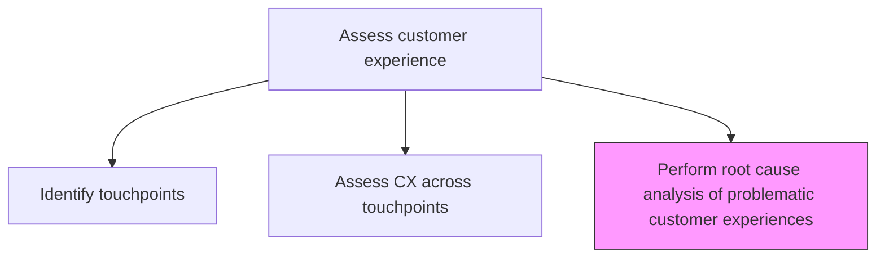
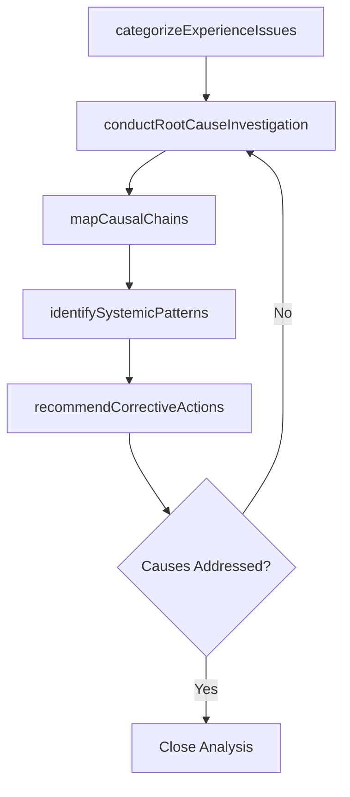

# Perform root cause analysis of problematic customer experiences

> Business-as-Code definition for CX root cause analysis. Models the systematic investigation of underlying causes behind negative customer experiences using structured analysis techniques.

## Overview

Analyzing the core reason for the customer experience/feedback/response about the product/service to take considerable action for better customer experience. Apply root cause analysis techniques such as 5 Whys, fishbone diagrams, and Pareto analysis to identify systemic issues behind recurring customer experience problems and develop targeted corrective actions.

## Process Hierarchy



## GraphDL

```yaml
perform:
  object: Root Cause Analysis Of Problematic Customer Experiences
  actor: CXAnalyst
  result: RootCauseAnalysisReport
```

## Actions

| Action | Description |
|--------|-------------|
| categorizeExperienceIssues | Classify negative customer experiences by type, severity, and frequency |
| conductRootCauseInvestigation | Apply 5 Whys, fishbone, or Pareto analysis to identify underlying causes |
| mapCausalChains | Document the chain of events and conditions leading to negative experiences |
| identifySystemicPatterns | Detect recurring patterns across multiple experience issues |
| recommendCorrectiveActions | Propose targeted fixes for identified root causes |

## Events

| Event | Description |
|-------|-------------|
| experienceIssuesCategorized | Negative experiences classified by type and severity |
| rootCauseInvestigationCompleted | Root cause analysis completed for an experience issue |
| causalChainsMapped | Causal event chains documented |
| systemicPatternsIdentified | Recurring cross-issue patterns detected |
| correctiveActionsRecommended | Targeted corrective actions proposed and prioritized |

## Searches

| Search | Description |
|--------|-------------|
| getRootCauseAnalyses | Retrieve root cause analysis reports by issue category |
| getSystemicPatterns | Access identified systemic patterns across CX issues |
| getCorrectiveActions | List recommended corrective actions and their status |

## Process Flow



## RACI Matrix

| Activity | Responsible | Accountable | Consulted | Informed |
|----------|-------------|-------------|-----------|----------|
| categorizeExperienceIssues | CXAnalyst | VP CustomerExperience | CustomerSupport | Product |
| conductRootCauseInvestigation | CXAnalyst | VP CustomerExperience | ProcessOwners | Engineering |
| recommendCorrectiveActions | VP CustomerExperience | CMO | Product | CEO |

## Related Processes

| Process | Relationship |
|---------|-------------|
| 1.2.7.1.2 Assess customer experience across touchpoints | Upstream - CX assessment identifies problematic experiences |
| 1.2.7.2 Design customer experience | Downstream - root causes inform experience redesign |
| 1.2.7.2.2 Create customer journey maps | Related - journey maps contextualize experience issues |

## Related Departments

| Department | Role |
|-----------|------|
| Customer Experience | Leads root cause investigation and corrective action design |
| Customer Support | Provides complaint data and frontline insights |
| Product | Implements product-related corrective actions |
| Engineering | Addresses technical root causes |

## Related Occupations

| Occupation | Involvement |
|-----------|-------------|
| CX Analyst | Conducts root cause analysis using structured techniques |
| Quality Manager | Applies process analysis methodologies |
| Process Improvement Specialist | Identifies systemic process issues |

## KPIs

| KPI | Description | Unit |
|-----|-------------|------|
| Root Cause Resolution Rate | Percentage of identified root causes with implemented corrective actions | % |
| Recurrence Rate | Percentage of resolved issues that recur within 6 months | % |
| Time to Root Cause | Average time from issue identification to root cause determination | Days |

## Usage

```typescript
import { performRootCauseAnalysisOfProblematicCustomerExperiences } from '@headlessly/perform-root-cause-analysis-of-problematic-customer-experiences'

const rca = performRootCauseAnalysisOfProblematicCustomerExperiences()

// Conduct root cause investigation
const investigation = await rca.conductRootCauseInvestigation({
  issueId: 'checkout-abandonment-spike',
  methodology: '5-whys',
  dataInputs: ['customer-feedback', 'session-recordings', 'support-tickets']
})

// Recommend corrective actions
const actions = await rca.recommendCorrectiveActions({
  rootCauseIds: investigation.rootCauses.map(rc => rc.id),
  prioritization: 'impact-effort-matrix'
})
```
