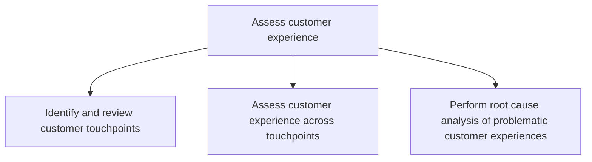
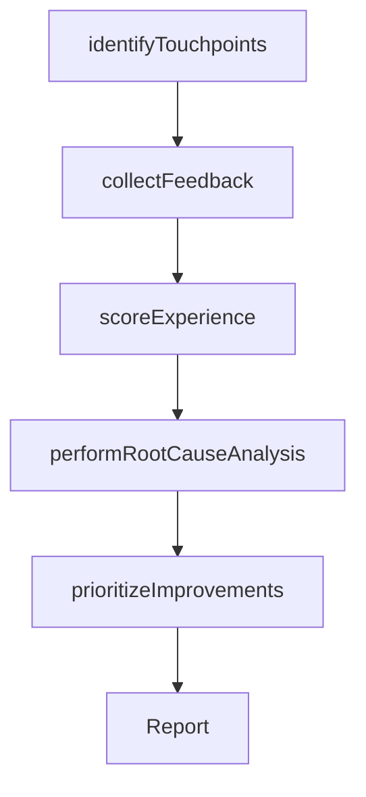

# Assess customer experience

> Business-as-Code definition for customer experience assessment. Models the measurement and analysis of customer satisfaction across touchpoints, including feedback collection, experience scoring, and root cause analysis of pain points.

## Overview

Measuring customer feedback in regard to product and services effectiveness based on overall satisfaction. The data to be analyzed is collected through surveys, customer responses, and feedbacks based on the delivered products/services.

## Process Hierarchy



## GraphDL

```yaml
assess:
  object: Customer Experience
  actor: CXManager
  result: CustomerExperienceAssessment
```

## Actions

| Action | Description |
|--------|-------------|
| identifyTouchpoints | Map all customer interaction points across the lifecycle |
| collectFeedback | Gather customer feedback through surveys, reviews, and direct interactions |
| scoreExperience | Rate customer experience across touchpoints using standardized metrics |
| performRootCauseAnalysis | Investigate the underlying causes of negative customer experiences |
| prioritizeImprovements | Rank experience gaps by severity and business impact |

## Events

| Event | Description |
|-------|-------------|
| touchpointsIdentified | Customer touchpoints mapped and cataloged |
| feedbackCollected | Customer feedback data gathered and validated |
| experienceScored | Customer experience ratings calculated across touchpoints |
| rootCauseAnalysisPerformed | Root causes of problematic experiences identified |
| improvementsPrioritized | Experience improvement opportunities ranked |

## Searches

| Search | Description |
|--------|-------------|
| getTouchpoints | Retrieve the customer touchpoint inventory |
| getExperienceScores | Access CX scores by touchpoint, segment, or period |
| getFeedbackData | Retrieve customer feedback data filtered by channel or topic |
| getRootCauses | List root causes of negative experiences by severity |

## Process Flow



## RACI Matrix

| Activity | Responsible | Accountable | Consulted | Informed |
|----------|-------------|-------------|-----------|----------|
| identifyTouchpoints | CXAnalyst | CXManager | ProductManagement | Marketing |
| collectFeedback | CXAnalyst | CXManager | CustomerSuccess | Sales |
| performRootCauseAnalysis | CXAnalyst | CXManager | Operations | Engineering |
| prioritizeImprovements | CXManager | ChiefCustomerOfficer | VP Strategy | ProductManagement |

## Sub-Processes

| ID | Name | Description |
|----|------|-------------|
| 1.2.7.1.1 | Identify and review customer touchpoints | Creating methods to gauge customer experiences, expectations, and suggestions. Review both liked and |
| 1.2.7.1.2 | Assess customer experience across touchpoints | Evaluating customer experiences, expectations, and suggestions in both liked and disliked areas of t |
| 1.2.7.1.3 | Perform root cause analysis of problematic customer experiences | Analyzing the core reason for the customer experience/feedback/response about the product/service to |

## Related Processes

| Process | Relationship |
|---------|-------------|
| 1.2.7.2 Design customer experience | Downstream - assessment findings inform experience design |
| 1.1.2 Survey market and determine customer needs | Related - market survey complements CX assessment |
| 1.2.7.3 Design customer experience support structure | Downstream - assessment gaps drive support structure design |

## Related Departments

| Department | Role |
|-----------|------|
| Customer Experience | Leads CX assessment and analysis |
| Customer Success | Provides direct customer interaction data |
| Marketing | Contributes survey and feedback collection capabilities |
| Product Management | Uses assessment insights for product improvement |

## Related Occupations

| Occupation | Involvement |
|-----------|-------------|
| CX Manager | Leads customer experience assessment |
| CX Analyst | Conducts touchpoint analysis and root cause investigation |
| Customer Insights Analyst | Analyzes feedback data and generates insights |

## KPIs

| KPI | Description | Unit |
|-----|-------------|------|
| NPS Score | Net Promoter Score across all touchpoints | Score (-100 to 100) |
| Touchpoint Coverage | Percentage of touchpoints with active feedback collection | % |
| Issue Resolution Rate | Percentage of identified CX issues with implemented fixes | % |

## Usage

```typescript
import { assessCustomerExperience } from '@headlessly/assess-customer-experience'

const cxAssess = assessCustomerExperience()

// Identify and map customer touchpoints
const touchpoints = await cxAssess.identifyTouchpoints({
  lifecycle: ['awareness', 'consideration', 'purchase', 'onboarding', 'usage', 'renewal']
})

// Perform root cause analysis on problem areas
const rootCauses = await cxAssess.performRootCauseAnalysis({
  touchpointIds: touchpoints.filter(t => t.score < 7).map(t => t.id),
  method: 'five-whys'
})
```
