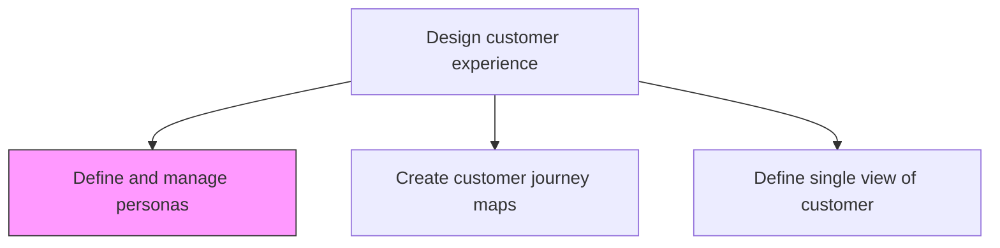
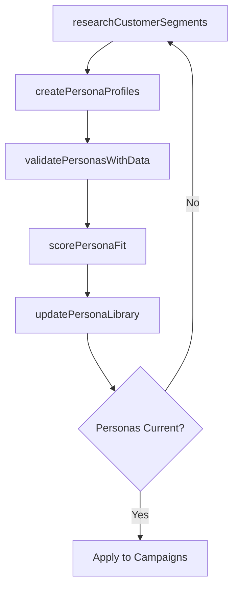

# Define and manage personas

> Business-as-Code definition for persona definition and management. Models the creation, maintenance, and application of customer personas to drive targeted marketing, product design, and experience optimization.

## Overview

Identifying a set of characteristics that define the demographic and behavioral patterns of the customer. Further, use persona scoring to design your marketing strategies around personas, and measure and optimize your interactions with the contacts classified by a certain persona.

## Process Hierarchy



## GraphDL

```yaml
define:
  object: And Manage Personas
  actor: MarketingStrategist
  result: PersonaLibrary
```

## Actions

| Action | Description |
|--------|-------------|
| researchCustomerSegments | Gather demographic, behavioral, and psychographic data on customer segments |
| createPersonaProfiles | Build detailed persona profiles with goals, pain points, and decision criteria |
| validatePersonasWithData | Validate persona definitions against quantitative customer data |
| scorePersonaFit | Classify contacts and accounts against defined persona profiles |
| updatePersonaLibrary | Refresh persona definitions based on evolving customer data and market changes |

## Events

| Event | Description |
|-------|-------------|
| customerSegmentsResearched | Customer segment research data collected and analyzed |
| personaProfilesCreated | Persona profiles documented with attributes and narratives |
| personasValidated | Persona definitions confirmed against quantitative data |
| personaFitScored | Contacts classified by persona profiles |
| personaLibraryUpdated | Persona definitions refreshed with current data |

## Searches

| Search | Description |
|--------|-------------|
| getPersonaProfiles | Retrieve persona profiles by segment or attribute |
| getPersonaDistribution | Access distribution of contacts across persona categories |
| getPersonaPerformance | Retrieve engagement and conversion metrics by persona |

## Process Flow



## RACI Matrix

| Activity | Responsible | Accountable | Consulted | Informed |
|----------|-------------|-------------|-----------|----------|
| researchCustomerSegments | MarketResearcher | CMO | Sales | Product |
| createPersonaProfiles | MarketingStrategist | CMO | UXResearcher | CustomerSuccess |
| scorePersonaFit | MarketingAnalyst | CMO | DataEngineering | Sales |

## Related Processes

| Process | Relationship |
|---------|-------------|
| 1.2.7.2.2 Create customer journey maps | Downstream - personas drive journey map creation |
| 1.2.7.1.1 Identify and review customer touchpoints | Related - personas inform touchpoint relevance |
| 1.2.7.2.4 Define a vision for the customer experience | Related - personas shape CX vision |

## Related Departments

| Department | Role |
|-----------|------|
| Marketing | Leads persona research, creation, and management |
| Sales | Validates personas against real customer interactions |
| Product | Uses personas for feature prioritization and design |

## Related Occupations

| Occupation | Involvement |
|-----------|-------------|
| Marketing Strategist | Creates and manages persona profiles |
| UX Researcher | Conducts qualitative persona research |
| Data Analyst | Validates and scores personas with quantitative data |

## KPIs

| KPI | Description | Unit |
|-----|-------------|------|
| Persona Coverage | Percentage of customer base classified by persona | % |
| Persona Accuracy | Prediction accuracy of persona-based targeting | % |
| Persona Freshness | Time since last persona validation and update | Months |

## Usage

```typescript
import { defineAndManagePersonas } from '@headlessly/define-and-manage-personas'

const personas = defineAndManagePersonas()

// Create persona profiles
const profiles = await personas.createPersonaProfiles({
  segments: ['enterprise-buyer', 'smb-decision-maker', 'technical-evaluator'],
  attributes: ['demographics', 'goals', 'pain-points', 'decision-criteria']
})

// Score contacts against personas
const scores = await personas.scorePersonaFit({
  contactIds: ['contact-001', 'contact-002'],
  personaIds: profiles.map(p => p.id)
})
```
