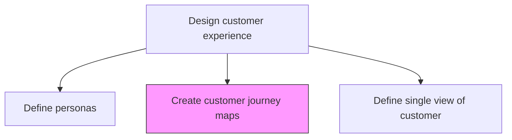
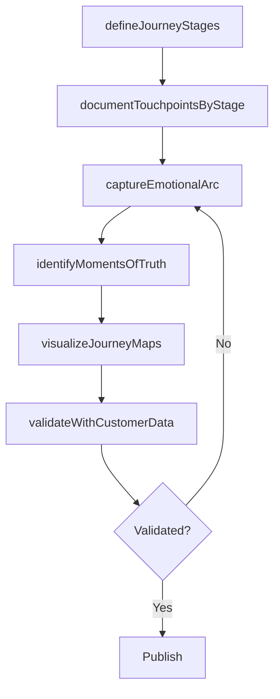

# Create customer journey maps

> Business-as-Code definition for customer journey map creation. Models the visualization of the end-to-end customer experience from awareness through advocacy, documenting emotions, touchpoints, and moments of truth.

## Overview

Creating a story of the customer's experience: from initial contact, through the process of engagement and into a long-term relationship. The goal is to teach organization about the customer. Map each stage of the customer journey, document emotional highs and lows, identify moments of truth, and highlight opportunities for experience improvement.

## Process Hierarchy



## GraphDL

```yaml
create:
  object: Customer Journey Maps
  actor: CXDesigner
  result: CustomerJourneyMapSet
```

## Actions

| Action | Description |
|--------|-------------|
| defineJourneyStages | Establish the key stages of the customer lifecycle from awareness to advocacy |
| documentTouchpointsByStage | Map all touchpoints and interactions within each journey stage |
| captureEmotionalArc | Record customer emotions, expectations, and pain points at each stage |
| identifyMomentsOfTruth | Pinpoint critical moments that disproportionately affect customer loyalty |
| visualizeJourneyMaps | Create visual journey map artifacts for communication and alignment |
| validateWithCustomerData | Confirm journey maps against actual customer behavioral data |

## Events

| Event | Description |
|-------|-------------|
| journeyStagesDefined | Customer lifecycle stages established |
| touchpointsDocumentedByStage | Touchpoints mapped within each journey stage |
| emotionalArcCaptured | Customer emotions and pain points recorded |
| momentsOfTruthIdentified | Critical loyalty-defining moments pinpointed |
| journeyMapsVisualized | Journey map artifacts created and published |
| mapsValidatedWithData | Journey maps confirmed against customer data |

## Searches

| Search | Description |
|--------|-------------|
| getJourneyMaps | Retrieve customer journey maps by persona or segment |
| getMomentsOfTruth | List identified moments of truth by journey stage |
| getJourneyPainPoints | Access documented pain points along the customer journey |

## Process Flow



## RACI Matrix

| Activity | Responsible | Accountable | Consulted | Informed |
|----------|-------------|-------------|-----------|----------|
| defineJourneyStages | CXDesigner | VP CustomerExperience | Marketing | Sales |
| identifyMomentsOfTruth | CXDesigner | VP CustomerExperience | CustomerSuccess | Product |
| visualizeJourneyMaps | CXDesigner | VP CustomerExperience | UXResearcher | AllDepartments |

## Related Processes

| Process | Relationship |
|---------|-------------|
| 1.2.7.2.1 Define and manage personas | Upstream - personas drive journey map perspective |
| 1.2.7.1.1 Identify and review customer touchpoints | Upstream - touchpoint inventory feeds journey mapping |
| 1.2.7.2.4 Define a vision for the customer experience | Downstream - journey maps inform CX vision |

## Related Departments

| Department | Role |
|-----------|------|
| Customer Experience | Leads journey map creation and validation |
| Marketing | Provides awareness and acquisition stage insights |
| Sales | Documents sales process touchpoints and interactions |
| Customer Support | Provides post-purchase service experience data |

## Related Occupations

| Occupation | Involvement |
|-----------|-------------|
| CX Designer | Creates and maintains customer journey maps |
| UX Researcher | Conducts customer research to validate journey stages |
| Service Designer | Designs service interactions along the journey |

## KPIs

| KPI | Description | Unit |
|-----|-------------|------|
| Journey Map Coverage | Percentage of personas with documented journey maps | % |
| Moment of Truth Resolution | Percentage of critical moments with improvement plans | % |
| Journey Map Freshness | Time since last journey map validation and update | Months |

## Usage

```typescript
import { createCustomerJourneyMaps } from '@headlessly/create-customer-journey-maps'

const journeyMaps = createCustomerJourneyMaps()

// Define journey stages for a persona
const stages = await journeyMaps.defineJourneyStages({
  personaId: 'enterprise-buyer',
  stages: ['awareness', 'consideration', 'evaluation', 'purchase', 'onboarding', 'usage', 'renewal', 'advocacy']
})

// Identify moments of truth
const moments = await journeyMaps.identifyMomentsOfTruth({
  journeyMapId: stages.journeyMapId,
  criteria: ['emotional-impact', 'loyalty-correlation', 'churn-risk']
})
```
