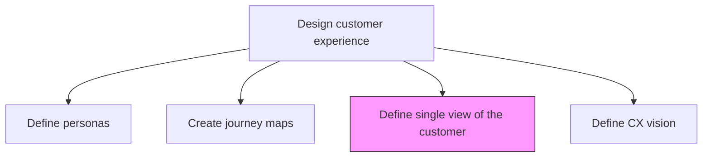
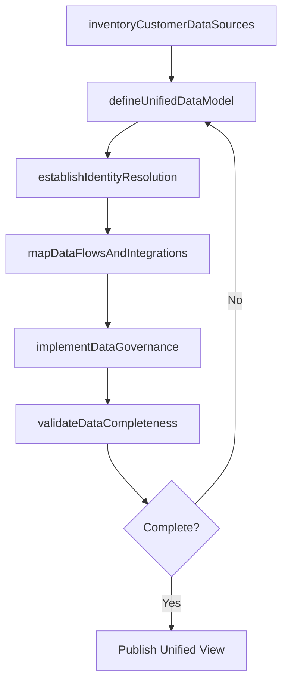

# Define single view of the customer for the organization

> Business-as-Code definition for unified customer data architecture. Models the creation of a consolidated, 360-degree customer profile that aggregates data from every channel, system, and interaction into a single authoritative record.

## Overview

Defining parameters to show aggregated, consistent, and holistic representation of known data about customers. Define key parameters which enable the tracking of customers and communications across every channel.

## Process Hierarchy



## GraphDL

```yaml
define:
  object: Single View Of Customer For Organization
  actor: DataArchitect
  result: UnifiedCustomerProfile
```

## Actions

| Action | Description |
|--------|-------------|
| inventoryCustomerDataSources | Catalog all systems, channels, and databases that capture customer information |
| defineUnifiedDataModel | Design the canonical customer data schema that reconciles fields across all sources |
| establishIdentityResolution | Create matching rules and algorithms to link customer records across systems |
| mapDataFlowsAndIntegrations | Document how customer data flows between systems and define integration patterns |
| implementDataGovernance | Define ownership, quality standards, and access controls for unified customer data |
| validateDataCompleteness | Verify that the unified profile captures all critical customer attributes |

## Events

| Event | Description |
|-------|-------------|
| customerDataSourcesInventoried | All customer data sources cataloged and classified |
| unifiedDataModelDefined | Canonical customer data schema designed and documented |
| identityResolutionEstablished | Record matching rules configured and tested |
| dataFlowsMapped | Customer data integration patterns documented |
| dataGovernanceImplemented | Ownership and quality standards applied to unified data |
| dataCompletenessValidated | Unified profile verified against completeness criteria |

## Searches

| Search | Description |
|--------|-------------|
| getUnifiedCustomerProfile | Retrieve the consolidated 360-degree profile for a customer |
| getDataSourceCoverage | Access coverage metrics showing which sources feed the unified view |
| getIdentityResolutionMatches | Retrieve cross-system record matches and confidence scores |
| getDataQualityMetrics | Access data completeness and accuracy metrics by source |

## Process Flow



## RACI Matrix

| Activity | Responsible | Accountable | Consulted | Informed |
|----------|-------------|-------------|-----------|----------|
| inventoryCustomerDataSources | DataArchitect | CTO | IT Operations | Marketing |
| defineUnifiedDataModel | DataArchitect | VP CustomerExperience | DataEngineering | Sales |
| establishIdentityResolution | DataEngineer | CTO | CXAnalyst | CustomerSupport |
| implementDataGovernance | DataGovernanceManager | CTO | Legal | AllDepartments |

## Related Processes

| Process | Relationship |
|---------|-------------|
| 1.2.7.2.1 Define and manage personas | Upstream - personas define which customer attributes matter most |
| 1.2.7.2.2 Create customer journey maps | Related - journey maps reveal which data is needed at each touchpoint |
| 1.2.7.2.4 Define a vision for the customer experience | Downstream - unified view enables the CX vision |

## Related Departments

| Department | Role |
|-----------|------|
| IT / Data Engineering | Builds and maintains data integration pipelines |
| Customer Experience | Defines business requirements for the unified customer view |
| Marketing | Contributes campaign interaction and preference data |
| Sales | Provides deal pipeline and relationship data |
| Customer Support | Supplies service interaction and issue history data |

## Related Occupations

| Occupation | Involvement |
|-----------|-------------|
| Data Architect | Designs the unified customer data model and integration patterns |
| Data Engineer | Implements identity resolution and data pipelines |
| CX Analyst | Validates the unified view meets business intelligence needs |

## KPIs

| KPI | Description | Unit |
|-----|-------------|------|
| Data Source Integration Rate | Percentage of customer data sources integrated into the unified view | % |
| Identity Resolution Accuracy | Match accuracy rate for cross-system customer records | % |
| Profile Completeness Score | Average completeness of unified customer profiles | % |
| Data Freshness | Average latency between source update and unified view update | Minutes |

## Usage

```typescript
import { defineSingleViewOfCustomerForOrganization } from '@headlessly/define-single-view-of-customer-for-organization'

const singleView = defineSingleViewOfCustomerForOrganization()

// Inventory customer data sources
const sources = await singleView.inventoryCustomerDataSources({
  categories: ['CRM', 'marketing-automation', 'support-tickets', 'web-analytics', 'billing'],
  includeMetadata: true
})

// Establish identity resolution rules
const resolution = await singleView.establishIdentityResolution({
  matchFields: ['email', 'phone', 'account-id', 'cookie-id'],
  confidenceThreshold: 0.85,
  deduplicationStrategy: 'golden-record'
})
```
