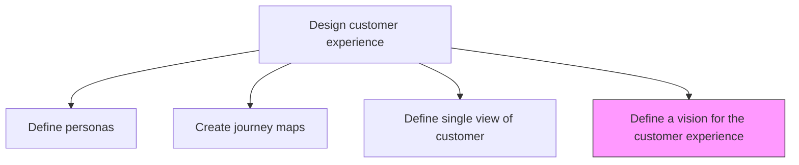
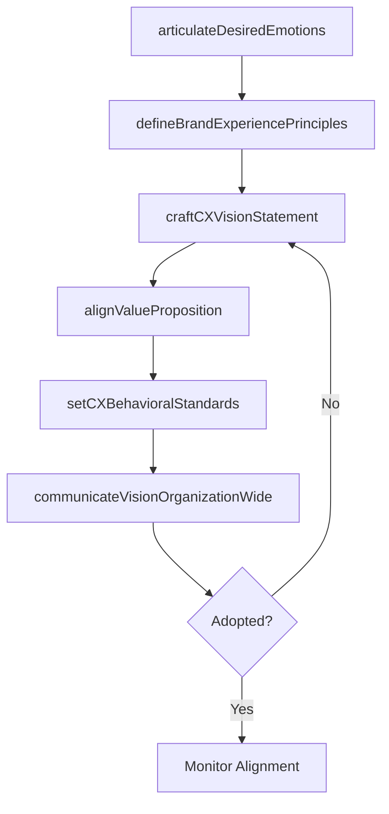

# Define a vision for the customer experience

> Business-as-Code definition for customer experience vision formulation. Models the creation of a compelling, organization-wide CX vision that defines emotional connection, value proposition, and behavioral standards for every customer interaction.

## Overview

Establishing a direction and vision on how the organization behaves towards customers in a consistent, effective way. The key attributes for customer experience vision consists of emotional connection, commitments and expectations, compelling value proposition, and ease of understanding the organization's behavior.

## Process Hierarchy



## GraphDL

```yaml
define:
  object: Vision For Customer Experience
  actor: VP CustomerExperience
  result: CXVisionStatement
```

## Actions

| Action | Description |
|--------|-------------|
| articulateDesiredEmotions | Define the emotional outcomes customers should experience at each lifecycle stage |
| defineBrandExperiencePrinciples | Establish guiding principles that connect brand promise to customer interactions |
| craftCXVisionStatement | Create a concise, aspirational CX vision statement for the organization |
| alignValueProposition | Ensure the CX vision reinforces the organization's core value proposition |
| setCXBehavioralStandards | Define the employee behaviors required to deliver on the CX vision |
| communicateVisionOrganizationWide | Cascade the CX vision across all departments and levels |

## Events

| Event | Description |
|-------|-------------|
| desiredEmotionsArticulated | Target emotional outcomes defined for each lifecycle stage |
| brandExperiencePrinciplesDefined | CX guiding principles established and documented |
| cxVisionStatementCrafted | CX vision statement finalized and approved |
| valuePropositionAligned | CX vision validated against core value proposition |
| cxBehavioralStandardsSet | Employee behavioral standards defined for CX delivery |
| visionCommunicatedOrganizationWide | CX vision cascaded across all departments |

## Searches

| Search | Description |
|--------|-------------|
| getCXVisionStatement | Retrieve the current CX vision statement and supporting principles |
| getBehavioralStandards | Access CX behavioral standards by role or department |
| getVisionAlignmentScore | Retrieve how well current operations align with the CX vision |

## Process Flow



## RACI Matrix

| Activity | Responsible | Accountable | Consulted | Informed |
|----------|-------------|-------------|-----------|----------|
| craftCXVisionStatement | VP CustomerExperience | CEO | CMO | AllDepartments |
| defineBrandExperiencePrinciples | CXDesigner | VP CustomerExperience | BrandManager | Marketing |
| setCXBehavioralStandards | VP CustomerExperience | CHRO | HR | FrontlineManagers |
| communicateVisionOrganizationWide | InternalComms | VP CustomerExperience | HR | AllEmployees |

## Related Processes

| Process | Relationship |
|---------|-------------|
| 1.2.7.2.1 Define and manage personas | Upstream - personas ground the CX vision in customer reality |
| 1.2.7.2.2 Create customer journey maps | Upstream - journey maps reveal where vision must be operationalized |
| 1.2.7.2.6 Align experience with brand values and business strategies | Downstream - CX vision drives brand-experience alignment |
| 1.2.7.4 Develop CX roadmap | Downstream - CX vision sets direction for the implementation roadmap |

## Related Departments

| Department | Role |
|-----------|------|
| Customer Experience | Leads CX vision creation and ongoing stewardship |
| Executive Leadership | Sponsors and champions the CX vision across the organization |
| Marketing | Ensures brand messaging reflects the CX vision |
| Human Resources | Embeds CX behavioral standards into hiring and training |

## Related Occupations

| Occupation | Involvement |
|-----------|-------------|
| VP Customer Experience | Authors and owns the CX vision statement |
| Brand Strategist | Ensures CX vision aligns with brand identity |
| Change Management Specialist | Drives organizational adoption of the CX vision |

## KPIs

| KPI | Description | Unit |
|-----|-------------|------|
| CX Vision Awareness | Percentage of employees who can articulate the CX vision | % |
| Behavioral Standards Compliance | Percentage of frontline staff meeting CX behavioral standards | % |
| Vision-to-Experience Gap | Delta between CX vision aspirations and actual customer feedback scores | Score (1-10) |
| CX Vision Refresh Cadence | Time since last CX vision review and update | Months |

## Usage

```typescript
import { defineVisionForCustomerExperience } from '@headlessly/define-vision-for-customer-experience'

const cxVision = defineVisionForCustomerExperience()

// Craft the CX vision statement
const vision = await cxVision.craftCXVisionStatement({
  brandValues: ['trust', 'simplicity', 'delight'],
  targetEmotions: ['confident', 'valued', 'empowered'],
  competitiveDifferentiators: ['speed-to-value', 'personalization', 'proactive-support']
})

// Set behavioral standards for CX delivery
const standards = await cxVision.setCXBehavioralStandards({
  roles: ['sales-rep', 'support-agent', 'account-manager'],
  visionId: vision.id,
  measurableExpectations: true
})
```
