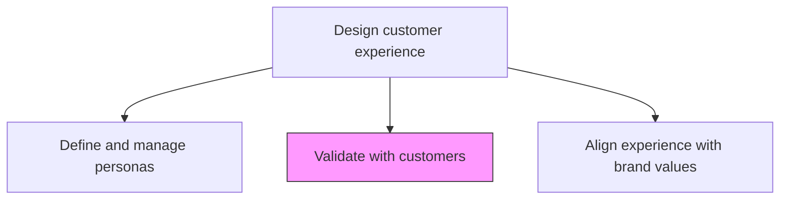
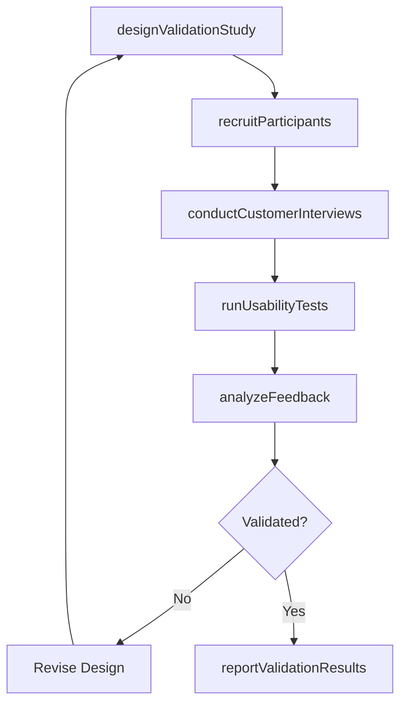

# Validate with customers

> Business-as-Code definition for customer validation of experience design. Models the process of testing business assumptions, product-market fit, and customer experience hypotheses through direct customer engagement and feedback loops.

## Overview

Creating a process to validate the sales process and the assumptions that underpin the business model. Understand if the products/services have a repeatable, scalable business model around that product.

## Process Hierarchy



## GraphDL

```yaml
validate:
  object: With Customers
  actor: UXResearcher
  result: CustomerValidationReport
```

## Actions

| Action | Description |
|--------|-------------|
| designValidationStudy | Plan the research methodology, sample size, and success criteria |
| recruitParticipants | Identify and enlist target customers for validation activities |
| conductCustomerInterviews | Run structured interviews to test experience and business model hypotheses |
| runUsabilityTests | Execute usability tests on prototypes or experience concepts |
| analyzeFeedback | Synthesize qualitative and quantitative feedback into actionable insights |
| reportValidationResults | Document findings and recommend adjustments to experience design |

## Events

| Event | Description |
|-------|-------------|
| validationStudyDesigned | Research methodology and success criteria established |
| participantsRecruited | Target customers enrolled for validation activities |
| customerInterviewsConducted | Structured customer interviews completed |
| usabilityTestsCompleted | Usability testing sessions finished and recorded |
| feedbackAnalyzed | Customer feedback synthesized into insights |
| validationResultsReported | Findings documented and distributed to stakeholders |

## Searches

| Search | Description |
|--------|-------------|
| getValidationResults | Retrieve results from a specific validation study |
| listValidationStudies | List all validation studies filtered by status or persona |
| getCustomerFeedback | Access raw customer feedback by study or touchpoint |
| getInsightsSummary | Retrieve synthesized insights and recommended actions |

## Process Flow



## RACI Matrix

| Activity | Responsible | Accountable | Consulted | Informed |
|----------|-------------|-------------|-----------|----------|
| designValidationStudy | UXResearcher | VP Customer Experience | ProductTeam | Marketing |
| recruitParticipants | UXResearcher | VP Customer Experience | CustomerSuccess | Sales |
| conductCustomerInterviews | UXResearcher | VP Customer Experience | CXDesigner | Product |
| analyzeFeedback | UXResearcher | VP Customer Experience | DataAnalyst | Executive |
| reportValidationResults | UXResearcher | VP Customer Experience | ProductTeam | AllStakeholders |

## Related Processes

| Process | Relationship |
|---------|-------------|
| 1.2.7.2.4 Define a vision for the customer experience | Upstream - CX vision provides hypotheses to validate |
| 1.2.7.2.6 Align experience with brand values | Downstream - validated insights inform alignment adjustments |
| 1.1.2 Survey market and determine customer needs | Parallel - market research complements customer validation |

## Related Departments

| Department | Role |
|-----------|------|
| UX Research | Leads validation study design and execution |
| Customer Experience | Provides experience hypotheses to test |
| Product | Uses validation results to refine product decisions |
| Customer Success | Facilitates customer access for validation activities |
| Marketing | Applies validated insights to messaging and positioning |

## Related Occupations

| Occupation | Involvement |
|-----------|-------------|
| UX Researcher | Primary executor of customer validation studies |
| CX Designer | Develops experience hypotheses for testing |
| Product Manager | Integrates validation findings into product roadmap |

## KPIs

| KPI | Description | Unit |
|-----|-------------|------|
| Validation Frequency | Number of customer validation studies conducted per quarter | Count |
| Hypothesis Confirmation Rate | Percentage of CX hypotheses validated by customers | % |
| Time to Insight | Average elapsed time from study design to actionable insights | Days |
| Participant Completion Rate | Percentage of recruited participants who complete the study | % |

## Usage

```typescript
import { validateWithCustomers } from '@headlessly/validate-with-customers'

const validation = validateWithCustomers()

// Design a validation study
const study = await validation.designValidationStudy({
  objective: 'Test onboarding flow redesign',
  methodology: 'usability-testing',
  sampleSize: 20,
  persona: 'mid-market-buyer'
})

// Conduct customer interviews
const interviews = await validation.conductCustomerInterviews({
  studyId: study.id,
  questions: ['onboarding-experience', 'pain-points', 'feature-expectations']
})

// Analyze collected feedback
const insights = await validation.analyzeFeedback({
  studyId: study.id,
  analysisType: ['thematic', 'sentiment', 'task-completion']
})
```
