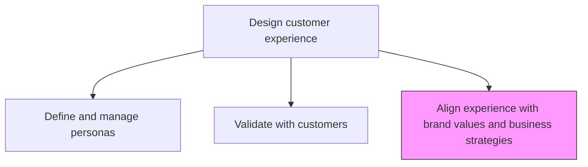
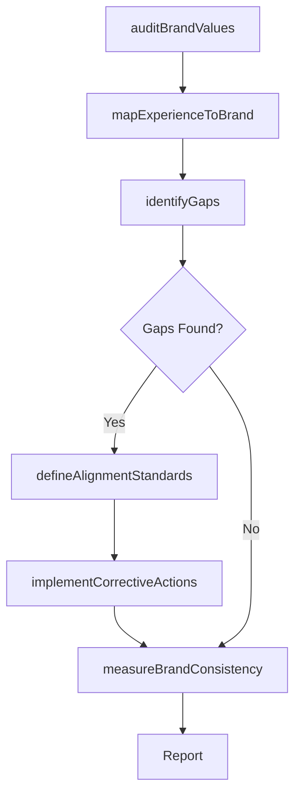

# Align experience with brand values and business strategies

> Business-as-Code definition for brand-experience alignment. Models the process of ensuring customer experience design is consistent with brand promise, core values, and overarching business strategies.

## Overview

Aligning and defining a relevant, differentiated, and credible value proposition for the brand. Align experience to ensure that the product and service quality is consistent with brand promise and business strategies.

## Process Hierarchy



## GraphDL

```yaml
align:
  object: Experience With Brand Values And Business Strategies
  actor: BrandManager
  result: BrandExperienceAlignmentReport
```

## Actions

| Action | Description |
|--------|-------------|
| auditBrandValues | Review and document the organization's core brand values and promise |
| mapExperienceToBrand | Map each customer touchpoint to its corresponding brand value expression |
| identifyGaps | Detect misalignments between delivered experience and brand promise |
| defineAlignmentStandards | Establish standards for brand-consistent experience delivery |
| implementCorrectiveActions | Address identified gaps to bring experience into brand alignment |
| measureBrandConsistency | Track ongoing consistency between experience and brand values |

## Events

| Event | Description |
|-------|-------------|
| brandValuesAudited | Core brand values reviewed and documented |
| experienceMappedToBrand | Customer touchpoints mapped to brand value expressions |
| gapsIdentified | Misalignments between experience and brand promise detected |
| alignmentStandardsDefined | Standards for brand-consistent experience established |
| correctiveActionsImplemented | Gap remediation actions executed |
| brandConsistencyMeasured | Brand-experience consistency metrics assessed |

## Searches

| Search | Description |
|--------|-------------|
| getBrandValues | Retrieve the current brand values and promise statements |
| getAlignmentMap | Access the touchpoint-to-brand-value mapping |
| getAlignmentGaps | List identified misalignments by severity and touchpoint |
| getBrandConsistencyMetrics | Retrieve brand consistency scores across channels |

## Process Flow



## RACI Matrix

| Activity | Responsible | Accountable | Consulted | Informed |
|----------|-------------|-------------|-----------|----------|
| auditBrandValues | BrandManager | CMO | VP Customer Experience | Marketing |
| mapExperienceToBrand | CXDesigner | VP Customer Experience | BrandManager | Product |
| identifyGaps | CXDesigner | VP Customer Experience | QualityAssurance | Operations |
| defineAlignmentStandards | BrandManager | CMO | VP Customer Experience | AllCustomerFacing |
| measureBrandConsistency | MarketingAnalyst | CMO | CustomerInsights | Executive |

## Related Processes

| Process | Relationship |
|---------|-------------|
| 1.2.7.2.4 Define a vision for the customer experience | Upstream - CX vision must align with brand values |
| 1.2.7.2.5 Validate with customers | Upstream - customer validation confirms brand alignment |
| 1.2.1 Develop overall mission statement | Upstream - mission statement defines brand foundation |

## Related Departments

| Department | Role |
|-----------|------|
| Marketing | Owns brand values and ensures experience consistency |
| Customer Experience | Designs experiences that express brand values |
| Product | Ensures product quality matches brand promise |
| Operations | Delivers service quality consistent with brand standards |
| Corporate Communications | Maintains brand voice and messaging consistency |

## Related Occupations

| Occupation | Involvement |
|-----------|-------------|
| Brand Manager | Leads brand value definition and alignment oversight |
| CX Designer | Maps customer experiences to brand value expressions |
| Marketing Strategist | Ensures campaign messaging reflects brand-aligned experiences |

## KPIs

| KPI | Description | Unit |
|-----|-------------|------|
| Brand Consistency Score | Percentage of touchpoints delivering brand-aligned experience | % |
| Brand-Experience Gap Count | Number of identified misalignments between brand and experience | Count |
| Brand Perception Alignment | Customer perception of brand vs intended brand values | Score (1-10) |
| Alignment Audit Frequency | How often brand-experience alignment is formally assessed | Per Year |

## Usage

```typescript
import { alignExperienceWithBrandValuesAndBusinessStrategies } from '@headlessly/align-experience-with-brand-values-and-business-strategies'

const alignment = alignExperienceWithBrandValuesAndBusinessStrategies()

// Audit current brand values
const brandValues = await alignment.auditBrandValues({
  categories: ['trust', 'innovation', 'simplicity', 'customer-first']
})

// Map experience touchpoints to brand values
const mapping = await alignment.mapExperienceToBrand({
  touchpoints: ['website', 'onboarding', 'support', 'billing'],
  brandValues: brandValues.map(v => v.id)
})

// Identify and address gaps
const gaps = await alignment.identifyGaps({
  mappingId: mapping.id,
  threshold: 'material-misalignment'
})
```
