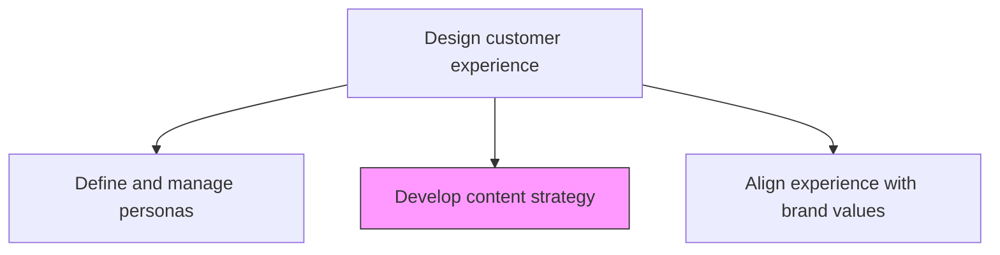
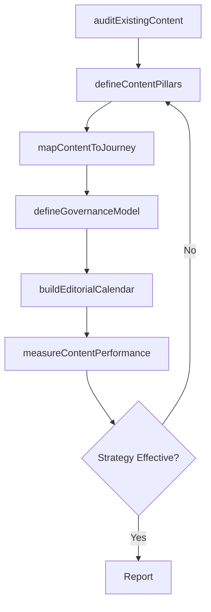

# Develop content strategy

> Business-as-Code definition for content strategy development. Models the planning, governance, and delivery framework that ensures the right content reaches the right customer at the right time across all channels.

## Overview

Planning, development, and management of content-written or in other media. Getting the right content to the right user at the right time through strategic planning of content creation, delivery, and governance.

## Process Hierarchy



## GraphDL

```yaml
develop:
  object: Content Strategy
  actor: ContentStrategist
  result: ContentStrategyPlan
```

## Actions

| Action | Description |
|--------|-------------|
| auditExistingContent | Inventory and assess current content assets for quality, relevance, and gaps |
| defineContentPillars | Establish the core themes and topics that align with brand and customer needs |
| mapContentToJourney | Align content types and topics to each stage of the customer journey |
| defineGovernanceModel | Set editorial standards, approval workflows, and content lifecycle rules |
| buildEditorialCalendar | Create a scheduled plan for content creation, publication, and distribution |
| measureContentPerformance | Track engagement, conversion, and satisfaction metrics for content assets |

## Events

| Event | Description |
|-------|-------------|
| contentAudited | Existing content inventory and gap analysis completed |
| contentPillarsDefined | Core content themes and topics established |
| contentMappedToJourney | Content aligned to customer journey stages |
| governanceModelDefined | Editorial standards and workflows established |
| editorialCalendarBuilt | Content publication schedule created |
| contentPerformanceMeasured | Content engagement and conversion metrics assessed |

## Searches

| Search | Description |
|--------|-------------|
| getContentStrategy | Retrieve the current content strategy plan |
| listContentAssets | Access content inventory filtered by type, pillar, or stage |
| getEditorialCalendar | Retrieve the content publication schedule |
| getContentPerformance | Access engagement and conversion metrics by content asset |

## Process Flow



## RACI Matrix

| Activity | Responsible | Accountable | Consulted | Informed |
|----------|-------------|-------------|-----------|----------|
| auditExistingContent | ContentStrategist | CMO | Marketing | Product |
| defineContentPillars | ContentStrategist | CMO | BrandManager | Sales |
| mapContentToJourney | ContentStrategist | VP Customer Experience | CXDesigner | Marketing |
| defineGovernanceModel | ContentStrategist | CMO | Legal | Editorial |
| buildEditorialCalendar | ContentManager | CMO | Marketing | AllContentCreators |

## Related Processes

| Process | Relationship |
|---------|-------------|
| 1.2.7.2.1 Define and manage personas | Upstream - personas define content audience |
| 1.2.7.2.2 Create customer journey maps | Upstream - journey maps guide content placement |
| 1.2.7.2.6 Align experience with brand values | Parallel - content must reflect brand values |

## Related Departments

| Department | Role |
|-----------|------|
| Marketing | Leads content strategy and editorial planning |
| Customer Experience | Ensures content supports the designed customer journey |
| Product Marketing | Creates product-specific content aligned with strategy |
| Sales Enablement | Uses strategic content for prospect engagement |
| Corporate Communications | Maintains messaging consistency across content |

## Related Occupations

| Occupation | Involvement |
|-----------|-------------|
| Content Strategist | Primary owner of content strategy development |
| Content Manager | Executes editorial calendar and content operations |
| SEO Specialist | Optimizes content for search visibility and discoverability |

## KPIs

| KPI | Description | Unit |
|-----|-------------|------|
| Content Coverage | Percentage of journey stages with assigned content | % |
| Content Engagement Rate | Average engagement rate across published content assets | % |
| Content Freshness | Percentage of content assets updated within their lifecycle | % |
| Editorial Calendar Adherence | Percentage of planned content published on schedule | % |

## Usage

```typescript
import { developContentStrategy } from '@headlessly/develop-content-strategy'

const content = developContentStrategy()

// Audit existing content assets
const audit = await content.auditExistingContent({
  contentTypes: ['blog', 'whitepaper', 'video', 'email', 'social'],
  evaluationCriteria: ['relevance', 'quality', 'performance', 'freshness']
})

// Define content pillars
const pillars = await content.defineContentPillars({
  brandValues: ['innovation', 'trust', 'simplicity'],
  personas: ['enterprise-buyer', 'technical-evaluator'],
  competitiveGaps: audit.gaps
})

// Build editorial calendar
const calendar = await content.buildEditorialCalendar({
  pillars: pillars.map(p => p.id),
  cadence: 'weekly',
  channels: ['blog', 'email', 'social', 'webinar']
})
```
