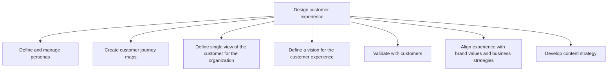
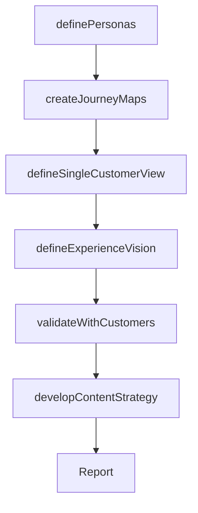

# Design customer experience

> Business-as-Code definition for customer experience design. Models the creation of personas, journey maps, unified customer views, experience vision, and content strategy to deliver differentiated, brand-aligned customer interactions.

## Overview

Creating a design of how customers interact with the business by analyzing data captured through various customer interaction and customer involvement. These will be captured through various channels such as customer satisfaction surveys, feedback forms, product reviews, targeted studies, observational studies, or voice of customer research.

## Process Hierarchy



## GraphDL

```yaml
design:
  object: Customer Experience
  actor: CXDesigner
  result: CustomerExperienceDesign
```

## Actions

| Action | Description |
|--------|-------------|
| definePersonas | Create detailed customer personas based on behavioral and demographic data |
| createJourneyMaps | Map the end-to-end customer journey across all stages and touchpoints |
| defineSingleCustomerView | Establish a unified customer data model for consistent cross-channel experiences |
| defineExperienceVision | Articulate the aspirational customer experience aligned with brand values |
| validateWithCustomers | Test experience designs with actual customers for feedback |
| developContentStrategy | Plan content creation and delivery across the customer journey |

## Events

| Event | Description |
|-------|-------------|
| personasDefined | Customer personas created and documented |
| journeyMapsCreated | Customer journey maps completed for all personas |
| singleCustomerViewDefined | Unified customer data model established |
| experienceVisionDefined | CX vision articulated and aligned with brand |
| validatedWithCustomers | Experience designs tested and validated with customers |
| contentStrategyDeveloped | Content strategy created for the customer journey |

## Searches

| Search | Description |
|--------|-------------|
| getPersonas | Retrieve customer personas with behavioral profiles |
| getJourneyMaps | Access customer journey maps by persona and stage |
| getExperienceVision | Retrieve the current CX vision and design principles |
| getContentStrategy | Access the content strategy by journey stage |

## Process Flow



## RACI Matrix

| Activity | Responsible | Accountable | Consulted | Informed |
|----------|-------------|-------------|-----------|----------|
| definePersonas | CXDesigner | CXManager | Marketing | Sales |
| createJourneyMaps | CXDesigner | CXManager | CustomerSuccess | ProductManagement |
| defineExperienceVision | CXManager | ChiefCustomerOfficer | VP Strategy | Marketing |
| validateWithCustomers | CXDesigner | CXManager | CustomerInsights | UXResearch |
| developContentStrategy | ContentStrategist | CXManager | Marketing | ProductMarketing |

## Sub-Processes

| ID | Name | Description |
|----|------|-------------|
| 1.2.7.2.1 | Define and manage personas | Identifying a set of characteristics that define the demographic and behavioral patterns of the cust |
| 1.2.7.2.2 | Create customer journey maps | Creating a story of the customer's experience: from initial contact, through the process of engageme |
| 1.2.7.2.3 | Define single view of the customer for the organization | Defining parameters to show aggregated, consistent, and holistic representation of known data about  |
| 1.2.7.2.4 | Define a vision for the customer experience | Establishing a direction and vision on how the organization behaves towards customers in a consisten |
| 1.2.7.2.5 | Validate with customers | Creating a process to validate the sales process and the assumptions that underpin the business mode |
| 1.2.7.2.6 | Align experience with brand values and business strategies | Aligning and defining a relevant, differentiated, and credible value proposition for the brand. Alig |
| 1.2.7.2.7 | Develop content strategy | Planning, development, and management of content-written or in other media. Getting the right conten |

## Related Processes

| Process | Relationship |
|---------|-------------|
| 1.2.7.1 Assess customer experience | Upstream - CX assessment findings inform design decisions |
| 1.2.7.3 Design customer experience support structure | Downstream - design defines the support requirements |
| 1.1.2 Survey market and determine customer needs | Related - customer needs data feeds persona creation |

## Related Departments

| Department | Role |
|-----------|------|
| Customer Experience | Leads experience design and persona management |
| Marketing | Provides customer insights and supports content strategy |
| Product Management | Ensures product experience aligns with journey maps |
| UX Design | Creates interface designs that deliver the experience vision |

## Related Occupations

| Occupation | Involvement |
|-----------|-------------|
| CX Designer | Creates personas, journey maps, and experience designs |
| Content Strategist | Develops content strategy for the customer journey |
| UX Researcher | Validates experience designs with customers |
| CX Manager | Oversees experience design and alignment with brand |

## KPIs

| KPI | Description | Unit |
|-----|-------------|------|
| Persona Coverage | Percentage of customer segments with defined personas | % |
| Journey Map Completeness | Percentage of touchpoints covered in journey maps | % |
| Validation Score | Customer feedback score on proposed experience designs | Score (1-10) |

## Usage

```typescript
import { designCustomerExperience } from '@headlessly/design-customer-experience'

const cxDesign = designCustomerExperience()

// Define customer personas
const personas = await cxDesign.definePersonas({
  dataSource: ['analytics', 'surveys', 'interviews'],
  segments: ['enterprise-buyer', 'self-service-user', 'technical-evaluator']
})

// Create customer journey maps
const journeyMaps = await cxDesign.createJourneyMaps({
  personaIds: personas.map(p => p.id),
  stages: ['awareness', 'consideration', 'purchase', 'onboarding', 'adoption', 'renewal']
})
```
