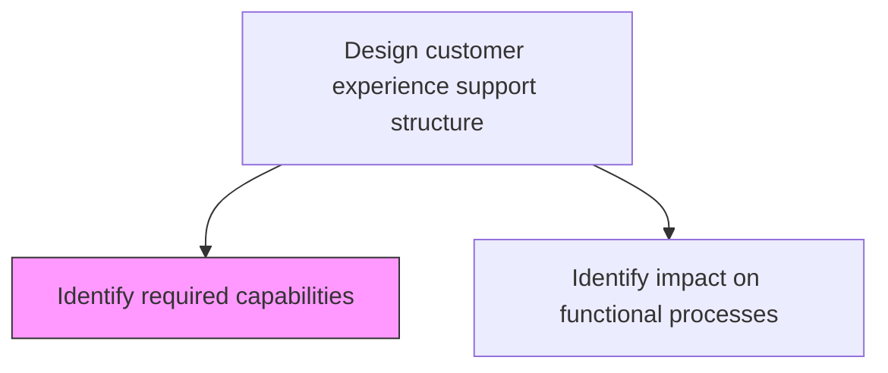
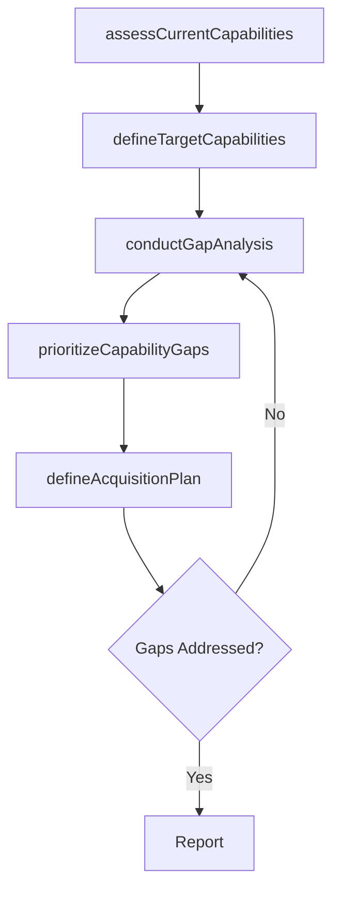

# Identify required capabilities

> Business-as-Code definition for CX capability assessment. Models the process of determining the skills, technologies, processes, and organizational competencies required to deliver the designed customer experience.

## Overview

Determining the necessary skills and competencies required to efficiently collect customer experiences through the support structure.

## Process Hierarchy



## GraphDL

```yaml
identify:
  object: Required Capabilities
  actor: CXOperationsManager
  result: CapabilityRequirementsMap
```

## Actions

| Action | Description |
|--------|-------------|
| assessCurrentCapabilities | Inventory existing skills, tools, and processes that support customer experience |
| defineTargetCapabilities | Specify the capabilities needed to deliver the designed customer experience |
| conductGapAnalysis | Compare current capabilities against target requirements to identify gaps |
| prioritizeCapabilityGaps | Rank capability gaps by strategic impact and urgency |
| defineAcquisitionPlan | Plan how to acquire missing capabilities through hiring, training, or technology |

## Events

| Event | Description |
|-------|-------------|
| currentCapabilitiesAssessed | Existing CX capabilities inventoried and documented |
| targetCapabilitiesDefined | Required CX capabilities specified and documented |
| gapAnalysisConducted | Capability gap analysis completed |
| capabilityGapsPrioritized | Gaps ranked by strategic impact and urgency |
| acquisitionPlanDefined | Plan for acquiring missing capabilities established |

## Searches

| Search | Description |
|--------|-------------|
| getCapabilityMap | Retrieve the current and target capability map |
| listCapabilityGaps | Access identified gaps filtered by priority or domain |
| getAcquisitionPlan | Retrieve the plan for acquiring missing capabilities |
| getCapabilityMaturity | Access maturity ratings for existing CX capabilities |

## Process Flow



## RACI Matrix

| Activity | Responsible | Accountable | Consulted | Informed |
|----------|-------------|-------------|-----------|----------|
| assessCurrentCapabilities | CXOperationsManager | VP Customer Experience | IT | HR |
| defineTargetCapabilities | CXDesigner | VP Customer Experience | Product | Operations |
| conductGapAnalysis | CXOperationsManager | VP Customer Experience | Finance | Executive |
| prioritizeCapabilityGaps | VP Customer Experience | CEO | CFO | BusinessUnitLeads |
| defineAcquisitionPlan | CXOperationsManager | VP Customer Experience | HR | Procurement |

## Related Processes

| Process | Relationship |
|---------|-------------|
| 1.2.7.3.2 Identify impact on functional processes | Downstream - capability gaps drive process changes |
| 1.2.7.2 Design customer experience | Upstream - experience design defines capability needs |
| 1.2.7.4 Develop CX roadmap | Downstream - capability plan feeds the implementation roadmap |

## Related Departments

| Department | Role |
|-----------|------|
| Customer Experience | Defines capability requirements and leads gap analysis |
| Human Resources | Addresses people and skill capability gaps |
| IT | Provides technology capability assessment and solutions |
| Operations | Ensures operational capabilities align with CX requirements |
| Finance | Validates budget feasibility for capability investments |

## Related Occupations

| Occupation | Involvement |
|-----------|-------------|
| CX Operations Manager | Leads capability assessment and gap analysis |
| HR Business Partner | Plans talent acquisition and training for capability gaps |
| IT Solutions Architect | Evaluates technology capability requirements |

## KPIs

| KPI | Description | Unit |
|-----|-------------|------|
| Capability Gap Closure Rate | Percentage of identified gaps addressed per quarter | % |
| Capability Maturity Score | Average maturity level across CX capabilities | Score (1-5) |
| Time to Capability | Average time from gap identification to capability delivery | Months |
| Capability Coverage | Percentage of target capabilities currently in place | % |

## Usage

```typescript
import { identifyRequiredCapabilities } from '@headlessly/identify-required-capabilities'

const capabilities = identifyRequiredCapabilities()

// Assess current CX capabilities
const current = await capabilities.assessCurrentCapabilities({
  domains: ['people', 'process', 'technology', 'data'],
  maturityModel: 'five-level'
})

// Conduct gap analysis against target state
const gaps = await capabilities.conductGapAnalysis({
  currentCapabilities: current.id,
  targetExperience: 'designed-cx-v2',
  prioritization: 'strategic-impact'
})

// Define acquisition plan for missing capabilities
const plan = await capabilities.defineAcquisitionPlan({
  gaps: gaps.prioritized,
  budget: 500000,
  timeline: '12-months'
})
```
